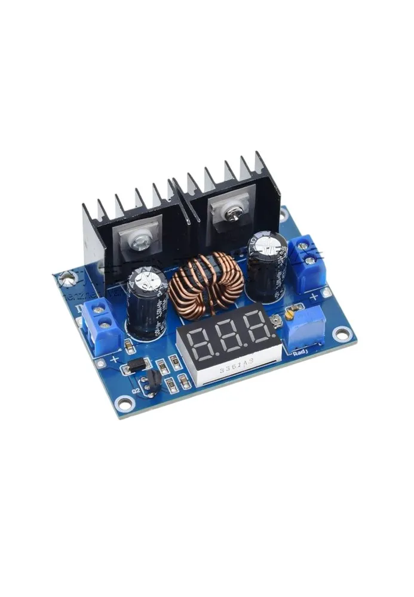
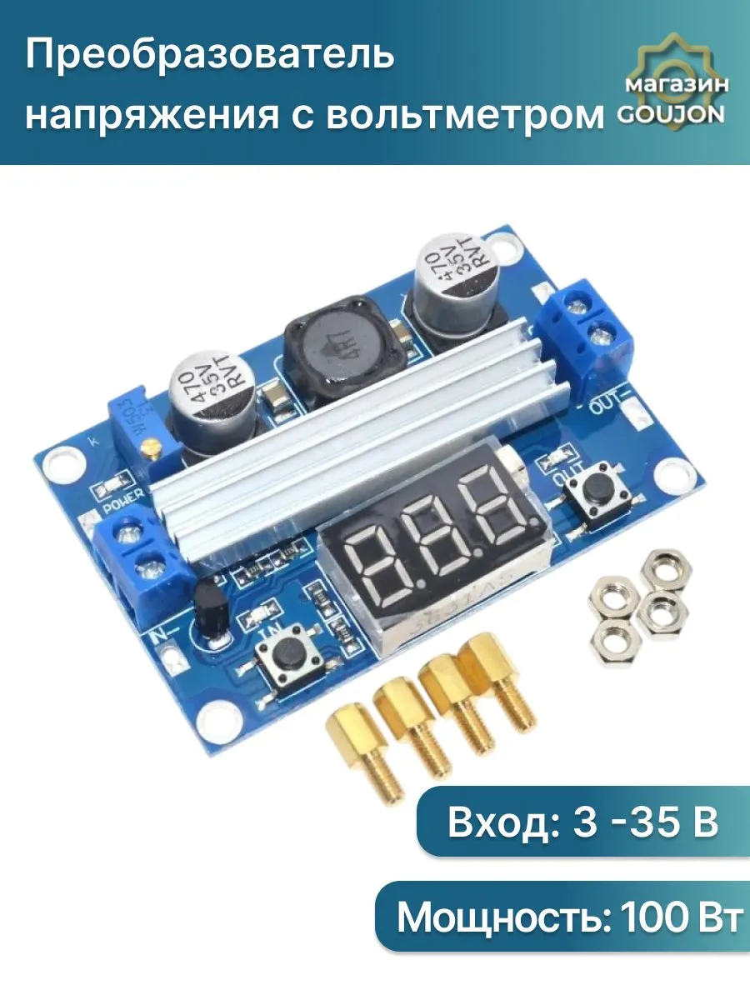

## Преобразователи напряжения и мощности

### LM2596

### [Понижающий DC-DC преобразователь XL4016E1](https://www.ozon.ru/product/ponizhayushchiy-dc-dc-preobrazovatel-xl4016e1-s-tsifrovym-displeem-uvh-4-38-uvyh-1-25-37-v-8a-2810654364/)

> ***Понижающий DC-DC преобразователь XL4016E1 с цифровым дисплеем Uвх.4 - 38, Uвых.1,25 - 37 В 8A***

Данный модуль является понижающим. Повысить напряжение он не может. Выходное напряжение всегда будет ниже чем входное.

Выходное напряжение стабилизированное. При изменении входного напряжение выходное остаётся стабильным (при условии что входное напряжение выше выходного на 0,1 вольт)

Пример:

Настроено выходное напряжение 12 вольт.

Вход 35 В     -   выход 12 В

Вход 13В      -   выход 12 В

Вход 12,1В   -   выход 12 В

Вход 12В      -    выход 11,9В

Электрические характеристики

1). Номинальный выходной ток: 5 А (макс 8А) при использовании с нагрузкой выше 5А длительно, требуется дополнительное охлаждения.

2). Входное напряжение: 4 В - 38 В

3). Выходное напряжение: 1,25 - 37 В

4). КПД:> 95%

5) Диапазон вольтметра: от 0 до 40 В

6) Вольтметр Точность: ± 0,1 В

7) Защита от обратной полярности (параллельно входу установлен диод, при переполюсовке, на нём происходит короткое замыкание)

8) Встроенная функция защиты от короткого замыкания на выходе 

9) Встроенная функция отключения при перегреве

10) Частота 180 кГц

11) Потребление без нагрузки: 6мА

Метод регулирования

Подключите модуль к источнику питания. Световой индикатор, покажет какое напряжение в данный момент.

Вращайте винт потенциометра по часовой стрелке чтобы увеличить напряжение. Против часовой чтобы уменьшить выходное напряжение.

> Если требуется получить больший ток, модули можно соединять параллельно
> 
> Подключить к источнику питания необходимое количество модулей, с помощью потенциометра выставить на выходе одинаковое напряжение, соединить выходные контакты модуля в параллель.

### [MP1584 EN](https://mysku.club/blog/aliexpress/37542.html)

### [LTC1871, повышающий DC-DC преобразователь](https://voltiq.ru/shop/step-up-module-ltc1871-dc-dc/)

Основан на микросхеме LTC1871, предназначенной для работы совместно с внешним силовым транзистором. 

Повышающий импульсный преобразователь напряжения. Выходное напряжение устанавливается переменным резистором. Модуль очень прост в подключении, имеет небольшие размеры. Его можно использовать в самодельных лабораторных источниках питания для зарядки литиевых или других аккумуляторов, в качестве источника питания для радиоприборов.

 
 

***Особенности:***

- индикация напряжения на входе и выходе;
- светодиодное отображение состояния модуля;
- высокий КПД;
- защита от короткого замыкания при 14 А;
- небольшой нагрев при работе;
- широкий диапазон рабочих температур;
- небольшая пульсация на выходе, не превышающая 24 мВ.

***Применение:*** питание устройств (gps-навигаторы, мобильные телефоны, фото- и видеокамеры и пр.), зарядка для аккумуляторов. 

***Характеристики:***

- максимальная мощность 100 Вт;
- входное напряжение: от 3 до 35 В постоянного тока ((при напряжении <4 В, индикатор-вольтметр не работает);
- максимальный входной ток: до 9 А;
- выходное напряжение: 3,5–35 В при максимальном токе 6 А;
- выходная мощность: до 75 Вт (до 128 Вт в течение короткого времени);
- выходной ток: до 6 А (max);
- коэффициент полезного действия: до 96,4%;
- пульсации: до 40мВ;
- защита от короткого замыкания: есть, предел по току 14 А;
- встроенная защита от переполюсовки: нет;
- встроенный вольтметр: 4-40 В (погрешность 0.1 В);
- погрешность вольтметра: ± 0,1 В;
- рабочая температура: от -45 °C до +85 °C;
- размер: 67 х 42 х 12 мм;
- вес: 35 г.

***Принцип работы***

Для корректной работы модуля выходное напряжение должно быть выше входного. Напряжение на выходе регулируется потенциометром, встроенным в плату.

***Инструкция по эксплуатации***

Кнопка справа от индикатора при коротком нажатии переключает показания со входного на выходное напряжение и обратно.

При длительном нажатии вольтметр входит в режим калибровки (требует применения внешнего вольтметра высокой точности). Для калибровки надо кнопками справа и слева от вольтметра уравнять его показания с показаниями внешнего прибора.

Кнопка слева от индикатора включает и выключает индикацию показаний вольтметра.

Над кнопками расположены красные светодиоды, обозначенные «IN» и «OUT», — они подсказывают, какое именно напряжение сейчас отображается на индикаторе — входное или выходное.