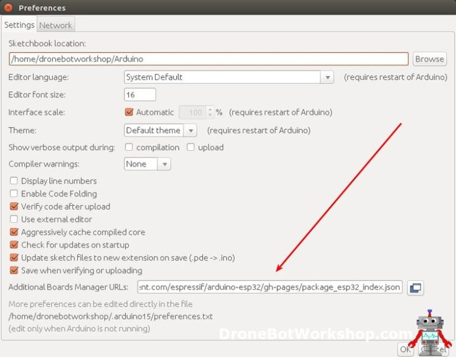
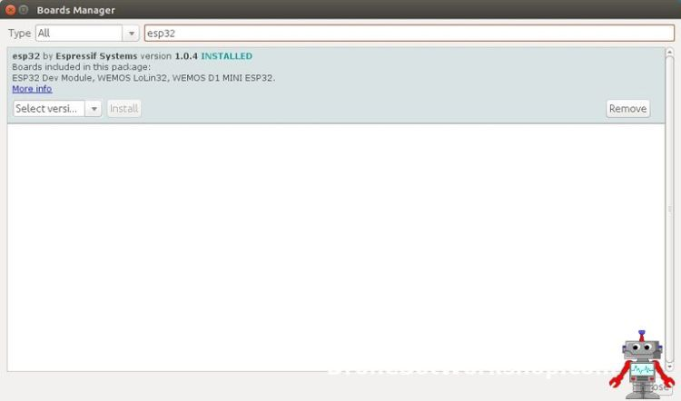
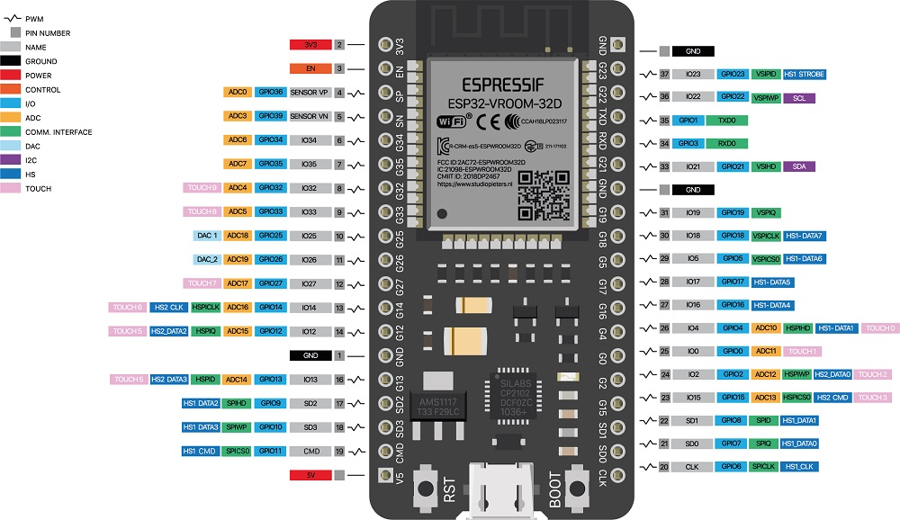
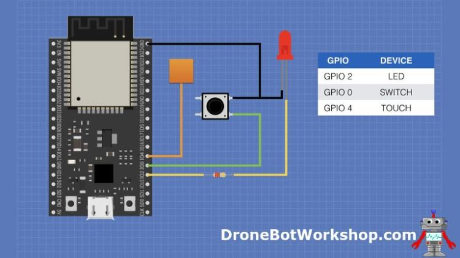
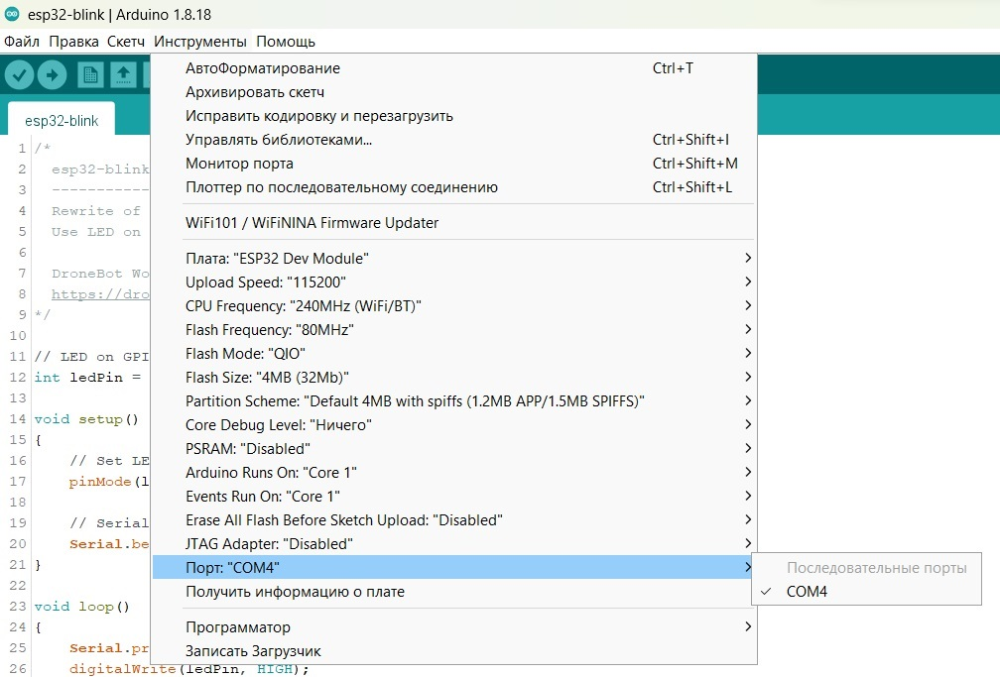

## [Мастерская DroneBot: Getting-started-with-ESP32](https://dronebotworkshop.com/esp32-intro/)

### Представляем ESP32

ESP32 представляет собой серию микроконтроллеров, производимых Espressif Systems в Шанхае. Это обновленная версия ESP8266, чипа, который “удивил” экспериментаторов в западном мире в 2014 году. Оригинальный ESP8266 был представлен на модуле под названием ESP-01, у которого было очень мало документации на английском языке, поэтому в то время его возможности были в значительной степени неизвестны. Как только документация была переведена на английский язык, многие экспериментаторы вскоре узнали о мощи ESP8266, и он быстро стал очень популярным.

ESP32 поддерживает как Bluetooth, так и BLE (Bluetooth с низким энергопотреблением), тогда как у ESP8266 есть только Wi-Fi (который, конечно же, есть и у ESP32). Он быстрее и доступен в двухъядерном исполнении. Он также способен работать в режиме сверхнизкого энергопотребления, что идеально подходит для приложений с батарейным питанием.

ESP32 включает:
```
До 18 12-разрядных аналого-цифровых преобразователей.
Два 8-разрядных цифроаналоговых преобразователя.
10 емкостных сенсорных переключателей.
Четыре канала SPI.
Два интерфейса I2C.
Два интерфейса I2S (для цифрового аудио).
Три интерфейса UART для связи.
До 8 каналов ИК-пульта дистанционного управления.
До 16 каналов светодиодной ШИМ (широтно-импульсной модуляции).
Встроенный датчик эффекта Холла.
Аналоговый предусилитель со сверхнизким энергопотреблением.
Внутренний регулятор низкого отключения.
```
***Обратите внимание, что многие контакты ESP32 совместно используют ряд вышеперечисленных функций, поэтому не все из них доступны одновременно.***

Основные технические характеристики модуля ESP32 представлены в следующей таблице:
```
Число ядер процессора	    2
Архитектура	                32 бита
Wi-Fi	                    есть
Bluetooth	                есть
RAM (ОЗУ)	                512 KB
FLASH	                    16 MB
Число контактов	            30-38 (в зависимости от модификации модуля)
Коммуникационные протоколы	SPI, IIC, I2S, UART, CAN
Каналы АЦП	                18
Разрешение АЦП	            12 бит
Каналы ЦАП	                2
Разрешение ЦАП	            8 бит
```

#### Назначение отдельных элементов ESP32:

***Micro-USB jack***: данный разъем используется для подключения модуля ESP32 к компьютеру с помощью USB кабеля. С его помощью можно программировать модуль с компьютера, а также осуществлять последовательную связь.

***Кнопка ENABLE***: это кнопка сброса модуля ESP32. Нажатие этой кнопки прекращает выполнение кода программы, которая запущена в модуле !!! (не во всех моделях).

***Кнопка BOOT***: эта кнопка используется для загрузки программы в модуль ESP32. Ее необходимо нажимать после нажатия кнопки загрузки программы в Arduino IDE.

***Когда эта кнопка нажата вместе с кнопкой EN (ENABLE), модуль переходит в режим загрузки прошивки (firmware). Не экспериментируйте с этим режимом если вы не понимаете суть происходящих при этом процессов***.

Светодиод красного цвета ***Red LED***: данный светодиод сигнализирует о том, что на модуль подано питание.

Светодиод синего цвета ***Blue LED***: данный светодиод подключен к контакту GPIO модуля. Его можно включать/выключать в программе. 

Контакты ввода/вывода ***I/O pins***: данные контакты могут выполнять функции цифрового ввода/вывода, аналогового ввода/вывода, ШИМ (PWM), IIC, SPI, ЦАП (DAC) и многое. Более подробно про назначение данных контактов вы можете прочитать в даташите на модуль ESP32.

[esp32_datasheet_en](esp32_datasheet_en.pdf)

### Начало работы в Arduino IDE

Чтобы иметь возможность работать с ESP32, вам нужно будет добавить дополнительный источник в Arduino IDE Board Manager, а затем установить платы ESP32. Компания Espressif предоставляет ссылку на файл JSON, который позаботится практически обо всем.
```
Откройте Arduino IDE. Убедитесь, что у вас установлена версия 1.8 или выше.
Нажмите на меню Файл в верхней строке меню.
Нажмите на пункт меню Настройки. Откроется диалоговое окно "Настройки".
Найдите текстовое поле с надписью “URL-адреса менеджера дополнительных плат”.
Если в этом поле уже есть текст, добавьте символ комы ('запятую') в конце, затем выполните следующий шаг.
Вставьте следующую ссылку в текстовое поле – 

https://raw.githubusercontent.com/espressif/arduino-esp32/gh-pages/package_esp32_index.json

или, как альтернативу -
https://dl.espressif.com/dl/package_esp32_index.json.

Нажмите кнопку OK, чтобы сохранить настройки.
```


Далее следует фактически добавить платы ESP32 в вашу Arduino IDE. Для этого выполните следующую процедуру:
```
В Arduino IDE нажмите на меню "Инструменты" в верхней строке меню.
Прокрутите вниз до записи "Плата:" (т.е. Плата: Arduino / Genuino Uno).
Подменю откроется, когда вы выделите запись "Плата:".
В верхней части подменю находится "Диспетчер плат". Щелкните по нему, чтобы открыть диалоговое окно "Диспетчер плат".
В поле поиска в диспетчере плат введите “esp32”.
Вы должны увидеть запись “esp32 от Espressif Systems”. Выделите эту запись и нажмите на кнопку Установить.
Это позволит установить платы ESP32 в вашу Arduino IDE
```


Если вы вернетесь в подменю Платы:, теперь вы должны увидеть несколько плат ESP32. Вам нужно будет выбрать плату, которая соответствует (или эквивалентна) приобретенной вами плате ESP32.



### Подключение для экспериментов

На следующей схеме показаны соединения, которые нам понадобятся для выполнения всех экспериментов и демонстраций, включенных в эту статью. Обратите внимание, что контакты ESP32 указаны по их названиям GPIO, а не по номерам контактов, поскольку разные платы ESP32 будут иметь разные номера контактов.



Вы можете использовать практически любой светодиод, для понижающего сопротивления подойдут любые значения от 150 до 470 Ом. 

Достаточно любой кнопки с мгновенным контактом.

Маленький золотой квадратик на схеме - это сенсорная панель. Вы можете использовать любой металлический предмет, к которому можно подключить провод, небольшой кусок печатной платы подойдет отлично. Я просто использовал небольшой кусок оголенного провода на своей макетной плате.

#### [Hello World – Blink для ESP32](esp32-blink/esp32-blink.ino)

Это классический скетч Arduino Blink, переписанный для модуля ESP32. Вместо а 13 цифрового вывода 13 Arduino используется вывод GPIO 2. 



Особенности загрузка программы: при работе с платами Arduino после подключения скетча в Arduino IDE вы просто нужимаете кнопку "Загрузить" после чего происходит компиляция кода, а затем он переносится на плату.

Для ESP32 требуется дополнительный шаг. Вы начинаете с того, что делаете точно то же самое, что и с Arduino – нажимаете кнопку "Загрузить" (ту, что со стрелкой вправо). После чего запускается компилятор (следует заметить, что компиляция программ для ESP32 занимает больше времени, чем для Arduino.

Посмотрите на строки в нижней части экрана, которые показывают текущее состояние процессов, происходящих в Arduino IDE. По завершении компиляции будет напечатано “Подключение”, затем последует строка точек, IDE будет ждать подключения контроллера, а, именно, нажатия кнопки "Загрузка".

Когда вы увидите это, вам нужно будет нажать кнопку "Загрузка" (BOOT, иногда с надписью IO0) и удерживать ее нажатой, пока не увидите ход загрузки, о чем вы узнаете, когда увидите прогресс загрузки, отображаемый в процентах.

После загрузки программы вам нужно будет нажать кнопку "Сброс" (ENABLE или RESET, чтобы запустить ее - для некоторых плат этот шаг не требуется).

#### Использование Wi-Fi

ESP32 поддерживает Wi-Fi в диапазоне 2,4 ГГц. Он поддерживает протоколы Wi-Fi 802.11 b / g / n с максимальной скоростью передачи данных 150 Мбит /с.

Устройство имеет регулируемую мощность передачи до 20,5 дБм, использование меньшей мощности снизит требования к току, поскольку WiFi-радио может потреблять значительное количество тока.

Расширенной функцией ESP32 WiFi является ”разнесение антенн". Это позволяет использовать некоторые выводы GPIO для управления внешним радиочастотным переключателем, подключенным к нескольким антеннам, а затем переключать WiFi-радио на наиболее подходящую антенну (и менять ее при изменении условий передачи сигнала).

***ESP32 можно использовать в двух разных режимах Wi-Fi: режим станции (STA), режим программируемой точки доступа (AP).***

В режиме станции (STA) ESP32 действует как станция Wi-Fi или клиент. В этом режиме ESP32 необходимо знать SSID и пароль для доступа к сети WiFi (в незащищенной сети пароль не требуется).

ESP32 предоставляется сетевой IP-адрес с помощью внутреннего DHCP-сервера маршрутизатора. Затем по этому адресу можно получить доступ к нашему контроллеру. Также возможно назначить ESP32 фиксированный IP-адрес, что полезно, если вы используете его в качестве веб-сервера, где изменение IP-адреса может вызвать трудности для других клиентов.

В режиме программируемой точки доступа (AP) ESP32 обеспечивает подключение Wi-Fi для внешних устройств. Этими устройствами могут быть компьютеры, телефоны, планшеты, устройства интернета вещей или даже другие ESP32, настроенные в режиме STA.

ESP32 может поддерживать максимум пять внешних устройств в режиме точки доступа. У него IP-адрес по умолчанию ***192.168.4.1***, и он будет предоставлять услуги DHCP для подключенных извне устройств. IP-адрес по умолчанию может быть изменен, если он конфликтует с существующими устройствами.

Это позволяет ESP32 создавать свою собственную IP-сеть, независимую от любых существующих сетей WiFi. Вы можете защитить сеть паролем и выбрать SSID (сетевое имя).

Кстати, это называется “программной” точкой доступа, поскольку ESP32 не обеспечивает проводного подключения к Интернету или другим существующим сетям.

#### Сканер Wi-Fi

Программа сканирует локальные сети Wi-Fi. Затем она выводит результаты на последовательный монитор. Результаты включают SSID сети (имя), уровень сигнала в дБм и индикатор того, защищена ли сеть.

> 2024-02-03. После запуска программы сканирования WiFi-сети (а затем при создании точки доступа) на ESP32-S при подключении платы по USB и одновременном использовании кабеля USB для последовательного обмена с монитором на компьютере возникало сообщение ***"Brownout detector was triggered"*** ***[Сработал детектор аварийного отключения]*** и сканер не запускался, выдавая ошибки.

> После подключения внешнего питания к схеме сообщение было устранено и схема заработала, как от неё требовалось.