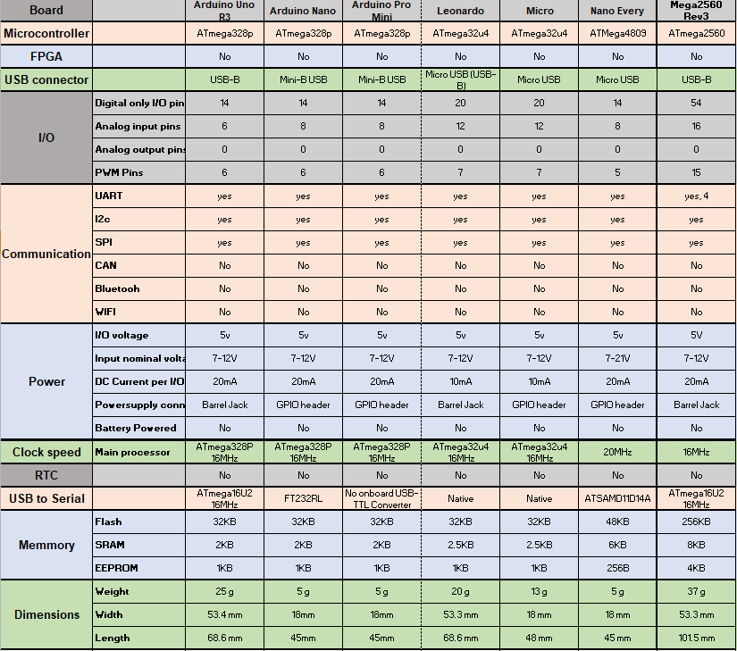
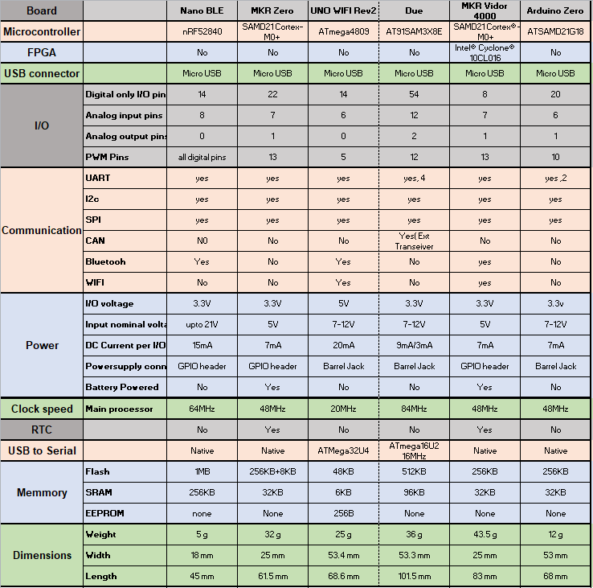
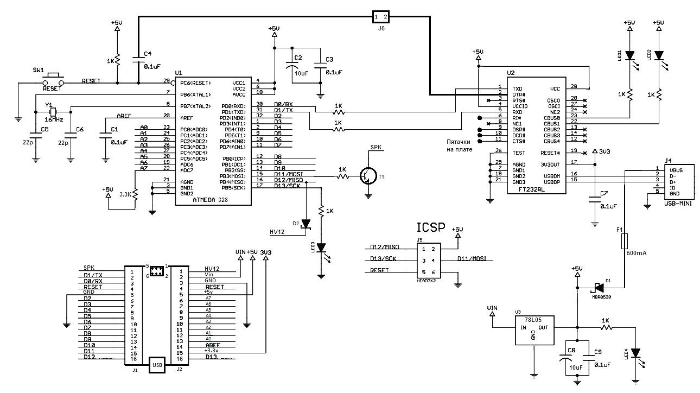

### [Сравнительные данные плат Arduino](https://arduinoplus.ru/arduino-vse-plati-sravnitelnaya-tablica/)

```
Arduino             Uno Rev 3      Leonardo	
Контроллер          ATmega328P     ATmega32u4	
Рабочее напряжение	5V	           5V	
Вх.напряж.рек/огр.	7-12V/6-20V    7-12V/6-20V
Цифровые(I/O)пины	14,4-PWM(Out)  20	
PWM Цифровые (I/O) 	6	           7
Аналоговые пины	    6              12
Постоянный ток-пин  20 mA          40 mA
Пост.ток 3.3V пин   50 mA          50 mA	
Флэш-память	        32K-.5K loader 32K-4K loader
SRAM                2K             2.5K
EEPROM              1K             1K	
Тактовая частота    16 MHz         16 MHz	
LED встроенные	    13             13
Длина	            68.6 mm        68.6 mm	
Ширина              53.4 mm	       53.3 mm
Вес	                25 g	       20 g	
```

### Платы Arduino для начинающих



### Платы Arduino с улучшенными возможностями



### [Arduino Nano](https://3d-diy.ru/blog/arduino-nano/)

#### [Arduino Nano v3.0 на процессоре ATMEGA328P](https://supereyes.ru/img/instructions/arduino_nano_v3.pdf)

#### [Arduino Nano: распиновка, схема подключения и программирование](https://wiki.amperka.ru/продукты:arduino-nano)

#### [ARDUINO NANO. Распиновка](https://enjoy-robotics.ru/arduino-nano)

#### [Питание Arduino поделок и не только. Часть 1](https://dzen.ru/a/YlUJ4ZQ47CXgK3v4)

#### [Какое питание подавать arduino nano](#)

Arduino Nano можно запитать несколькими способами, в зависимости от условий использования и требований к питанию. 



***Через USB***

Самый распространённый способ — подключение через USB-кабель к компьютеру, пауэрбанку или адаптеру питания. В этом случае на плату подаётся напряжение 5 В. Максимальный ток — до 500 мА. 

Важно: при подключении через USB на плате активируется микросхема FTDI FT232R, которая обеспечивает работу USB-интерфейса. При этом выход 3,3 В (формируемый этой микросхемой) активен только при питании через USB. Если плата питается от внешнего источника, выход 3,3 В может быть неактивен, что может привести к мерцанию светодиодов RX и TX при наличии высокого уровня сигнала на выводах 0 и 1. 

***Через вывод VIN***

Для внешнего питания используется вывод VIN. Рекомендуемое напряжение —  7–12 В, предельное —  6–20 В. В этом случае встроенный стабилизатор понижает входное напряжение до необходимых 5 В. 

Если одновременно подключены два источника питания, плата выберет тот, у которого потенциал выше.

При выборе величины напряжения питания входа VIN следует учитывать, что стабилизатор линейный — напряжение выше 5 В будет превращаться в тепло.
На входе стабилизатора нет конденсаторов и защит, поэтому при подаче внешнего питания рекомендуется использовать конденсаторы (электролит для сглаживания низкочастотных пульсаций и керамику для высокочастотных). Рабочее напряжение этих конденсаторов должно быть выше подаваемого примерно в 2 раза.

***Через вывод 5V***

Можно подавать стабилизированное напряжение 5 В напрямую на вывод 5V, но только при условии, что источник питания стабилен. Важно: не рекомендуется питать устройство через этот вывод, если есть риск обхода встроенной защиты от перенапряжения. 

Запрещено подавать напряжение 12 В или выше напрямую на пин 5 В — это может повредить плату. 

***Дополнительные рекомендации***

Не стоит питать мощные потребители (серводвигатели, адресные светодиодные ленты, моторы и т. п.) от встроенного стабилизатора — это может привести к выходу платы из строя. 

Для питания тяжёлых устройств (модульных дисплеев, радиомодулей) лучше использовать внешний источник, а не вывод 3,3 В. 

При использовании аналоговых датчиков рекомендуется стабилизировать питание с помощью внешнего линейного регулятора (например, типа AMS1117) и конденсаторов. 

Для управления сервоприводами и реле используйте внешний источник питания через транзистор или модуль питания. 

Перед подачей внешнего питания всегда проверяйте, не подключён ли в этот момент кабель USB.

### [Arduino Nano 33 BLE Sense](https://docs.arduino.cc/hardware/nano-33-ble-sense)

Arduino Nano 33 BLE Sense сочетает в себе крошечный форм-фактор, различные датчики окружающей среды и возможность запуска искусственного интеллекта с использованием TinyML и TensorFlow ™ Lite. Независимо от того, планируете ли вы создать свое первое встроенное ML-приложение или хотите использовать Bluetooth® для подключения вашего проекта к телефону с низким энергопотреблением, Nano 33 BLE Sense обеспечит это.

