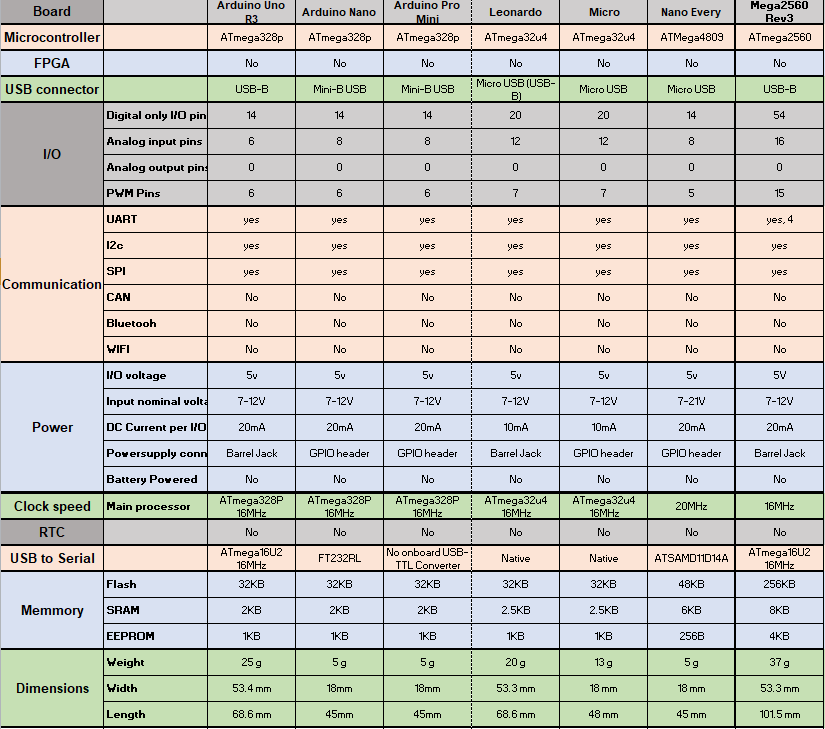
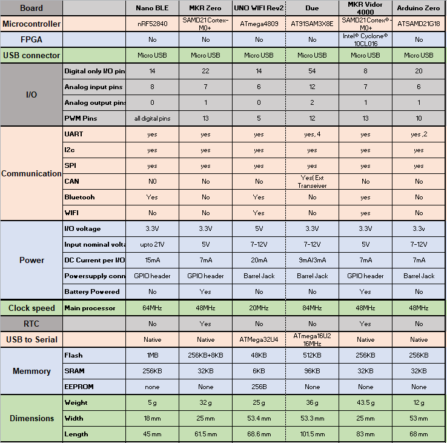

### [Сравнительные данные плат Arduino](https://arduinoplus.ru/arduino-vse-plati-sravnitelnaya-tablica/)

```
Arduino             Uno Rev 3      Leonardo	
Контроллер          ATmega328P     ATmega32u4	
Рабочее напряжение	5V	           5V	
Вх.напряж.рек/огр.	7-12V/6-20V    7-12V/6-20V
Цифровые(I/O)пины	14,4-PWM(Out)  20	
PWM Цифровые (I/O) 	6	           7
Аналоговые пины	    6              12
Постоянный ток-пин  20 mA          40 mA
Пост.ток 3.3V пин   50 mA          50 mA	
Флэш-память	        32K-.5K loader 32K-4K loader
SRAM                2K             2.5K
EEPROM              1K             1K	
Тактовая частота    16 MHz         16 MHz	
LED встроенные	    13             13
Длина	            68.6 mm        68.6 mm	
Ширина              53.4 mm	       53.3 mm
Вес	                25 g	       20 g	
```

#### Платы Arduino для начинающих



#### Платы Arduino с улучшенными возможностями



#### [Arduino Nano 33 BLE Sense](https://docs.arduino.cc/hardware/nano-33-ble-sense)

Arduino Nano 33 BLE Sense сочетает в себе крошечный форм-фактор, различные датчики окружающей среды и возможность запуска искусственного интеллекта с использованием TinyML и TensorFlow ™ Lite. Независимо от того, планируете ли вы создать свое первое встроенное ML-приложение или хотите использовать Bluetooth® для подключения вашего проекта к телефону с низким энергопотреблением, Nano 33 BLE Sense обеспечит это.

