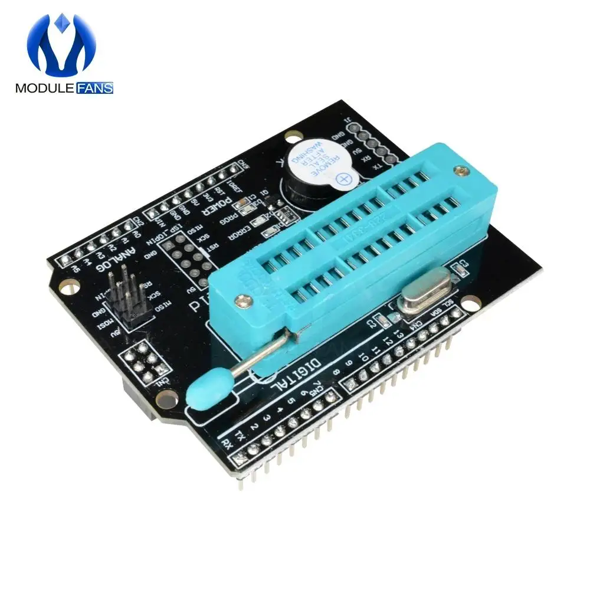
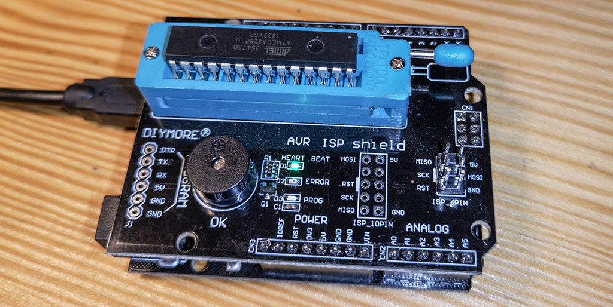

### [Программируемый модуль расширения AVR ISP для Arduino R3 Mega2560 Atmega328P Nano Pro Mini](https://aliexpress.ru/item/32888710207.html?spm=a2g2w.orderdetail.0.0.3eee4aa6EI6xHF&sku_id=65633499455)



Это плата расширения для программатора, который позволяет вашей плате Arduino UNO изменять биты предохранителей и записывать загрузчик во внешний чип и другие платы Arduino.

Встроенный зуммер и светодиодные индикаторы, указывающие, прошла ли прошивка успешно. Дизайнерам плат Arduino позволяет удобно построить пакетную прошивку.
 
Особенности:
 
``` 
Совместимость: поскольку он использует контакты SPI интерфейса ICSP,
совместимые с Arduino UNO R3/Arduino Mega2560, может переключаться на прошивку загрузчика, когда он напрямую подключен к двум платам.

Рабочее напряжение: 5 В
Рабочий ток: 500 мА (макс.)

Для записываемой платы Arduino: Поддержка Arduino UNO R3 / Mega2560 / Nano/Pro Mini (5V 16M)

Встроенный зуммер, если бит предохранителя успешно изменен, он прозвучит один раз, а затем, если горящий загрузчик в порядке, он прозвучит еще раз. 
Если не два звуковых сигнала, горение не удается. Вы можете захватывать звук вместо светодиодных фонарей, так что это повысит эффективность горения.

Встроенные светодиодные индикаторы, светодиод HEART BEAT загорается как дыхательный свет при нормальном питании. Во время программирования индикатор PROG мигает, пока не закончится. Если программирование не удалось, загорится индикатор ОШИБКА (красный).

Встроенный замок 28P для записи загрузчика Atmega328P, Atmega168P, Atmega8
Встроенный интерфейс ISP _ 6PIN, для записи внешнего загрузчика платы Arduino
Встроенный интерфейс ISP_10PIN
Встроенный интерфейс программатора FT232RL и CH340G USB-TTL для загрузки кода на чип на запирающем сиденье 28P.
```

### [Прошивка AVR (ATMEGA328) различными программаторами (в том числе и из-под Arduino)](https://blog.kvv213.com/2019/08/proshivka-avr-atmega328-razlichnymi-programmatorami-v-tom-chisle-i-iz-pod-arduino/)

#### Прошиваем AVR при помощи Arduino AVP ISP Shield от DIYMORE



Шилд от DIY More, пожалуй, самый интересный образчик сегодняшнего обзора. Не секрет, что в ISP программатор можно превратить любую плату Arduino (и даже обычный микроконтроллер ATmega328). Все дело в том, что для того, чтобы стать программатором ISP, нужно иметь цифровые выходы, которые можно превратить в выходы ISP: MISO, SCK, RST, MOSI. На всех оригинальных и не очень, платах Arduino Uno (и многих других) вообще специально разведен ISP 6-пин коннектор. Через него можно запрограммировать сам микроконтроллер на плате.

Плата устанавливается как плата расширения на Arduino Uno. Чтобы воспользоваться AVR ISP shield сперва в Arduino-носитель нужно закачать скетч ArduinoISP. Скетч входит в стандартную поставку Arduino IDE и располагается в примерах. Залить скетч можно как обычным способом, через загрузчик (по USB), так и через ISP на плате Arduino при помощи одного из вышеописанных программаторов ISP. Напомню, что если загружать скетч из Arduino IDE посредством ***Upload using programmer***, то скетч загрузится в плату без загрузчика. И для того, чтобы им потом плату можно было прошивать по USB придется отдельно загрузить в нее загрузчик. Данная операция осуществляется в том числе и через Arduino IDE (***Burn bootloader***), разумеется, с использованием ISP программатора. Однако, если скомпилировать скетч через Export compiled Binary, то можно загрузить через ISP-программатор и AVRDUDESS (или просто AVRDUDE) прошивку вместе с загрузчиком.

> 
Еще одна особенность AVR ISP Shield. На ней, как и на плате Arduino Uno присутствует вывод ISP 6-пин. И если установить плату AVR ISP Shield на Arduino Uno, то задаешься вопросом — к какому микроконтроллеру дает доступ этот разъем? К тому, что установлен в колодку или к тому, что стоит в Arduino? Ответ находится очень просто — экспериментом. Разъем на AVR ISP Shield дает доступ только к микроконтроллеру, что установлен на колодке. Запрограммировать плату Arduino-носитель через шилд не выйдет. Нужно его снять и подключиться к разъему ISP самой платы Arduino. С другой стороны, AVR ISP Shield можно использовать вообще без Arduino-носителя (Uno), просто подключив 6-ти пиновый разъем к ISP-программатору (не забыв про питание). Точно так же можно подключить и USB2TTL, дабы получать вывод с Serial.

Пробрасывает ли AVR ISP Shield вывод в последовательный порт на плату носитель с установленной ArduinoISP? Нет, такой функции не предусмотрено, хотя ее ничто не мешает реализовать. Ну почти ничего. Во-первых, необходимо физически соединить выводы с колодки на AVR ISP Shield к необходимым pin-ам, а затем произвести проброску чтения с этих пинов в скетче ArduinoISP с выводом их в стандартный Serial. Текущие версии фреймворка Arduino позволяют провернуть подобную операцию. Связь будет односторонней, только с микроконтроллера на плате и в порт носителя, но тем не менее, подобный подход позволит в одном устройстве соединить сразу две функции. Что, согласитесь, удобно.