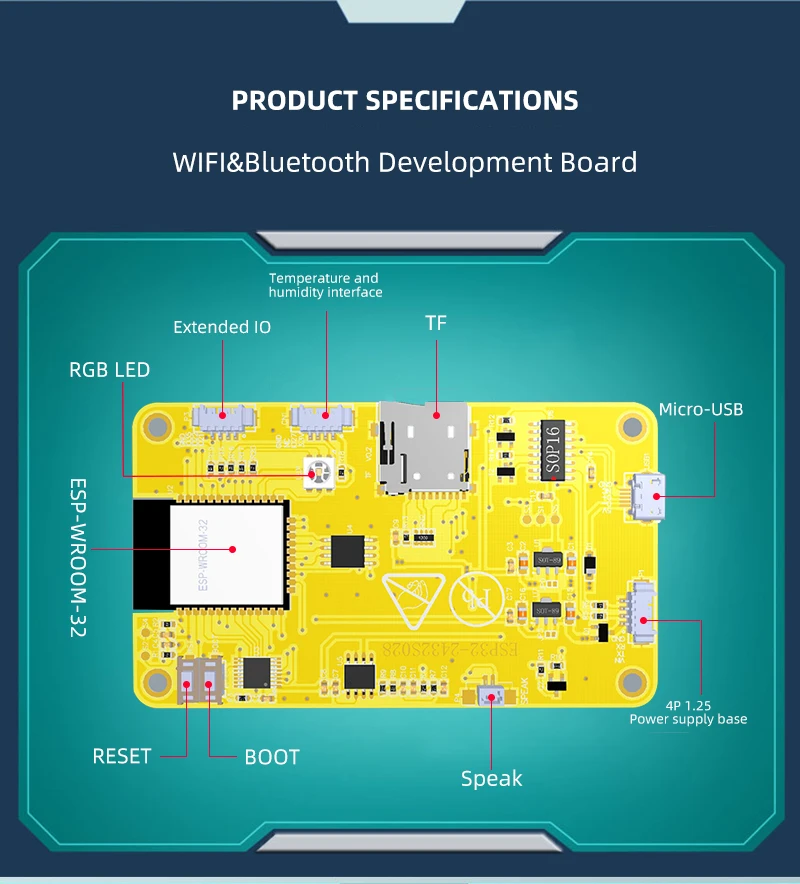
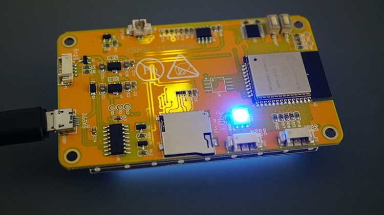
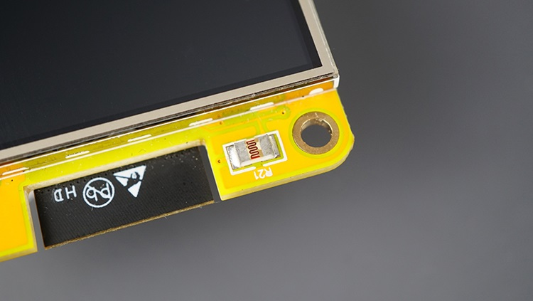
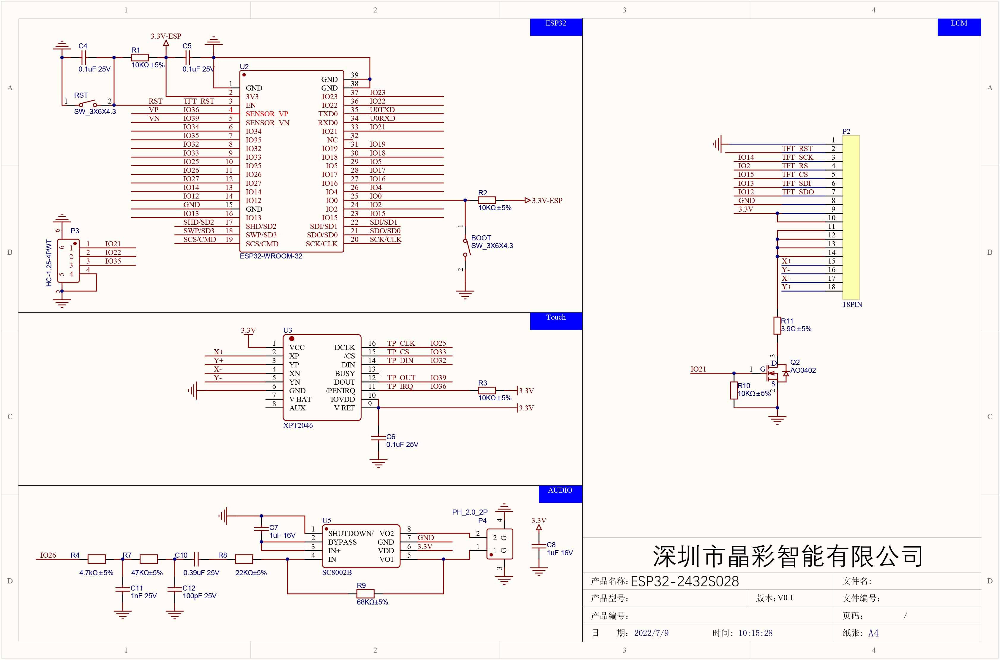
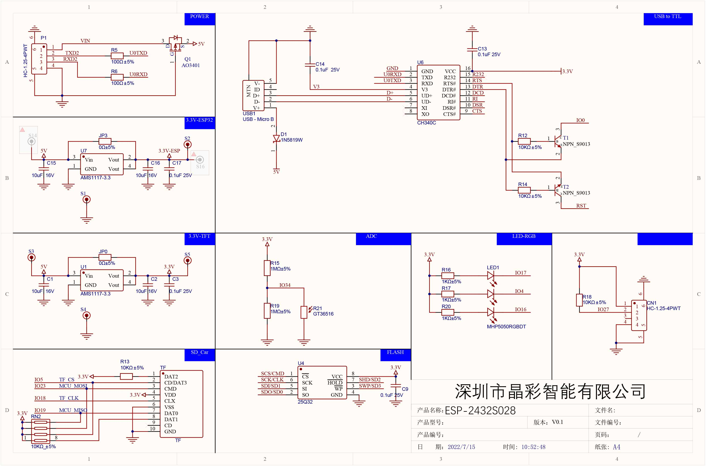
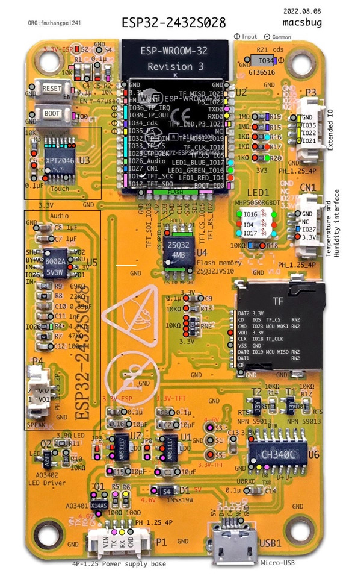

## [ESP32-2432S028R](http://electriccircuits.org/index-619.html)

> ***ESP32 Cheap Yellow Display (CYD) - Дешевый желтый дисплей ESP32 (CYD)***



---

#### [Распиновка дешевого желтого дисплея ESP32 (CYD)](#rui-sara-santos1)

#### [Кнопка включения / выключения сенсорного экрана ESP32 (CYD)](#rui-sara-santos2)

#### [LVGL с дешевым Желтым дисплеем ESP32](#rui-sara-santos3)

#### [Getting Started with ESP32-2432S028R](#rui-sara-santos4)

#### [Шpифты](#%D1%88%D1%80%D0%B8%D1%84%D1%82%D1%8B)

#### [Eщё](#%D0%B5%D1%89%D1%91)


---

###### Rui-Sara Santos1

### [Распиновка дешевого желтого дисплея ESP32 (CYD)](http://electriccircuits.org/index-619.html)


Плата для разработки ESP32-2432S028R стала известна в сообществе разработчиков как «дешевый желтый дисплей» или сокращенно CYD. Эта плата для разработки, основным чипом которой является модуль ESP32-WROOM-32, оснащена

- 2,8-дюймовым сенсорным TFT-дисплеем
- интерфейсом для карты microSD
- RGB-светодиодом
- встроенным LDR (светозависимым резистором)
- всеми необходимыми схемами для программирования и подачи питания на плату.
 
 Она гораздо удобнее и практичнее, чем отдельная плата ESP32 с TFT-экраном.

#### Выводы дисплея

TFT-дисплей взаимодействует с платой по протоколу SPI (HSPI). 

> ***В наших руководствах мы используем следующее назначение контактов для TFT-дисплея (настраивается в User_Setup.h библиотеки TFT_eSPI).***

```
Контакт SPI	        GPIO
---------------     -------
MISO (TFT_MISO)	    GPIO 12
MOSI (TFT_MOSI)	    GPIO 13
SCKL (TFT_SCLK)	    GPIO 14
CS   (TFT_CS)       GPIO 15
DC   (TFT_DC)	    GPIO 2
RST  (TFT_RST)	    -1
Контакт подсветки	GPIO 21
```

#### Контакты сенсорного экрана

Сенсорный экран также использует протокол SPI для связи с ESP32. Это контакты VSPI для сенсорного экрана:

```
Контакт SPI	        GPIO
------------------- -------
IRQ  (XPT2046_IRQ)	GPIO 36
MOSI (XPT2046_MOSI)	GPIO 32
MISO (XPT2046_MISO)	GPIO 39
CLK  (XPT2046_CLK)	GPIO 25
CS   (XPT2046_CS)	GPIO 33
```
 
#### RGB-светодиод

На задней панели платы расположен RGB-светодиод, который может пригодиться для отладки. 


 
 Вот распиновка RGB-светодиода:
 
 ```
RGB-светодиод	    GPIO
Красный светодиод	GPIO 4
Зеленый светодиод	GPIO 16
Синий светодиод	    GPIO 17
```

Важно: RGB-светодиоды работают с инвертированной логикой, так как активны при низком уровне сигнала. Это означает, что если вы настроите их на ВЫКЛ = ВЫСОКИЙ уровень сигнала, а ВКЛ = НИЗКИЙ уровень сигнала, то они будут работать.
 
 #### Контакты для карт microSD
 
Дешевая карта памяти microSD с желтым дисплеем ESP32
Карта microSD использует протокол связи SPI. Для этого используются контакты VSPI ESP32 по умолчанию:

```
SPI карты microSD	GPIO
-----------------   -------
MISO	            GPIO 19
MOSI	            GPIO 23
SCK	                GPIO 18
CS	                GPIO 5
```

#### LDR (светозависимый резистор) - датчик освещенности



На передней панели платы, рядом с дисплеем, расположен фоторезистор. Фоторезистор подключен к **GPIO 34**.

#### Динамик

Для подключения динамика предусмотрен разъем JST 2P 1,25 мм. Он управляется с помощью **GPIO 26**.

#### Кнопки BOOT и RST

На плате есть кнопка BOOT, которая подключена к **GPIO 0**, а также встроенная кнопка RST (RESET).

#### Расширенные входы/выходы

На плате есть два разъема расширенных GPIO, обозначенных P3 и CN1. В разъемах расширенных GPIO доступны 4 GPIO: GPIO 35, GPIO 22, GPIO 21 и GPIO 27, которые можно использовать для подключения периферийных устройств.

Расширенные входы и выходы P3

В разъеме P3 есть контакты GND и GPIO 35, GPIO 22 и GPIO 21.

Обратите внимание, что GPIO 22 также используется на разъеме CN1, а GPIO 21 — в качестве подсветки дисплея. Таким образом, пока включена подсветка, GPIO 21 будет активен.

Расширенные входы и выходы CN1

В разъеме CN1 есть контакты GND, GPIO 22, GPIO 27 и 3V3. Обратите внимание, что GPIO22 также доступен на разъеме P3.

Выводы на разъеме CN1 могут быть особенно полезны для подключения устройств I2C, поскольку у вас есть два доступных GPIO, которые можно использовать для линий шины I2C, а также выводы питания и заземления.

Если вы хотите использовать эти контакты для подключения датчиков I2C, вам нужно настроить пользовательские контакты I2C. Вы не можете использовать стандартные контакты SDA и SCL (GPIO 21 и GPIO 22), потому что GPIO 21 используется для подсветки).

#### Доступные контакты для подключения периферийных устройств

Итак, в общей сложности у вас есть три доступных контакта для подключения периферийных устройств:

```
GPIO 35 -  на разъеме P3
GPIO 22 -  на разъемах P3 и CN1
GPIO 27 -  на разъеме CN1
```

#### Разъем TX/RX

На разъеме также есть контакты TX/RX, обозначенные как P1. Они используются для последовательной связи и подключены напрямую к CH340 (преобразователю USB в последовательный порт).

GPIO 1 — TX
GPIO 3 — RX

###### [в начало](#esp32-2432s028r)

---

###### Rui-Sara Santos2

### [Кнопка включения / выключения сенсорного экрана ESP32 (CYD)](http://electriccircuits.org/index-618.html)

#### Необходимые условия

ESP32 взаимодействует с TFT-дисплеем и сенсорным экраном по протоколу SPI. Мы будем использовать библиотеки TFT_eSPI и XPT2046_Touchscreen. Чтобы правильно использовать библиотеку TFT_eSPI, вам понадобится файл конфигурации User_Setup.h с правильными определениями.

#### Код — сенсорный экран с кнопкой включения/выключения

С помощью следующего кода на TFT-дисплее будет отображаться кнопка включения/выключения для управления выходом. При нажатии на сенсорный экран пальцем или стилусом должен включаться/выключаться зеленый RGB-светодиод на задней панели платы.

Скопируйте ***[следующий код в Arduino IDE](ButtonOnOff/ButtonOnOff.ino)*** и загрузите его на свою плату.

#### Комментарии

##### Friedrich

1 мая 2024 года в 15:27
Привет,
может кто-нибудь объяснить,
как работает функция калибровки сенсорной карты.
x = map(p.x, 200, 3700, 1, SCREEN_WIDTH);
y = map(p.y, 240, 3800, 1, SCREEN_HEIGHT);
откуда взялись параметры 200,3700 / 240,3800
на моем CYD тачскрин работает не очень хорошо, даже кнопки маленькие.
с уважением, Фридрих

##### Рэй Лейтер

1 мая 2024 г. в 21:48
Полагаю, вы на самом деле спрашиваете, откуда взялись числа для x (200,3700) и y (240,3800). То есть как они были определены?
Кроме того, я полагаю, что на самом деле вы спрашиваете не о том, как работает функция map!
Если это так, то вот что я узнал:
Мое объяснение касается x, с y все аналогично.
Для начала нужно понять, что при касании экрана в программу возвращается аналоговое значение. Возвращаемое значение находится в диапазоне примерно от 120 до 3900. Я не знаю, почему значение находится в таком диапазоне, но мне кажется, что это похоже на подключение потенциометра к контакту и считывание его значения. Я полагаю, что значение зависит от количества бит разрешения, используемых в процессе цифро-аналогового преобразования на плате.
Итак, исходя из предложенного мной диапазона, все значения в этом диапазоне должны быть преобразованы в диапазон значений для координаты x, равный 320.
Другими словами, входные значения от 120 до 3900 должны быть преобразованы в значения от 0 или 1 до 320.
Если вы попытаетесь определить входные значения по аналоговому входу, результат может отличаться, но он будет близок к значениям, указанным в руководстве (200, 3700).
Я получил немного другие значения, когда запустил цикл и вывел значения x, перемещая стилус из крайнего левого угла дисплея в крайний правый. Приведенные значения (200,3700) являются очень точными. Еще один момент, который следует учитывать: даже если бы вы знали ТОЧНОЕ значение левой стороны, когда касаетесь стилусом крайнего левого угла дисплея, вы не смогли бы использовать это значение, потому что как можно гарантировать, что человек, использующий дисплей, действительно коснется именно этого места? Мы определяем приблизительные значения в тех местах, где пользователь может коснуться экрана стилусом, и используем эти значения.
Я изо всех сил старался коснуться стилусом КРАЙНЕГО левого угла экрана, а затем провести его до КРАЙНЕГО правого угла, но не смог добиться лучших результатов, чем те, что указаны в руководстве.
Итак, когда мы касаемся экрана, мы получаем аналоговые значения от 120 до 3700 для координаты «x», и эти значения необходимо преобразовать в пиксельные координаты дисплея, которые для координаты «x» составляют от 0 или 1 до 320.
Другой подход заключается в следующем: какая-то группа аналоговых входных значений должна представлять координату x для числа 1, следующая группа аналоговых значений — координату x для числа 2 и так далее. Я не знаю, что это за разбиение, но если это линейная зависимость, то, возможно, мы можем сказать, что, поскольку мы сопоставляем большой набор чисел с меньшим набором, наш целевой набор состоит из 320 значений, а исходный — из 3700. Итак, 3700 разделить на 320, получится примерно 11, то есть, возможно, каждые 11 аналоговых значений представляют одну координату x.
Таким образом, если вы коснетесь экрана в любом месте, где аналоговое значение будет равно 120–131 (120+11), то можете интерпретировать это как координату x, равную 1.
Надеюсь, я не слишком затянул ответ — просто мне показалось, что объяснение должно быть достаточно полным. Надеюсь, я не допустил серьезных ошибок в своем объяснении. Пожалуйста, дайте мне знать, если это так.
Рэй Лейтер

##### Crunchysteve

3 июня 2024 г. в 6:30
Привет Руи и Саре (и другим фанатам RNT)

У меня была проблема с платой ESP32-2432S028R: сторожевой таймер сбрасывал ее каждые несколько секунд. Оказывается (судя по информации в интернете), такая проблема возникает у некоторых людей с определенными платами.

Поэкспериментировав с несколькими настройками в меню инструментов, я обнаружил, что проблема исчезла, когда я выбрал «События запускаются на: “Ядре 0”» и «Arduino работает на: “Ядре 1”». Не знаю, правильное это решение или нет, но оно устранило неисправность, и теперь мой дисплей постоянно находится во включенном положении, пока я не выключу его, а не перезагружается постоянно.

Надеюсь, это поможет вашим читателям

##### Эдсон Куарежма

29 октября 2024 г. в 17:57
Мой скетч работает правильно, но у меня проблемы с цветами. Вместо красного — пурпурный. Вместо зеленого — голубой. Я протестировал два модуля ESP32 LVGL, и проблема осталась.

##### Sara Santos

29 октября 2024 г. в 21:44
Привет.
В таком случае вам может потребоваться раскомментировать
#define TFT_INVERSION_ON
в User_Setup.h

Дайте мне знать, если это решит проблему.

С уважением,
Сара

###### [в начало](#esp32-2432s028r)

---

###### Rui-Sara Santos3

### [LVGL с дешевым Желтым дисплеем ESP32](http://electriccircuits.org/index-616.html)

В этом руководстве вы начнете работу с LVGL (легкой и универсальной графической библиотекой) с ESP32 CYD (дешевым желтым дисплеем ESP32-2432S028R). LVGL — это популярная бесплатная встраиваемая графическая библиотека с открытым исходным кодом для создания потрясающих пользовательских интерфейсов для многих микроконтроллеров и дисплеев. Мы будем использовать плату для разработки ESP32 со встроенным сенсорным TFT-дисплеем.

Ниже приведен список более подробных технических характеристик этой платы для разработки:

```
Двухъядерный микроконтроллер со встроенными функциями Wi-Fi и Bluetooth
Частота может достигать 240 МГц
520 КБ ОЗУ, 448 КБ ПЗУ, объем флэш-памяти — 4 МБ
Размер модуля 50,0×86,0 мм
Рабочее напряжение: 5 В
Энергопотребление: около 115 мА
Вес изделия: около 50 г

В комплект входит:

2,8-дюймовый цветной TFT-дисплей с микросхемой драйвера ILI9341
Разрешение дисплея: 240x320 пикселей, резистивный сенсорный экран
Схема управления подсветкой
Интерфейс для TF-карты для внешнего хранения данных
Последовательный интерфейс
Интерфейс для датчика температуры и влажности (интерфейс DHT11)
Зарезервированный интерфейс порта ввода-вывода
Может программироваться с помощью Arduino IDE, MicroPython, ESP-IDF
```

#### Представляем LVGL (легкую и универсальную графическую библиотеку)

LVGL (Light and Versatile Graphics Library) — это бесплатная графическая библиотека с открытым исходным кодом, которая предоставляет широкий спектр простых в использовании графических элементов для проектов на микроконтроллерах, требующих графического пользовательского интерфейса (GUI).

Вот некоторые из его ключевых особенностей:

```
Блоки: кнопки, диаграммы, списки, ползунки, изображения и т.д.…
Улучшенная графика с анимацией, сглаживанием, непрозрачностью, плавной прокруткой;
Различные устройства ввода, такие как сенсорная панель, мышь, клавиатура, кодировщик и т. Д…
Поддержка нескольких языков в кодировке UTF-8;
Поддержка нескольких дисплеев, т. е. одновременное использование нескольких TFT-монохромных дисплеев;
Полностью настраиваемые графические элементы со стилями, подобными CSS;
Не зависит от оборудования: используется с любым микроконтроллером или дисплеем;
Масштабируемый: способен работать с небольшим объемом памяти (64 кБ флэш-памяти, 16 кБ ОЗУ);
Написан на C для максимальной совместимости (совместимый с C ++) и привязки к MicroPython.
```

> ***Переместите lv_conf.h в папку с библиотеками (НЕ перемещайте его в папку lvgl)***.


###### [в начало](#esp32-2432s028r)

---

###### Rui-Sara Santos4
 
### [Getting Started with ESP32-2432S028R](http://electriccircuits.org/index-615.html)

***[Отображение текста и тестирование сенсорного экрана](TestTouchscreen/TestTouchscreen.ino)***

###### [в начало](#esp32-2432s028r)

---

### [Шрифты](#)

#### [TFT_eSPI: работа с русским текстом](https://robotclass.ru/tutorials/russkij-tekst-tft_espi/)

##### [**Олег Евсегнеев**](https://robotclass.ru/tutorials/)

TFT_eSPI — самая лучшая библиотека для работы с дисплеями в среде Arduino IDE, на момент написания данной статьи. Она отличается высоким быстродействием и поддержкой множества популярных контроллеров TFT дисплеев.

1. ***Сначала подменим коллекцию символов GLCD***.

Cтандартный шрифт GLCD - это растровый шрифт с очень низким разрешением — всего 5*8 точек. Его целесообразно использовать только для вывода служебных сообщений и отладки. 

Символы шрифта хранятся в файле:

```
путь_к_библиотекам\Arduino\libraries\TFT_eSPI-master\Fonts\glcdfont.c
```

Заменяем этот файл на [русифицированный, за авторством Вячеслава Загайнова](https://download.robotclass.ru/Arduino/glcdfont.c). В отличие от оригинала, новый файл содержит как оригинальную таблицу ASCII так и блок кириллических символов таблицы UTF-8. Так что в коде программы просто пишем русский текст, и он будет выводиться на дисплей без всяких дополнительных ухищрений.

2. ***Затем, внесём небольшое изменение в код библиотеки***, а именно в файл TFT_eSPI.cpp. Нужно найти и удалить (или закомментировать) такую строку:

```
if (c > 255) return;
```

Это ограничение не даёт библиотеке извлекать из коллекции символы с кодом больше 255.

3. ***[Soulectro](#) нужно в файле TFT_eSPI.cpp закомментировать еще одну строчку***

```
if (!_cp437 && c > 175) c++;
```

тогда смещения на букву не будет.

Готово, теперь пишем первую программу.


#### [TFT_eSPI: русский текст TrueType](https://robotclass.ru/tutorials/tft_espi-russkij-tekst-truetype-ttf-otf/)


#### [Esp32 русский шрифт html](https://indeksstroy.ru/esp32-russkiy-shrift-html/)

###### [в начало](#esp32-2432s028r)

---

### [Ещё](#)

#### [HMI дисплей 240x320 с резистивным сенсором - ESP32-2432S028R](https://arduino-tex.ru/news/164/hmi-displei-s-rezistivnym-sensorom-na-esp32-28-dyuima.html?ysclid=mqvvaax9mu710294470)

В комплекте с дисплеем идёт стилус, который очень удобен для работы с резистивным сенсором. С помощью стилуса вы можете точно и удобно взаимодействовать с экраном, не оставляя на нём следов от пальцев. Что особенно полезно, если работать с мелкими элементами интерфейса.

Эта плата сделана крайне неудачно, свободные пины были потрачены на светодиод. Для чего - непонятно! Не разведена ни одна шина.





#### [Модуль ESP32-2432S028R с TFT-дисплеем 2,8" 240х320, резистивный сенсор](https://kulibin.su/catalog/radiodetali/esp32-esp8266/plata-lvgl-esp32-2432s028-s-tft-displeem-2-8-240kh320-wi-fi-bluetooth-esp-wroom-32.html?ysclid=mqvv4dnahp67492722)

```
ESP32  
FLASH: 4 МБ
PSRAM: НЕТ*

Слот для карты Micro-SD (SPI)
2,8-дюймовый TFT-дисплей 320x240 — ILI9341 (SPI)
Резистивная сенсорная панель - XPT2046 (SPI)
1 RGB-светодиод
1 USB-Micro  (CH340C)
Кнопки Load и Reset
Источник питания: 5 В/1 А
Разъем P3: GND — GPIO 35 — GPIO 22 — GPIO 21
Разъем CN1: GND — NC (или GPIO 22 на некоторых платах) — GPIO 27 — V3.3.
Разъём питания: VIN-TX-RX-GND

Pins

ESP Pin	GPIO	Description
--- ----------  ----------- 
1	GND	        Ground
2	VCC	        +3V3
3	EN	        RST/TFT_RST (Reset/LCD)
4	GPIO36	    SENSOR_VP / TP_IRQ (Touchscreen)
5	GPIO39	    SENSOR_VN / TP_OUT (Touchscreen)
6	GPIO34	    ADC
7	GPIO35	    Header P3 Pin 3
8	GPIO32	    TP_DIN (Touchscreen)
9	GPIO33	    TP_CS (Touchscreen)
10	GPIO25	    TP_CLK (Touchscreen)
11	GPIO26	    AUDIO IN-
12	GPIO27	    Header CN1 Pin 2
13	GPIO14	    TFT_SCK (TFT)
14	GPIO12	    TFT_SDO (TFT)
15	GND	        Ground
16	GPIO13	    TFT_SDI (TFT)
17	SHD/SD2	    HOLD (SPI Flash / PSRAM*)
18	SWP/SD3	    WP (SPI Flash / PSRAM*)
19	SCS/CMD	    CS (SPI Flash)
20	SCK/CLK	    SCK (SPI Flash)
21	SDO/SD0	   SO (SPI Flash / PSRAM*)
22	SDI/SD1     SI (SPI Flash / PSRAM*)
23	GPIO15      TFT_CS (TFT)
24	GPIO02      TFT_RS (TFT)
25	GPIO0	        BOOT_SW
26	GPIO04      LED_RGB
27	GPIO16      LED_RGB (PSRAM_CS*)
28	GPIO17	LED_RGB (PSRAM_SCK*)
29	GPIO05	TF_CS (SD Card)
30	GPIO18	TF_CLK (SD Card)
31	GPIO19	MCU_MISO (SD Card)
32	NC	NA
33	GPIO21	TFT_BL (TFT) / Header P3 Pin 1
34	RXD0	RXD2 Header P1 Pin 3
35	TXD0	TXD2 Header P1 Pin 2
36	GPIO22	Header P3 Pin 2 (also Header CN1 Pin 3 on some boards)
37	GPIO23	MCU_MOSI (SD Card)
38	GND	Ground
39	GND	Ground
```




#### [chanslor ESP32-2432S028R](https://github.com/chanslor/ESP32-2432S028R?ysclid=mqw030nz5a344036717)

работает!

#### [ESP-WROOM-32 - Configuring Arduino IDE](https://github.com/anandsummer28/ESP-WROOM-32-Doc)

###### [в начало](#esp32-2432s028r)
