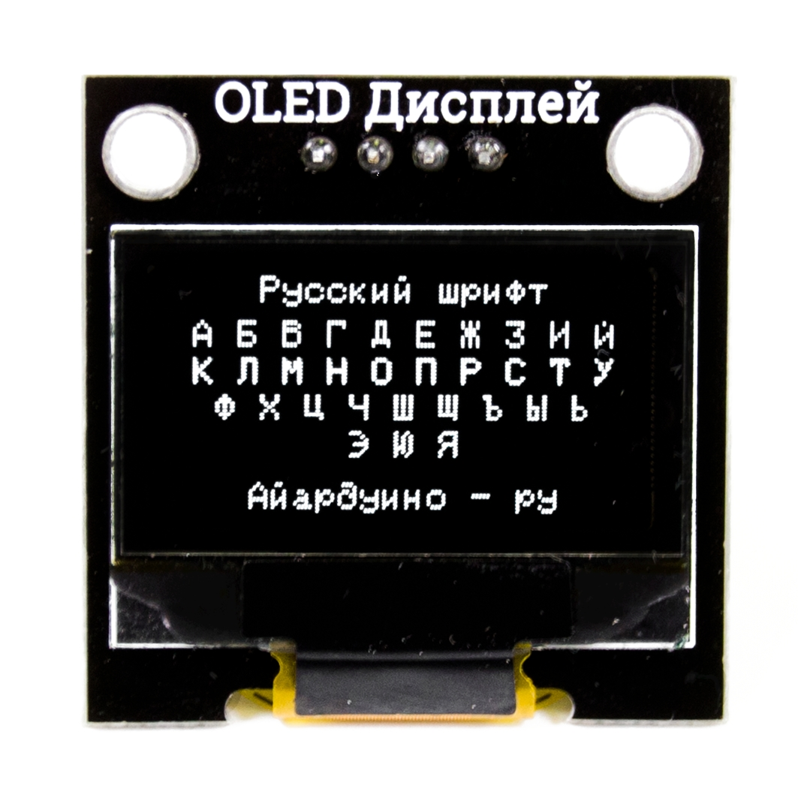

### DISPLAYS, OLED и другие дисплеи

#### Содержание

#### [OledTrema - OLED экран 128x64/0.96" trema модуль V2.0](#oledtrema)

#### [ЖК-дисплей 1602A LCD с конвертером в IIC/I2C](zhk-displej-1602a-lcd-s-konverterom-v-iici2c/zhk-displej-1602a-lcd-s-konverterom-v-iici2c.md)

#### [HMI дисплей 240x320 с резистивным сенсором - ESP32-2432S028R](hmi-displej-240x320-s-rezistivnym-sensorom-esp32-2432s028r/hmi-displej-240x320-s-rezistivnym-sensorom-esp32-2432s028r.md)

---

#### OledTrema
#### [OLED экран 128×64 / 0,96” (Trema-модуль V2.0)](https://wiki.iarduino.ru/page/OLED_trema/)

#### Общие сведения:

Trema-модуль OLED-дисплей (128x64) - это графический дисплей, каждый пиксель которого является отдельным OLED (organic light-emitting diode) светодиодом. В отличии от TFT (Thin-Film Transistor), LCD (ЖК) и других дисплеев, этот дисплей не нуждается в подсветке, каждый пиксель светится самостоятельно, а не затемняет свет подсветки. Благодаря этому черный цвет - действительно чёрный (выключенный светодиод не светится в темноте), а белый цвет - действительно белый (не проходит через слой жидких кристаллов или тонкоплёночных транзисторов).

Использование органических светодиодов позволило достичь угла обзора более 160° и значительно снизить энергопотребление. Так же стоит отметить высокую контрастность (что повышает удобочитаемость текста и изображений), и небольшие размеры дисплея, всего 0.96 дюйма. Всё это, в сочетании с удобством и функциональностью, позволяет сказать что OLED-дисплей (128x64) один из лучших.

Логические уровни шины I2C не должны превышать напряжение питания. В комплекте имеется кабель для быстрого и удобного подключения модуля к колодке I2C на Trema Shield.

```
Адрес дисплея на шине I2C выбирается переключателем на обратной стороне платы, 

что позволяет подключить два дисплея к одной шине I2C. 
```
Для работы во Fritzing подготовлен файл [OLED128x64Trema.svg](OLED128x64Trema/OLED128x64Trema.svg).

#### Характеристики:

```
Тип дисплея: графический, OLED (organic light-emitting diode) на основе органических светодиодов.
Тип драйвера матрицы: SSD1306.
Разрешение: 128 x 64 точек.
Цвет пикселей (светодиодов): белый.
Количество цветов: белый и черный (монохромный).
Угол обзора: > 160°.
Коэффициент контрастности: 10000:1.
Яркость: >120 кд/м2.
Напряжение питания: 3,3 ... 5 В.
Энергопотребление: до 80 мВт (при свечении всего экрана);
Интерфейс: I2C (поддерживается Arduino, WeMos, STM32, MSP430 и множеством других микроконтроллеров, и отладочных плат).
Адрес на шине I2C: 0x3C или 0x3D выбирается переключателем.
Время отклика < 10 мкс.
Рабочая температура: -40 ... 85 °С.
Габариты: 30x30 мм.
```



Для работы с Trema OLED дисплеями, разработаны две библиотеки: [iarduino_OLED (графическая)](https://iarduino.ru/file/340.html) и iarduino_OLED_txt (текстовая). Обе библиотеки позволяют указывать адрес дисплея на шине I2C. В обеих библиотеках присутствуют шрифты с поддержкой русского языка.

Графическая библиотека iarduino_OLED представлена в двух версиях: [версия 1.2.0 от 25.11.2022](OLED128x64Trema/iarduino_OLED-1.2.0/README.md) и [версия 1.1.0 от 27.08.2019](OLED128x64Trema/iarduino_OLED-1.1.0/README.md).

Текстовая библиотека iarduino_OLED_txt также представлена в двух версиях: [версия 1.2.0 от 25.11.2022](OLED128x64Trema/iarduino_OLED_txt-1.2.0/README.md) и [версия 1.1.0 от 27.08.2019](OLED128x64Trema/iarduino_OLED_txt-1.1.0/README.md).


###### [к содержанию](#%D1%81%D0%BE%D0%B4%D0%B5%D1%80%D0%B6%D0%B0%D0%BD%D0%B8%D0%B5)

###### [ByHeart](../README.md)

---

1

2

3

4

5

6

7

8

9

10

11

12


###### [к содержанию](#%D1%81%D0%BE%D0%B4%D0%B5%D1%80%D0%B6%D0%B0%D0%BD%D0%B8%D0%B5)
