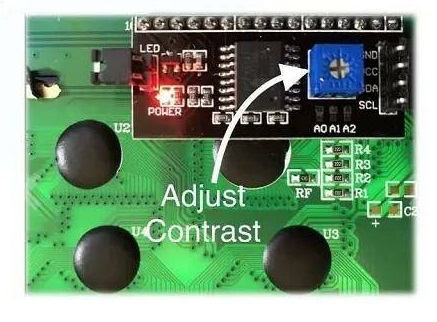

### [ЖК-дисплей 1602A LCD с конвертером в IIC-I2C](https://aliexpress.ru/item/1005006082912057.html?spm=a2g2w.orderdetail.0.0.4d164aa6hyjl0Z)


#### [Общие сведения интерфейсного модуля - I2C](#%D0%BE%D0%B1%D1%89%D0%B8%D0%B5-%D1%81%D0%B2%D0%B5%D0%B4%D0%B5%D0%BD%D0%B8%D1%8F-%D0%B8%D0%BD%D1%82%D0%B5%D1%80%D1%84%D0%B5%D0%B9%D1%81%D0%BD%D0%BE%D0%B3%D0%BE-%D0%BC%D0%BE%D0%B4%D1%83%D0%BB%D1%8F-i2c)
#### [Документация на микросхему PCF8574T](PCF8574T-Datasheet.pdf)
#### [Документация к LCD1602A](LCD1602A-Datasheet-v1.2.pdf)
#### [Проверка подключения дисплея LCD1602a через - I2C](#%D0%BF%D1%80%D0%BE%D0%B2%D0%B5%D1%80%D0%BA%D0%B0-%D0%BF%D0%BE%D0%B4%D0%BA%D0%BB%D1%8E%D1%87%D0%B5%D0%BD%D0%B8%D1%8F-%D0%B4%D0%B8%D1%81%D0%BF%D0%BB%D0%B5%D1%8F-lcd1602a-%D1%87%D0%B5%D1%80%D0%B5%D0%B7-i2c)

#### Особенности для 1602A LCD:
```
1. Модуль ЖК-дисплея с синим (зеленым) черным светом.
2. Широкий угол обзора и высокая контрастность.
3. Встроенный ЖК-контроллер, эквивалентный промышленному стандарту HD44780.
4. Обычно используется в: копировальных аппаратах, факсах, лазерных принтерах, промышленном испытательном оборудовании, сетевом оборудовании, таком как маршрутизаторы и устройства хранения данных.
5. Может отображать 2 строки по 16 символов.
```

```
► Напряжение питания:                 5В
► Размер модуля:                      80мм x 36мм x 11мм
► Размер области просмотра:           64,5мм x 16мм
► Логическое рабочее напряжение-Vdd:  +4,8 ~ +5,2В
► Напряжение ЖК-дисплея (Vdd-Vo):     +3,0 ~ +5,0В
► Рабочая температура (Ta):           -20 ~ +70°C
► Температура хранения (Tso):         -30 ~ +80°C
► Рабочий ток (кроме подсветки):      1,7 мА (макс.)
► Рабочий ток (подсветка):            24,0 мА (макс.)
```


#### Меры предосторожности при пайке: 

```
поскольку жидкокристаллический модуль имеет прецизионные компоненты, то следует использовать
паяльник хорошего качества, а так как некоторые недорогие паяльники низкого
качества имеют высокое статическое электричество, ими легко повредить прецизионные 
компоненты. Если у вас нет паяльника хорошего качества, вы можете использовать
провод для подключения паяльника к водопроводной трубе (если ваша труба железная) 
или к железным воротам стены. Хотя это не является строго обоснованным, оно
может сыграть хорошую роль в защите наших ЖК-модулей.
```

#### Описание контактов LCD1602: 
```
[1 контакт]: VSS-это заземление 
[2 контакт]: VDD подключен к положительному источнику питания 5 В 
[3 контакт]: v0-конец регулировки контрастности жидкокристаллического дисплея. Когда подключен положительный источник питания, контраст слабый, а контраст выше при использовании заземления. 
[4 контакт]: RS-выбор регистра. Когда выбран высокий уровень, выбирается регистр данных, а когда выбран низкий уровень, выбирается регистр инструкций.
[5 контакт]: RW-сигнальная линия чтения/записи. Когда он высокий - выполняется операция чтения, а когда он низкий - выполняется операция записи. Когда RS и RW находятся на низком уровне, можно записать инструкцию или адрес дисплея. Когда RS низкий, RW может считывать сигналы, а когда RS высокий, RW может записывать данные. 
[6 контакт]: клемма E является клеммой включения. Когда терминал E переходит с высокого уровня на низкий, жидкокристаллический модуль выполняет команду. 
[От 7 контакта до 14 контакта]: от D0 до D7 - это 8-битные двунаправленные линии данных.
[15 контакт]: положительный источник питания подсветки. 
[16 контакт]: отрицательный источник питания подсветки.
```

ЖК-экран 1602 с 2 цветами. Размер, функция и контакты синего экрана и зеленого экрана точно такие же. Разница в эффекте отображения. Синий экран - белый с синим фоном, а зеленый экран - черный с желтым фоном. 


C помощью переменного резистора контрастности ЖК-дисплея можно сделать, чтобы символы были четкими.



###### [в начало](#%D0%B6%D0%BA-%D0%B4%D0%B8%D1%81%D0%BF%D0%BB%D0%B5%D0%B9-1602a-lcd-%D1%81-%D0%BA%D0%BE%D0%BD%D0%B2%D0%B5%D1%80%D1%82%D0%B5%D1%80%D0%BE%D0%BC-%D0%B2-iic-i2c)

---
#### [Общие сведения интерфейсного модуля I2C](https://robotchip.ru/obzor-interfeysnogo-modulya-i2c/)

```
1. Интерфейс Arduino 1602 I2C 4-проводной экран 1602
2. Портов ввода-вывода платы управления Arduino всего 20, что недостаточно 
   для подключения множества датчиков, SD-карт, релейных модулей.
3. Для оригинального экрана 1602 требуется 7 портов ввода-вывода, а этот модуль
   может сохранить 5 портов ввода-вывода и с его помощью можно реализовать
   передачу по двум контактам (SDA и SCL).
   
Кроме того обеспечивается:

► Поддержка дисплеев:    LCD 16×2 / 20×4
► Дополнительно:         регулировка контрастности
► Напряжение питания:    5В
► Интерфейс:             I2C
► Габариты:              54мм x 19мм x 15мм
```


Модуль построен на микросхеме PCF8574T. Резисторы R8 (4.7кОм) и R9 (4.7кОм) необходимы для подтяжки линий SDA и SCL. На плате предусмотрены три перемычки (по схеме видно что линии A0, A1, A2 подтянуты к питанию через резисторы R4, R5, R6), необходимы они для смены адресации устройства, всего их 8 вариантов. Изменение адресации дает нам возможность подключения до восьми устройств по шине IC2 c микросхемой PCF8574T, варианты адресов показаны на рисунке (по умолчанию адрес устройства 0x27). Так же модуль оснащен потенциометром R11 с его помощью можно изменить контрастность LCD дисплея.


###### [в начало](#%D0%B6%D0%BA-%D0%B4%D0%B8%D1%81%D0%BF%D0%BB%D0%B5%D0%B9-1602a-lcd-%D1%81-%D0%BA%D0%BE%D0%BD%D0%B2%D0%B5%D1%80%D1%82%D0%B5%D1%80%D0%BE%D0%BC-%D0%B2-iic-i2c)


#### [Проверка подключения дисплея LCD1602a через I2C](LCD1602aWithI2C/LCD1602aWithI2C.ino)


```
#include <Wire.h>
#include <LiquidCrystal_I2C.h> 
 
LiquidCrystal_I2C lcd(0x27,16,2);   // задали адрес и размер дисплея
 
void setup()
{
  lcd.init();                       // проинициализировали lcd    
  lcd.backlight();                  // включили подсветку
  lcd.setCursor(0,0);               // установили курсор в начало 1 строки
  lcd.print("Hello, world");        // вывели текст
  lcd.setCursor(0,1);               // установили курсор в начало 2 строки
  lcd.print("https://doortry.ru/"); // вывели текст
}
void loop()
{
}

```

###### [в начало](#%D0%B6%D0%BA-%D0%B4%D0%B8%D1%81%D0%BF%D0%BB%D0%B5%D0%B9-1602a-lcd-%D1%81-%D0%BA%D0%BE%D0%BD%D0%B2%D0%B5%D1%80%D1%82%D0%B5%D1%80%D0%BE%D0%BC-%D0%B2-iic-i2c)
