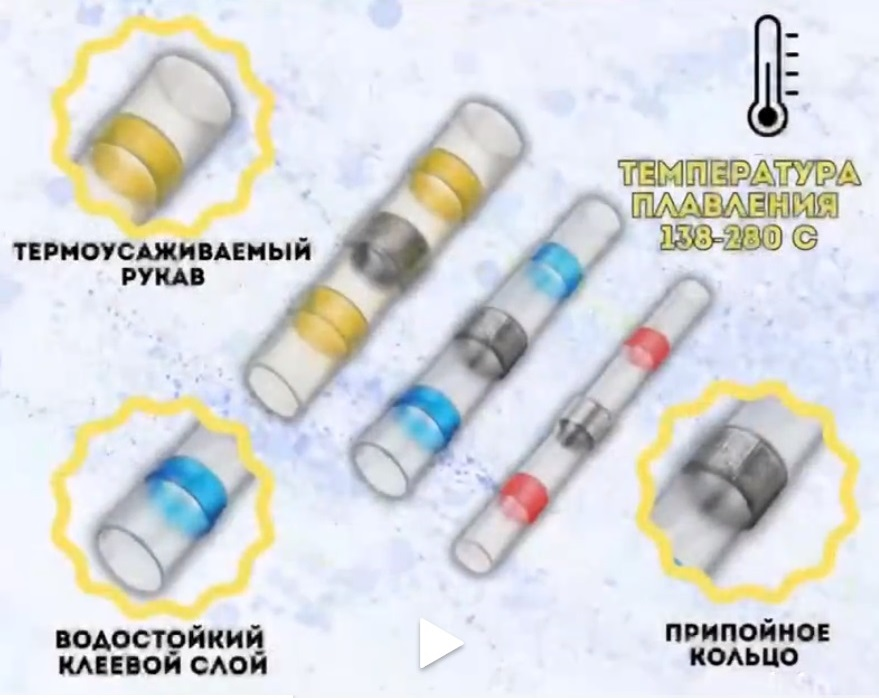
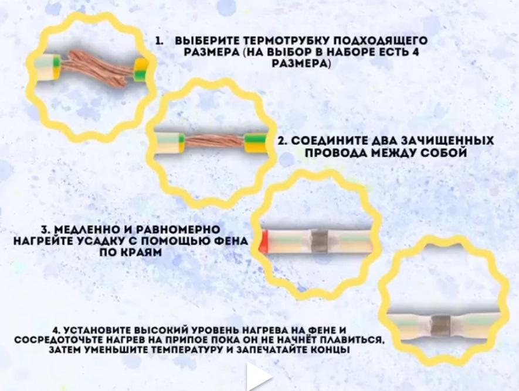

## Термоусадочные трубки

### Термоусадочные трубки с припоем

Термоусадочные трубки под пайку предназначены для соединения медных многопроволочных проводов внахлест или встык методом термообработки. В середине кембрика термоусадочного располагается гильза из низкотемпературного припоя оловянно-свинцовой группы. С обеих сторон на внутренней поверхности термоусадочной трубки располагаются клеевые полосы, обеспечивающие герметичность соединения после усадки. Независимо от того, работаете ли вы на своей лодке, транспортном средстве, домашнем или промышленном объекте, термоусадочные паяльные и уплотнительные соединители обеспечат плотную пайку, повышенный контакт и всепогодные соединения каждый раз. Идеальный набор для ремонта или монтажа проводки.,

[к содержанию](#%D1%81%D0%BE%D0%B4%D0%B5%D1%80%D0%B6%D0%B0%D0%BD%D0%B8%D0%B5)

---

0

1

2

3

4

5

6

7

8

9

0

1

2

3

4

5

