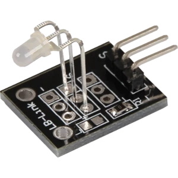
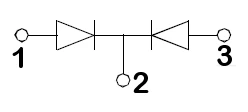
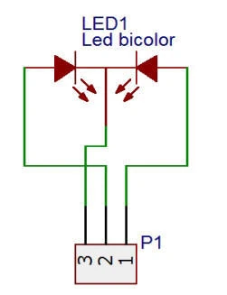
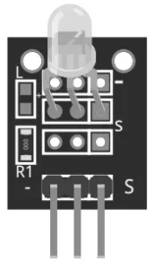
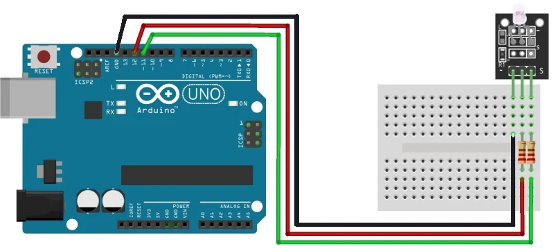

### KY-029

### [Модуль двухцветного светодиода 3 мм](https://rxtx.su/mikrokontrollery/arduino/moduli-i-datchiki-k-arduino/cvetodiodnyj-dvuxcvetnyj-modul-ky-029/)



Двухцветный светодиодный модуль KY-029, излучающий красный и зеленый свет. Аналог светодиодного модуля KY-011. Отличается диаметром светодиода — 3мм против 5мм.

Интенсивность каждого цвета можно регулировать с помощью ШИМ.

##### ХАРАКТЕРИСТИКИ МОДУЛЯ



Внешний вид двухцветного светодиода L-93WEGW

```
Цвет	                        Красный / Зеленый
Длины волн	                    625 нм / 568 нм
Ток	                            20 мА
Диаметр линзы	                3 мм
Цвет линзы	                    бесцветный
Напряжение (макс.)	            2.5 В
Обратное напряжение (макс.)	    5 В
Температура окружающей среды    от -40 до 85 ºC
```



Модуль состоит из 3-х миллиметрового двухцветного (красный и зеленый) светодиода с общим катодом типа L-93WEGW, SMD-резистора 0 Ом и 3 штыревых контактов. 

```
Но встречаются версии плат, где вместо резистора 0 Ом дополнительно 
запаян SMD-резистор номиналом 1 кОм и красный SMD-светодиод.

 ВНИМАНИЕ!
 
Используйте этот модуль с токоограничивающими резисторами, 
чтобы предотвратить перегорание светодиода при длительной работе.
```

##### КАК ПОДКЛЮЧИТЬ МОДУЛЬ KY-029 К ARDUINO UNO

```
Модуль KY-029	      Макетная плата	    Плата Arduino UNO
Правый контакт (S)	  220 Ом резистор	    Контакт 11
Средний контакт	      220 Ом резистор	    Контакт 12
Левый контакт (-)	 	                    GND
```



```
Не забудьте использовать пару резисторов между модулем и платой Arduino, 
чтобы предотвратить перегорание светодиода.
```



##### ПРИМЕР КОДА ДЛЯ ARDUINO И МОДУЛЯ KY-029

```
//  KY-029-red-green.ino
//  Cкетч будет постепенно изменять интенсивность красного и зеленого цвета

int red = 12;   // Контакт для красного цвета
int green = 11; // Контакт для зеленого цвета
int val;        

void setup() 
{
  pinMode(red, OUTPUT);   
  pinMode(green, OUTPUT);
}

void loop() 
{
  for(val=255; val>0; val--) 
  { 
    analogWrite(red, val);          // Установка красного цвета
    analogWrite(green, 255 - val);  // Установка зеленого цвета
    delay(20);
  }
  
  for(val=0; val<255; val++) 
  { 
    analogWrite(red, val);          // Установка красного цвета
    analogWrite(green, 255 - val);  // Установка зеленого цвета
    delay(20);
  }
}
```
[KY-029.pdf](KY-029.pdf)
