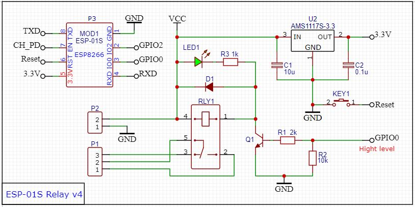

## Релейный модуль умного дома на ESP01

Одноканальный релейный модуль (на чипе ESP826) представляет собой плату расширения с реле для управления нагрузкой. Используя данный модуль можно реализовать удаленную точку управления двигателем, замком, другим исполнительным устройством через реле посредством Wi-Fi.

Модуль дистанционного и беспроводного управления реле через Wi-Fi подключение. Особенностью устройства является встроенный чип ESP8266. Он обеспечивает быстрый отклик на поступающие команды. Управление можно реализовать через приложение Blynk. При подключении к модулю одноканального реле тот отправляет на ваше устройство инструкцию по дальнейшей работе с ним и реализует ее в локальной сети (LAN). 

Таким образом, имеется два способа подключения: смартфон к модулю реле Wi-Fi напрямую, либо сотовый телефон и модуль реле Wi-Fi подключаются к одному и тому же маршрутизатору. В режиме точки доступа устройство поддерживает до пяти устройств. Для защиты выводов модуля от перегрузок по напряжению используется диодная защита. 

На открытом пространстве в локальной сети расстояние передачи данных составляет 400 метров. При подключении через общий со смартфоном маршрутизатор дальность действия зависит от интенсивности сигнала Wi-Fi.

Модуль имеет встроенный стабилизатор и может питаться от напряжения в диапазоне от 5 до 12В. Реле имеет опторазвяку и поддерживает нагрузку до 10А как постоянного (до 30В), так и переменного (до 250В) тока.

***Технические характеристики:***

```
Тип устройства:                 электромеханическое реле;

Количество каналов:             1;

Напряжение питания модуля:      5V;

Коммутируемая сила тока (max):  10A;

Коммутируемое напряжение (max): 250V AC и 30V DC;

Размер изделия:                 37*25 мм

Расстояние передачи:            макс 400 м (открытая среда, мобильный телефон с модулем WIFI)

Нагрузка:                       10A/250VAC 10A/30VDC, реле тянет 100000 раз
```




### [ESP-01S-Relay-v4.0](https://github.com/IOT-MCU/ESP-01S-Relay-v4.0)

### [ESP-01S-Relay-v1.0](https://github.com/IOT-MCU/ESP-01S-Relay-v1.0)


