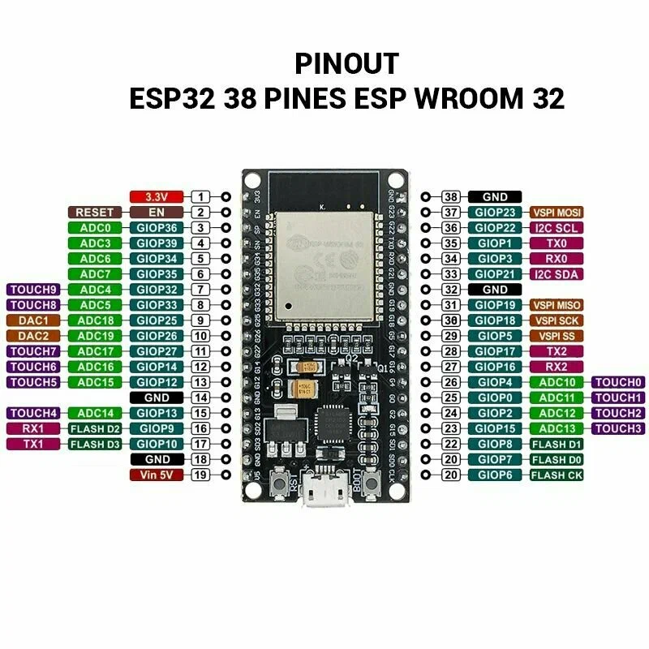

## [NodeMCU ESP-32S](https://microcontrollerslab.com/microsd-card-esp32-arduino-ide/)



### [как отформатировать sd на esp32]

Для форматирования SD-карты через код в Arduino IDE можно использовать библиотеку SdFat. Пример кода:

```
#include <SPI.h>
#include <SdFat.h>

const uint8_t chipSelect = 5;   // Пин, подключённый к линии CS модуля SD-карты
SdFat SD;                       // Создание объекта SdFat

void setup()
{
  Serial.begin(115200);
  while (!Serial) 
  {
    ; // Ожидание подключения последовательного порта (нужно для нативного USB)
  }
  Serial.println("Тип 'format' для форматирования SD-карты.");
}

void loop() 
{
  if (Serial.available() > 0) 
  {
    String command = Serial.readStringUntil('
');
    command.trim();
    if (command == "format") 
    {
      formatSDCard();
    }
  }
}

void formatSDCard()
{
  // Инициализация SD-карты с использованием SPI-пинов по умолчанию
  if (!SD.begin(chipSelect, SD_SCK_MHZ(50))) 
  {
    Serial.println("Инициализация не удалась. Карта вставлена?");
    return; // Выход из функции при неудаче
  }

  // Попытка отформатировать SD-карту
  if (!SD.format())
  {
    Serial.println("Форматирование не удалось.");
    return; // Выход из функции при неудаче
  }

  Serial.println("Форматирование завершено успешно.");
}

```


### [MicroSD Card Module with ESP32 using Arduino IDE](https://microcontrollerslab.com/microsd-card-esp32-arduino-ide/)

In this user guide, we will learn how to interface a microSD card with ESP32 using the microSD card module or connector and Arduino IDE. This module provides an SPI interface to connect an SD card module with any microcontroller which supports the SPI communication interface. Using a microSD card becomes very handy for applications where we need to store files that are larger than the size of SPIFF (flash file system) of ESP32.

### [greiman/SdFat: Arduino FAT16/FAT32 exFAT Library](https://github.com/greiman/SdFat)

