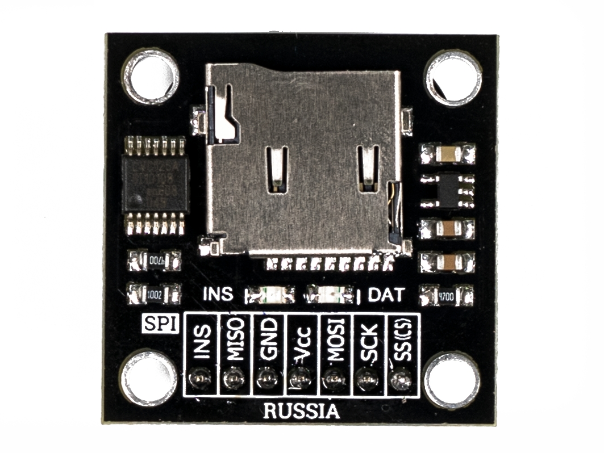
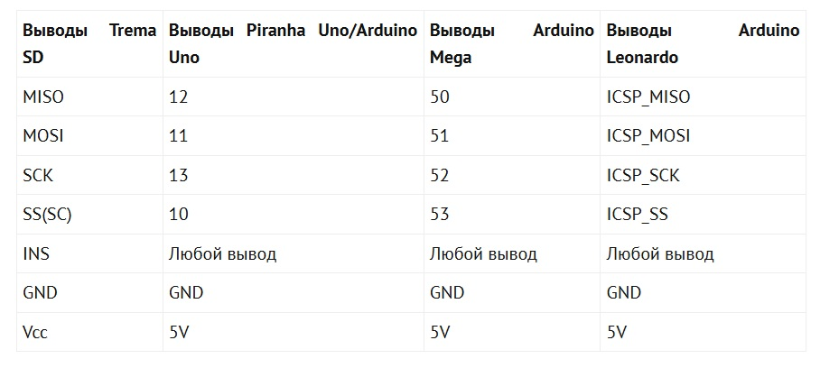
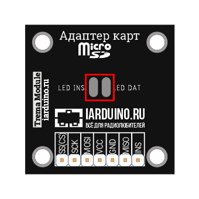

## [Адаптер карт MicroSD (Trema-модуль)](https://iarduino.ru/shop/Expansion-payments/adapter-kart-microsd-trema-modul-v2-0.html)

### Характеристики

- Входное напряжение питания: 5 В
- Ток потребляемый адаптером: 0,2 ... 200 мА
- Поддерживаемый объем MicroSD: до 2 Гб
- Поддерживаемый объем MicroSDHC: до 32 Гб
- Габариты: 30x30x4.3 мм (без учёта выводов)
- Вес: 4 г

### Подробнее о модуле:

Данный модуль питается от источника постоянного напряжения 5В.

Модуль поддерживает карты microSD. Для работы с библиотекой Arduino карта должна быть отформатирована в  формате FAT16 или FAT32.

У модуля есть возможность снизить энергопотребление путём отключения индикаторных светодиодов. Это производится посредством удаления двух напаянных джамперов на нижней стороне платы: 

На модуле имеется вывод "INS", определяющий наличие карты.

### [Описание функций библиотеки SD](https://wiki.iarduino.ru/page/sdcard/)

На заметку: Библиотека SD входит в стандартный набор библиотек Arduino

