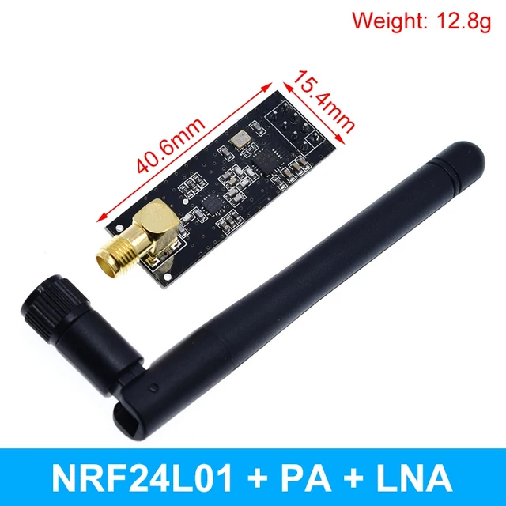
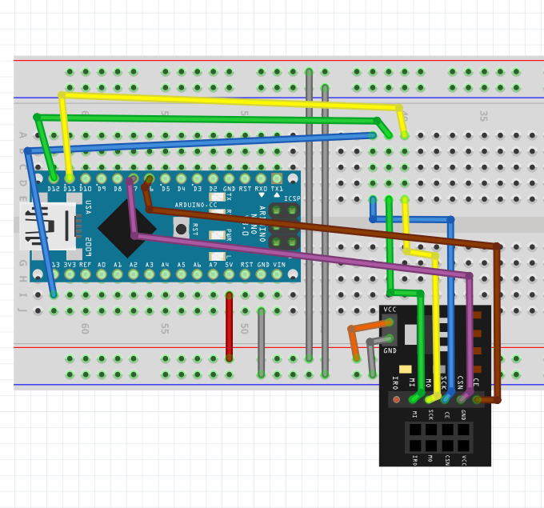
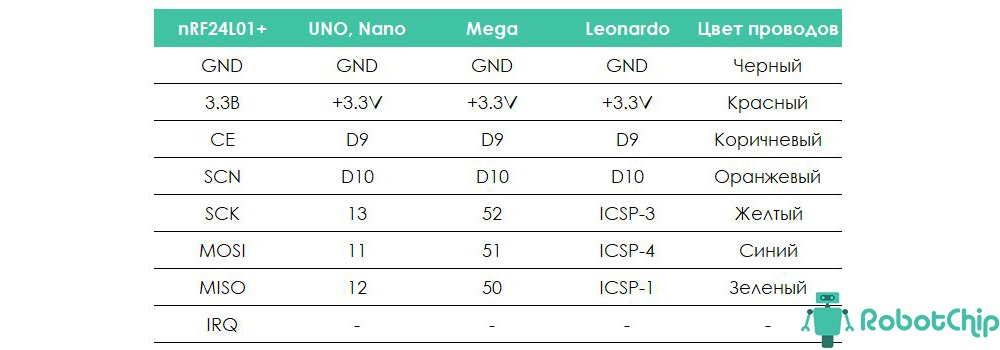

## [Радиомодуль nRF24L01](https://3d-diy.ru/blog/radio-modul-nrf24l01/)


> **В интерфейсе SPI контакт SS (Slave Select) соответствует сигналу CS (Chip Select). Это линия выбора ведомого устройства, которая управляется ведущим устройством (мастером).** 

SCK (Serial Clock) — это линия тактового сигнала, которая генерируется ведущим устройством и синхронизирует передачу данных. 
habr.com

> **Таким образом, SS и CS — это разные обозначения для одного и того же сигнала, который используется для активации конкретного ведомого устройства при общении с мастером. При активном (низком) уровне сигнала SS ведомое устройство становится активным, и оно начинает воспринимать данные с линии MOSI и тактовый сигнал с SCK. При пассивном (высоком) уровне сигнала SS тактовый сигнал и данные на MOSI не влияют на ведомое устройство.** 



> При питании радиомодуля от платы контроллера Arduino могут возникнуть проблемы, связанные с недостаточной мощностью источника питания, которые приводят к потере связи и нестабильной работе. Подобные трудности появляются, когда используются платы Arduino, в которых не хватает мощности источника питания. Для решения этой проблемы лучше всего использовать отдельный источник питания 3,3 В для радиомодуля. 







```
Arduino Nano                       NRF24L01
-----------------------------------------------
13 [SCK]               ==>         [SCK]
12 [MISO]              ==>         [MISO]
11 [MOSI]              ==>         [MOSI]
7                      ==>         [CSN]
6                      ==>         [CE]

Настройка в коде:      CE [ 6 ][ 7 ] CSN

```

---

### [Скетч проверки работоспособности и правильности подключения](#proverka-rabotosposobnosti-nrf24l01)

### [Скетчи проверки приемо-передачи](#peredacha-priyom)

### [Скетчи "Победа над nRF24L01: на три шага ближе"](#na-tri-shaga-blizhe)

### [Скeтчи от AlexGyver](#%D1%81%D0%BA%D0%B5%D1%82%D1%87%D0%B8-%D0%BE%D1%82-alexgyver)

---

###### proverka-rabotosposobnosti-nrf24l01

### [Скетч проверки работоспособности и правильности подключения](proverka-rabotosposobnosti-nrf24l01/proverka-rabotosposobnosti-nrf24l01.ino)
 

Вывод после теста ***NRF24L01 (09.04.2024)***

```
SPI Speedz	= 10 Mhz
STATUS		= 0x0e RX_DR=0 TX_DS=0 MAX_RT=0 RX_P_NO=7 TX_FULL=0
RX_ADDR_P0-1	= 0x000000000e 0xc2c2c2c2c2
RX_ADDR_P2-5	= 0x0e 0xc4 0x0e 0xc6
TX_ADDR		= 0x000000000e
RX_PW_P0-6	= 0x20 0x0e 0x20 0x0e 0x20 0x0e
EN_AA		= 0x00
EN_RXADDR	= 0x0e
RF_CH		= 0x4c
RF_SETUP	= 0x0e
CONFIG		= 0x0e
DYNPD/FEATURE	= 0x0e 0x00
Data Rate	= 2 MBPS
Model		= nRF24L01+
CRC Length	= 16 bits
PA Power	= PA_MAX
ARC		= 14

```

 Опыт повторен c показанной схемой на ***Arduino Nano 03.05.2026***:
 
 ```
 12:23:02.483 -> 
SPI Speedz	= 10 Mhz
12:23:07.284 -> STATUS		= 0x0e RX_DR=0 TX_DS=0 TX_DF=0 RX_PIPE=7 TX_FULL=0
12:23:07.366 -> RX_ADDR_P0-1	= 0x0000000000 0xc2c2c2c2c2
12:23:07.401 -> RX_ADDR_P2-5	= 0xc3 0xc4 0xc5 0xc6
12:23:07.445 -> TX_ADDR		= 0xe7e7e7e7e7
12:23:07.445 -> RX_PW_P0-6	= 0x20 0x20 0x20 0x20 0x20 0x20
12:23:07.511 -> EN_AA		= 0x00
12:23:07.511 -> EN_RXADDR	= 0x02
12:23:07.545 -> RF_CH		= 0x4c
12:23:07.545 -> RF_SETUP	= 0x07
12:23:07.578 -> CONFIG		= 0x7f
12:23:07.578 -> DYNPD/FEATURE	= 0x00 0x00
12:23:07.612 -> Data Rate	= 1 MBPS
12:23:07.645 -> Model		= nRF24L01+
12:23:07.645 -> CRC Length	= 16 bits
12:23:07.678 -> PA Power	= PA_MAX
12:23:07.715 -> ARC		= 0
12:23:17.679 -> 00000000000000001111111111111111222222222222222233333333333333334444444444444444555555555555555566666666666666667777777777777777
12:23:17.833 -> 
0123456789abcdef0123456789abcdef0123456789abcdef0123456789abcdef0123456789abcdef0123456789abcdef0123456789abcdef0123456789abcdef
12:23:17.949 -> 
34532232334343221213343443312233244322120100400001000000222222433332010000000000000000000000000000000000000000000000000000000000
 ```
 
Дальнейший вывод после теста ***NRF24L01 (09.04.2024)***

```
00000000000000001111111111111111222222222222222233333333333333334444444444444444555555555555555566666666666666667777777777777777

0123456789abcdef0123456789abcdef0123456789abcdef0123456789abcdef0123456789abcdef0123456789abcdef0123456789abcdef0123456789abcdef

01235532101123432110123454441012200000000000000000000000000000000000000000000000010000000000000000000000000000000000000000000000

21245653210012345432111335452311000000000000000000000000000000000000000000000010000100000000000000000000000000000000000000000000

32224656543212355665432123456322100000000000000000000000000000000000000000000000100000000000000000000000000000000000000000000000

33120123454321012344532103254531000000000000000000000000000000000000000000000200010000000000000000000000000000000000000000000000

46432113345543322345654321322444200000000000000000000000000000000000000000000200010100000000000000000000000000000000000000000000

54453412136574433111235322322244320101100101000000011100012010010000000100000200200000000000000000000000000000000000000000000000
```

Вывод после теста ***NRF24L01+PA+LNA (09.04.2024)***
(пока не прикрутил антенну, во второй части теста были нули)

```
SPI Speedz	= 10 Mhz
STATUS		= 0x0e RX_DR=0 TX_DS=0 MAX_RT=0 RX_P_NO=7 TX_FULL=0
RX_ADDR_P0-1	= 0xe7e7e7e7e7 0xc2c2c2c2c2
RX_ADDR_P2-5	= 0xc3 0xc4 0xc5 0xc6
TX_ADDR		= 0xe7e7e7e7e7
RX_PW_P0-6	= 0x20 0x20 0x20 0x20 0x20 0x20
EN_AA		= 0x00
EN_RXADDR	= 0x02
RF_CH		= 0x4c
RF_SETUP	= 0x07
CONFIG		= 0x0f
DYNPD/FEATURE	= 0x00 0x00
Data Rate	= 1 MBPS
Model		= nRF24L01+
CRC Length	= 16 bits
PA Power	= PA_MAX
ARC		= 0
00000000000000001111111111111111222222222222222233333333333333334444444444444444555555555555555566666666666666667777777777777777

0123456789abcdef0123456789abcdef0123456789abcdef0123456789abcdef0123456789abcdef0123456789abcdef0123456789abcdef0123456789abcdef

01221012344332112344432101123443210122343210000345432000000000000000000000000000000000000000000000000000000000000000000000000000

02653212235554542101333421324565320012234543000223443100000000000000000000000001001000000000000000000000000000000000000000000000

02455322123355432000123332101123430210123444000123445400000000000000000000000000001000000000000000000000000000000000000000000000

10445432100233554210122343221012440544221223000212344200000000000000000000000000210000000000000000000000000000000000000000000000

12244564433243456543223446754323420544310223000321011200000000000000000000000000001000000000000000000000000000000000000000000000
```

###### [в начало](#%D1%80%D0%B0%D0%B4%D0%B8%D0%BE%D0%BC%D0%BE%D0%B4%D1%83%D0%BB%D1%8C-nrf24l01)

---

###### peredacha-priyom

### [Скетчи проверки приемо-передачи](https://dzen.ru/a/YYIaUt9Bz32SgEZy)

Здесь один из модулей является передатчиком и отправляет сообщение "Hello World" на приёмник. Приёмник выводит сообщение в монитор порта. В данном примере модули используют канал ***0x6f***. Можно выбрать любой другой незашумлённый канал.

#### [Проверить передачу данных между NRF24L01 и NRF24L01+PA+LNA - передатчик](peredacha-priyom/testirovanie-nrf24l01-peredacha/testirovanie-nrf24l01-peredacha.ino)

#### [ Проверить прием данных между NRF24L01 и NRF24L01+PA+LNA - приёмник](peredacha-priyom/testirovanie-nrf24l01-priyom/testirovanie-nrf24l01-priyom.ino)

###### [в начало](#%D1%80%D0%B0%D0%B4%D0%B8%D0%BE%D0%BC%D0%BE%D0%B4%D1%83%D0%BB%D1%8C-nrf24l01)

---

###### na-tri-shaga-blizhe

#### [Скетчи "Победа над nRF24L01: на три шага ближе"](https://habr.com/ru/articles/476716/)

Модули nRF24L01 работают в полудуплексном режиме. Это как разговор по рации: каждый из корреспондентов в один момент времени либо говорит, либо слушает. То есть, каждый из двух узлов работает в режиме и приемника и передатчика: передатчик, отправив сообщение ждет на подтверждение приема сообщения со стороны приемника.

Я же разделил эту задачу на несколько простых задачек. Вначале модули проверяются на работоспособность и правильность подключения (шаг 1), затем один из пары работающих радиомодулей тестируется на работу в режиме передатчика без ожидания отклика с приемника (шаг 2) и последний этап — улучшение качества связи в этой связке передатчик-приемник (шаг 3).

#### [Шаг 1 - скетч сканера эфира](na-tri-shaga-blizhe/skaner-ehfira/skaner-ehfira.ino)

Загрузить в контроллер платы Ардуино скетч сканера эфира, который можно найти среди примеров Arduino IDE: Файл -> Примеры -> RF24 -> scanner. 

Этот скетч с несущественным изменением. В нем изменено время между стартом и остановкой сканирования одного канала с 128 мксек на 512 мксек. Увеличение времени позволило за один цикл сканирования всего диапазона выявлять больше источников помех и сигналов. Это равнозначно замене результата измерений в канале на сумму четырех соседних результатов в этом канале до изменения времени сканирования. При этом, время прохода всего прослушиваемого диапазона сканером увеличилось несущественно: примерно с 8 до 10 сек.

В разных скетчах адрес канала в командах приводится в разных форматах: в одних — ...(0x6f), в других — ...(112). Перевод с одного формата в другой станет понятным с примера перевода. Например, для (0x1а) — это: (1+1)*16 + а = (1+1)*16 + 10 = 42. Отсчет каналов начинается с частоты 2,4 ГГц, далее идет увеличение частоты на 1 МГц с увеличением номера канала на 1.

#### [Шаг 2 - скетч передатчика](na-tri-shaga-blizhe/sketch-peredatchika/sketch-peredatchika.ino)

По схеме, аналогичной для сканера, собираем второй радиоузел. Это будет передатчик. 

Передатчик без пауз в работе передает сигнал на канале 6f (112).

Подаем питание на сканер эфира и передатчик. Присмотритесь что творится на канале 6f и соседних с ним каналах. Сканер эфира при включенном передатчике рано или поздно прорисует единички или другие одноразрядные числа в шестнадцатиричном исчислении в области 6f, на который запрограммирован передатчик. Наберитесь терпения на 1 — 2 минуты, особенно при работе со сканером из примеров.

#### [Шаг 3 - скетч приёмника](na-tri-shaga-blizhe/sketch-prijomnika/sketch-prijomnika.ino)

Логика работы приемника такая же, как и у сканера эфира, но он в отличие от сканера принимает сигналы только на частоте передатчика 6f и, как и сканер, не посылает автоответ. Скорость обмена информацией и размер контрольной суммы у приемника такие же, как у передатчика. После каждых 1000-и циклов прослушивания счетчик числа циклов обнуляется и выводится инфа о количестве принятых пакетов с передатчика в монитор порта Arduino IDE.

Включаем передатчик и приемник. Если приемник принимает хотя бы каждый третий пакет — это уже успех. У меня не получилось. Приемник по непонятным причинам принимал максимум 50 пакетов.

Подумал о увеличении мощности передаваемого сигнала с помощью дополнительной антенны. Для начала, подключил зажимом монтажный провод «папа-мама» к «корню» штатной антенны передатчика. И счастье привалило: сразу 999 принятых пакетов — максимально возможное число из 1 000!

> - tve от 05-05-2026 без конденсаторов, но на адаптерах и на близком расстоянии 999 пакетов;
> 
> - tve от 05-05-2026 без конденсаторов, но на адаптерах с кухни в гостинную между NRF24L01 и NRF24L01+PA+LNA через стену 446 пакетов (могло быть и больше, отключался блок питания);

Юзерам, которые захотят сделать все грамотно, придется поработать. Дополнительная антенна в данном случае — это отрезок коаксиального кабеля с волновым сопротивлением 50 Ом и длиной 115 мм. Антенна подключается к выводу 13 (АNT2) микросхемы nRF24L01+. Схему подключения и номиналы нескольких недостающих smd компонентов, которые надо поставить на плату радиомодуля, можно найти [на принципиальной электрической схеме nRF24L01+](https://robotchip.ru/obzor-radio-modulya-nrf24l01/). 

###### [в начало](#%D1%80%D0%B0%D0%B4%D0%B8%D0%BE%D0%BC%D0%BE%D0%B4%D1%83%D0%BB%D1%8C-nrf24l01)

---

### [Скетчи от AlexGyver](https://github.com/AlexGyver/nRF24L01)

#### [vyvod-nastroek-modulya - вывод настроек модуля](AlexGyver/vyvod-nastroek-modulya/vyvod-nastroek-modulya.ino)

#### [nrf_listen_air - прослушивание всех каналов](AlexGyver/nrf_listen_air/nrf_listen_air.ino)

> ***2026-05-07 После обзора скетчей от AlexGyver понял, что нужно сделать ревизию скетчей библиотеки RF24.***


GettingStarted_CallResponse - тест качества связи между двумя модулями

время передачи - скетч, измеряющий время передачи с модуля на модуль (сильно упрощённый GettingStarted_CallResponse)

тест расстояния - скетч из видео, к Ардуино подключен дисплей, отображающий число принятых пакетов за единицу времени

Projects - папка со схемами и скетчами

3 канальное управление - трёхканальное управлением реле, LED лентой и сервомашинкой

простой приём передача - базовая пара скетчей со всеми настрйоками модулей, а также примером передачи данных
```
vyvod-nastroek-modulya


###### [в начало](#%D1%80%D0%B0%D0%B4%D0%B8%D0%BE%D0%BC%D0%BE%D0%B4%D1%83%D0%BB%D1%8C-nrf24l01)

---

### Конденсатор!

1. Внимание! Для [стабильной работы модуля NRF24L01+](https://robotchip.ru/obzor-radio-modulya-nrf24l01/) необходимо припаять конденсатор на 10 мкФ (изначально тестировал без конденсаторов, модули лежали друг от друга на расстоянии 10 см и связи не было).

2. [Конденсатор 2-10 мкф](https://dzen.ru/a/YYIaUt9Bz32SgEZy) (необязателен). При работе теста показывается: в первой строке - первая цифра номера канала, во второй строке - вторая (hex). Ниже выводится уровень зашумленности канала при каждом тесте. Если у вас везде одни нули, то либо модуль подключён неправильно, либо нужно напаять конденсатор 2-10 мкф между плюсом и минусом на модуле, а если и тогда не заработало, то параллельно припаяйте керамический конденсатор, а если снова нет - можете посетить форум на сайте Amperka.

3. Для более стабильной работы рекомендуется напаять [конденсатор не менее, чем на 10мкф](https://voltiq.ru/nrf24l01-and-arduino/) прямо на ножки питания модуля, соблюдая полярность! Конденсатор для nRF24l01 – как подорожник, решает почти все проблемы с передачей и приёмом.

4. [100 мкФ](https://3d-diy.ru/blog/radio-modul-nrf24l01/)

5. Юзерам, которые захотят сделать все грамотно, придется поработать. Дополнительная антенна в данном случае — это отрезок коаксиального кабеля с волновым сопротивлением 50 Ом и длиной 115 мм. Антенна подключается к выводу 13 (АNT2) микросхемы nRF24L01+.

- Обязательно [припаиваем между пинами GND и VCC](https://habr.com/ru/articles/476716/) обеих радиомодулей по два конденсатора. Керамический конденсатор, выполняющий роль ВЧ-фильтра, емкостью не менее 0,15 мкФ (чем больше, тем лучше) и электролит емкостью около 10 мкФ (можно и больше, но бесполезно) — это НЧ-фильтр. ВЧ-фильтр шунтирует высокочастотные помехи по цепи питания радиомодуля, а НЧ-фильтр сглаживает пульсации питания. Для надежности, цепи питания радиомодулей лучше непосредственно подпаять к пинам контроллеров.

-  Установить на платах nRF24L01+ отсутствующий конденсатора С6 (1...2pF). Конденсатор будет выполнять роль пассивной нагрузки. Без пассивной нагрузки модули nRF24L01+ со встроенной антенной «захлебываются» и часто нормально работают только на пониженных мощностях передатчика.

6. Миша Б., 15 июл 2023. ***Важное замечание***, нужно ВСЕ ПАЯТЬ и НЕ ПОЛЬЗОВАТЬСЯ АРДУИНО ПРОВОДАМИ я два дня пытался передать информацию с одного на второй модуль, ничего не получалось до того пока я не припаял ардуино к НРФ24

### Библиография

#### [Обзор адаптера NRF24L01](https://robotchip.ru/adapter-review-nrf24l01/)

#### [Обзор радио модуля NRF24L01+](https://robotchip.ru/obzor-radio-modulya-nrf24l01/)

#### [Обзор радио модуля NRF24L01+PA+LNA](https://robotchip.ru/obzor-radio-nrf24l01palna/)

#### [Подключение NRF24L01+PA+LNA к Arduino. Побеждаем радиомодули](https://dzen.ru/a/YYIaUt9Bz32SgEZy)

#### [Модуль радиосвязи nRF24L01 для Интернета вещей](https://www.cta.ru/articles/soel/2020/2020-2/123119/)

#### [nRF24l01 и Arduino – примеры использования](https://voltiq.ru/nrf24l01-and-arduino/)

#### [Радио модуль nRF24L01](https://3d-diy.ru/blog/radio-modul-nrf24l01/)

#### [Победа над nRF24L01: на три шага ближе](https://habr.com/ru/articles/476716/)

#### [Радио модуль 1100м. 2.4G NRF24L01+PA+LNA](https://iarduino.ru/shop/Expansion-payments/radio-modul-rf-2400-wireless-module-2-4g-1000m.html)

#### [Радиомодуль NRF24L01+подключение к Ардуино](https://arduino-site.ru/radiomodul-nrf24l01/)

#### [Радио модуль nRF24L01 Ардуино подключение](https://роботехника18.рф/nrf24l01-ардуино/)

#### [Range Extender на NRF24L01+PA+LNA: обмен текстовыми сообщениями между устройствами там, где нет сотовой связи](https://habr.com/ru/companies/ruvds/articles/792922/)

