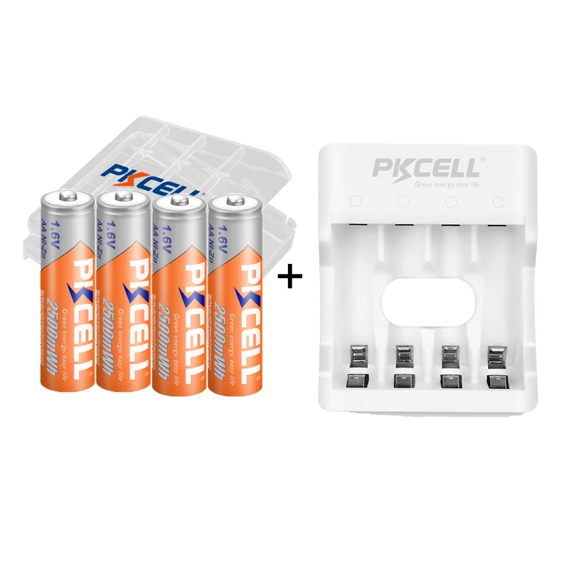
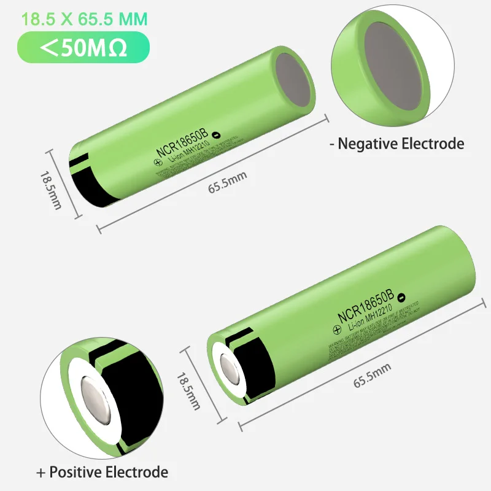
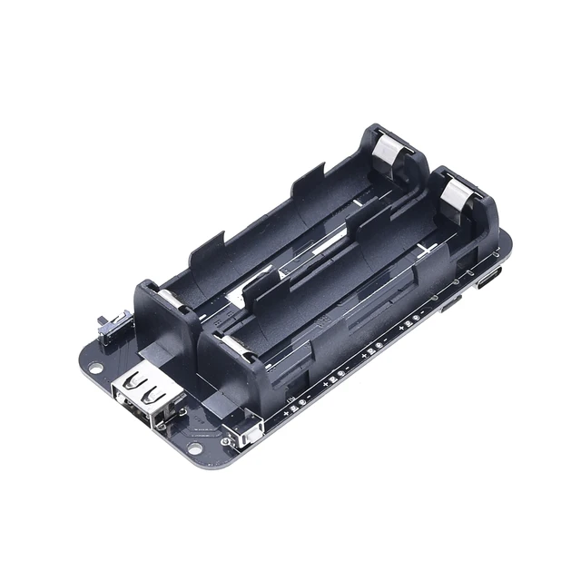
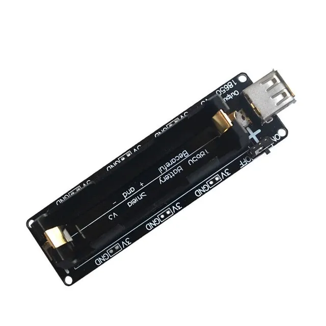
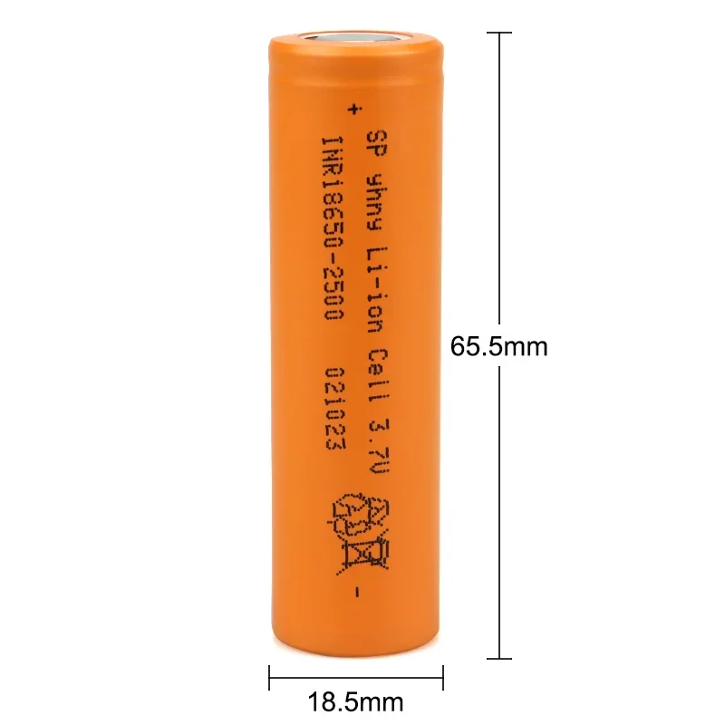

## POWERD, элементы и модули питания

### 18650 - аккумуляторы и модули питания

### Ni-Zn AA-A - аккумуляторы и зарядные устройства

---

### Ni-Zn AA-A - аккумуляторы и зарядные устройства

### [PKCELL Battery with NIZN Battery Charger for AAA/AA Batteries]()

---

### [PKCELL Battery with NIZN Battery Charger for AAA/AA Batteries](https://aliexpress.ru/item/1005005247641785.html?spm=a2g2w.orderdetail.0.0.31d44aa687tga3&sku_id=12000033308163600)

***2024-08-29 в [Pkcell Store](https://aliexpress.ru/store/918700?g=y&page=1&searchInfo=search&spm=a2g2w.detail.0.0.42295e86Rp5RkB)***



Характеристики

```
Название бренда      Pkcell
Номер модели         AA Rechargeable Battery
Происхождение        Китай
Режимы работы        NIZN
Размер               AA
Сертификация         Евротест (СЕ)
Номинальная емкость  1500 мАч
Количество батарей   4 aa battery and nizn charger
Chemical Composition Nickel Zinc
Charge Cycles        Over 1000Cycles
Dimension            Diameter:14.5mm*Height:50.5mm
Standard Charge      0.5C to 1C in Amps to 1.9V/cell taper charge and cut-off
Capacity Typical     2500mWhrs~Minimun:2250mWhrs
Nominal Voltage      1.6V
Nominal Capacity     2500mWh
charger              NIZN AA/AAA battery charger
Application          Specially designed for digital camera,CD,Game machine,toy,Flashlight
```
---
### 18650 - аккумуляторы и модули питания

### [Аккумулятoрная батарея 18650 - 3400 мАч - 3,7 в](#%D0%B0%D0%BA%D0%BA%D1%83%D0%BC%D1%83%D0%BB%D1%8F%D1%82%D0%BE%D1%80%D0%BD%D0%B0%D1%8F-%D0%B1%D0%B0%D1%82%D0%B0%D1%80%D0%B5%D1%8F-18650---3400-%D0%BC%D0%B0%D1%87---37-%D0%B2)

### [Зарядный мoдуль и блок питания 5V - 3A для 2 аккумуляторов 18650 V8](#%D0%B7%D0%B0%D1%80%D1%8F%D0%B4%D0%BD%D1%8B%D0%B9-%D0%BC%D0%BE%D0%B4%D1%83%D0%BB%D1%8C-%D0%B8-%D0%B1%D0%BB%D0%BE%D0%BA-%D0%BF%D0%B8%D1%82%D0%B0%D0%BD%D0%B8%D1%8F-5v---3a-%D0%B4%D0%BB%D1%8F-2-%D0%B0%D0%BA%D0%BA%D1%83%D0%BC%D1%83%D0%BB%D1%8F%D1%82%D0%BE%D1%80%D0%BE%D0%B2-18650-v8)

### [Мoдуль платы расширения мобильной мощности 18650, литиевый, Защита аккумулятора, V8, 5 В/3 А, 3 В/1 А, Micro USB для Arduino, ESP32, ESP8266](#%D0%BC%D0%BE%D0%B4%D1%83%D0%BB%D1%8C-%D0%BF%D0%BB%D0%B0%D1%82%D1%8B-%D1%80%D0%B0%D1%81%D1%88%D0%B8%D1%80%D0%B5%D0%BD%D0%B8%D1%8F-%D0%BC%D0%BE%D0%B1%D0%B8%D0%BB%D1%8C%D0%BD%D0%BE%D0%B9-%D0%BC%D0%BE%D1%89%D0%BD%D0%BE%D1%81%D1%82%D0%B8-18650)


---

### [Аккумуляторная батарея 18650 - 3400 мАч - 3,7 в](https://aliexpress.ru/item/1005006045402901.html?spm=a2g2w.orderdetail.0.0.40424aa6YZhJ5J&sku_id=12000035470071188)

***2024-06-24 в JOUYM MMCELL Store***

```
Емкость:                    3400 мАч ± 5%
Напряжение заряда:          4,2 V
Номинальное напряжение:     3,7 V
Ток разряда:                макс. 3C
Внутреннее сопротивление:   <50 МОм
Перезаряжаемый:             >1000 циклов
Химический состав:          литий-ионный
Верх батареи:               плоский
Цвет:                       зеленый
Вес:                        около 46 г
Размер (ххд):               65,5x18,5 мм
```




---

### [Зарядный модуль и блок питания 5V - 3A для 2 аккумуляторов 18650 V8](https://aliexpress.ru/item/1005005514477500.html?spm=a2g2w.orderdetail.0.0.64f14aa6L8kg8p&sku_id=12000033372596392)

***2024-07-03 в Module X Store***

Для двух литиевых аккумуляторов 18650, Φ V8 - 3V 1A или 5В 3A, блок питания Micro USB, зарядный модуль для Raspberry Pi Wifi ESP8266 ESP32



Этот модуль представляет собой портативный мобильный источник питания, который поддерживает два выхода напряжения 3В/1А и 5В/2,2А!

Номинальный выходной ток напряжения 5В составляет 2,2 А, максимальный ток поддержки 3А (не рекомендуется при перегрузке, легко повредить модуль, уменьшает срок службы), выходной ток зависит от качества батареи 18650!

Ток зарядки MICRO USB 600 мА-800 мА. Поддерживает до двух аккумуляторов 18650. 
 
Особое внимание: установка батареи должна быть определена строго положительной и отрицательной сторонами, на плате они четко отмечены. Ошибки установки приведут к сгоранию модуля!
 
Особенности:
```
Защита аккумулятора от перезарядки или чрезмерной разрядки,
1 переключатель управления выходом USB, 
светодиодный индикатор (зеленый означает, что аккумуляторы полностью заряжены, красный означает необходимость зарядки)

Вход                  Micro USB
USB-выход             тип A
Зарядка током         0,5 А
Входное напряжение    5 ~ 8 В
Выходы 3В и 1А        3 выходных порта 
Выходы 5В и 2А        3 выходных порта 
```

> Будьте осторожны с "+" и "-", следуйте указанию "-" на печатной плате. Если вы батареи уложите в неправильном направлении, зарядный чип будет разрушен.
> 

Размер: 9,8 x 2,9 см / 3,86 x 1,14 дюйма

Особенности:

Защита от перенапряжения на входе, защита от перегрузки по току/короткого замыкания на выходе, тайм-аут зарядки / защита от перенапряжения.

Выходной ток до 3А, КПД до 95%.

Блок питания имеет встроенную микросхему защиты литиевой батареи от перегрузки по току, перенапряжения, пониженного напряжения.

Выход представлен портом USB, а плата питания имеет, как расширения, выходные порты 3 В и 5 В для облегчения потребностей клиентов.

4-х уровневый светодиодный индикатор показывает мощность. Включение по умолчанию работает всегда. Его нужно выключить вручную. (Если вам нужно перейти в режим автоматического отключения в нерабочем состоянии, Просто отрежьте среднюю линию бита «NC» или удалите резистор «ROUT». Может)
1.8A зарядка 3A разрядка с высокой степенью интеграции ИС для мобильных устройств

Размер материнской платы: 99,98*96,24*21 мм (Д * Ш * В)

Входной порт: MICRO USB, тип-C, широкое напряжение, вход до 6,5 В

Требования к входу: источник питания постоянного напряжения 5 В может использоваться в качестве входной мощности зарядки, соответствующего зарядному устройству 5V1A или выше.

Эффективность преобразования до 95% (высокий коэффициент конверсии)
Рабочая температура: -20 -70 ° C

Инструкция использования:

!!! Нажмите для загрузки.
Нажмите и удерживайте кнопку, чтобы выключить.
4-полосная светодиодная индикация состояния питания, автоматическое выключение света через 3 секунды, батарея менее 3 В, сигнализация 6 под защитой, полная остановка менее 2,4 В, никаких действий

Ток батареи составляет всего 3 мкА после режима ожидания.
Интеллектуальный вход и выход, не беспокойтесь о том, что время зарядки слишком велико

Напряжение аккумулятора нормально работает при 3,2-4,2 В. Не подключайте батареи последовательно. Последующее соединение увеличит напряжение. Если емкость аккумулятора увеличена, аккумулятор можно подключить параллельно. Не подключайтесь последовательно.

Когда аккумулятор переустановлен, чип может обнаружить механизм защиты от отключения питания. Его нужно перезарядить и активировать. Это же нормально!

Характеристики продукта:

1. Адаптер литиевой батареи 16340;

2. Двойной выход 2,5 В и 3,3 В;

3. Встроенная микросхема защиты литиевой батареи с защитой от перегрузки по току, перенапряжения, пониженного напряжения и короткого замыкания;

4. встроенная защита от обратного хода аккумулятора;

5. тумблер может свободно переключать выход.

Технические параметры:

Интерфейс зарядки: MicroUSB (порт Android)
Напряжение зарядки: 4,5 В ~ 5,5 В
Ток зарядки: 580 мА макс.
Выходной интерфейс: разъем 2,5 мм и стандартный разъем USB
Выходной ток 5 В: макс. 1,3 А
Выходной ток 3,3 В: макс. 1,0 А
Индикатор зарядки: красный свет во время зарядки, полный зеленый свет
Изделие: 60 мм * ширина 28 мм * высота 16 мм.
16340 Тип 2
 
Наши инженеры тщательно разработали мобильный источник питания Arduino. Наша конструкция позволяет избавиться от зависимости адаптера. Вы можете вынуть свои работы и поделиться ими с друзьями в любое время и в любом месте. Разве это не здорово!

Мобильное питание укладывается на плату Arduino и питается через контакт 5 В/GND.

Мы также предоставляем интерфейс вывода USB-A, который вы можете использовать для подключения к другим устройствам с помощью USB-кабеля. Интерфейс зарядки-Micro USB, и инструмент для зарядки очень удобно получить (например, адаптер для мобильного телефона Android).

Когда он остановлен, рекомендуется выключить выходную мощность и позволить мобильному источнику питания перейти в режим ожидания, что позволит сэкономить ограниченное количество энергии батареи.

Мы используем литиевую батарею 16340 (ее нужно купить самостоятельно), вы можете использовать только одну батарею, вы также можете использовать 2 батареи, чтобы получить более длительный срок службы. Две литиевые батареи 16340 (в зависимости от емкости аккумулятора) емкостью около 1500 мАч.
Модель литиевой батареи: 16340

Зарядный ток: 500 мА
Ток разряда: 1000 мА

---

### [Модуль платы расширения мобильной мощности 18650](https://aliexpress.ru/item/1005005514477500.html?spm=a2g2w.orderdetail.0.0.64f14aa6L8kg8p&sku_id=12000033372596392)

#### Литиевый, Защита аккумулятора, V8, 5 В/3 А, 3 В/1 А, Micro USB для Arduino, ESP32, ESP8266

***2024-07-22 в [Advanced Tech](https://aliexpress.ru/store/1185416?g=y&page=1&searchInfo=search&spm=a2g2w.detail.0.0.47657b7bypNbNZ)***

```
Защита аккумулятора (перезарядка или чрезмерная разрядка)
Вход порта Micro USB
USB-выход типа A
Зарядка током 0,5А
1 переключатель управления выходом USB
Входное напряжение 5 ~ 8 В
Выход 3В и 1А
Выход 5В и 2А
Светодиодный индикатор (зеленый означает полный, красный означает зарядку)
Выходной порт 3В x 3
Выходной порт 5В x 3

Будьте осторожны с «+» и «-», вы должны следовать направлению «+» «-» 
на печатной плате. Если вы уложите неправильно, 
то зарядный чип будет разрушен.
```



#### 100% Оригинальный аккумулятор 12-16 МОМ 18650 высокотоковый 3,7 в 2500 мАч 18650 перезаряжаемые литиевые батареи

***2024-07-22 в [JOUYM MMCELL Store](https://aliexpress.ru/store/5787826?g=y&page=1&searchInfo=search&spm=a2g2w.detail.0.0.764379f98zeBQG)***



```
Емкость:                        2200-2500mAh
Напряжение заряда:              4,2V
Номинальное напряжение:         3,7V
Непрерывный ток разряда: макс.  20А
Импульсный ток разряда: макс.   30А
Внутреннее сопротивление:       12-16 мОм
Перезаряжаемый:                 >1000 циклов
Химический состав:              литий-ионный
Верх батареи:                   плоский
Цвет:                           оранжевый
Вес:                            46 ± 2 г
Размер (ххд):                   65,5x18,5 мм
```


---

### Библиография

#### [Аккумуляторный блок 2x18650 V8 для питания плат Arduino, ESP8266, ESP32](https://3drob.ru/arduino_moduli/moduli_i_platy_rasshireniya/akkumulyatornyy_blok_2x18650_v8_dlya_pitaniya_plat_arduino_esp8266_esp32)


---

1

2

3

4

5

6

7

8

9

0

a

b

c

d

e

f


###### [к содержанию](../README.md)

