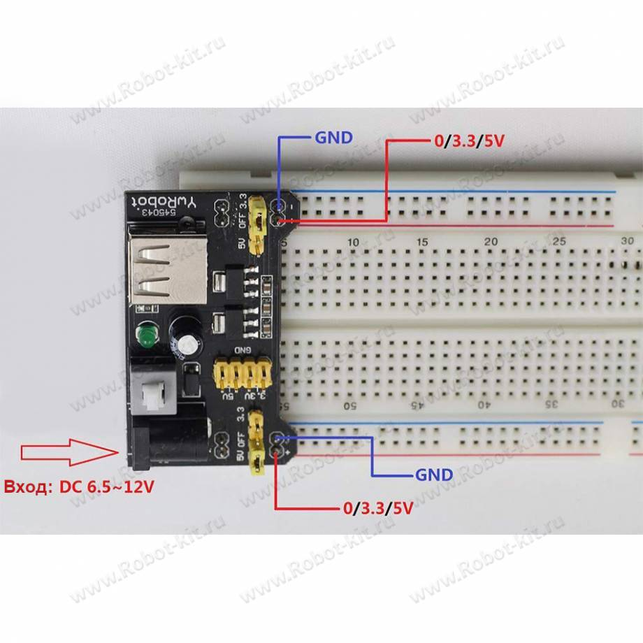
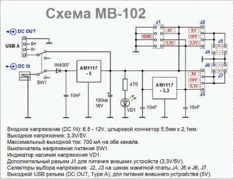

### Модуль питания 3.3V-5V для макетной платы MB-102

Модуль для запитывания проектов собираемых на макетной плате МВ102. Представляет собой двухканальный стабилизатор постоянного напряжения 5,0 и 3,3 Вольта. 

Входное напряжение для модуля подаётся через круглый штекер 5,5 мм. 

Выходное напряжение устанавливается перемычками на модуле.

Модуль формирует одновременно два выходных фиксированных напряжения (5,0 или 3,3 В) по Вашему выбору. Это позволяет создать на макетной плате одновременно две шины питания с разными или одинаковыми напряжениями и оперативно их изменять.

Выходы модуля организованы в виде трех секций, две из которых, служат для установки на макетку. Штыри “+” и “-” этих секций направлены вниз, для лучшего контакта штыри продублированы. Еще одна секция штырей в центре платы “смотрит” вверх. На ней имеется по два выхода каждого напряжения. Отсюда снимается питание, например, для второй макетной платы. Кнопка с фиксацией включает и отключает питание на всех каналах. Светодиод показывает наличие напряжения на линии 5В. Расстояние между выходными штырями рассчитано для установки модуля на шины питания с шагом 44,5мм. Такой шаг имеют беспаечные макетные платы шириной 55мм.

```
Входное напряжение:         7…12V DC
Выходные напряжения:        3,3V и 5V DC, независимые каналы
Максимальный выходной ток:  700mA
Тип преобразователя:        линейный, понижающий
Размеры:                    53×33мм
```

#### [Описание на Robot-Kit](https://robot-kit.ru/3312/)



Модуль питания 3.3В или 5В для установки на макетную плату Arduino.

Используется с беспаечными макетными платами:
```
BB-102 (Arduino Prototype 830-Point Breadboard (RKP-MB-102A))
BB-400 (Arduino Prototype 400-Point Breadboard (RKP-BB-400)).
```
Модуль питания имеет два выхода и формирует одновременно два выходных фиксированных напряжения на каждом выходе по Вашему выбору (0В, 3.3В, 5В, переключаются джамперами).

Модуль питания можно применить для снабжения электропитанием прибора, который питается от USB порта. USB-выход может использоваться, например, для питания плат Arduino.

Стабилизацию напряжений выполняют две микросхемы, включенные последовательно: AMS1117-5.0 и AMS1117-3.3  Микросхемы имеют защиту от перегрузки по току и перегрева.

Имеется выключатель напряжения (кнопка).

Для индикации включения на плате установлен светодиод.

Конструкция устройства обеспечивает легкую установку на макетную плату Arduino.

 
 

**Характеристики**

```
Входное постоянное напряжение:  от 6.5 до 12 В (разъем 5.5x2.1 мм DJK Джек)
Выходные напряжения:            3.3 и 5 В (переключаются джамперами)
Дополнительный разъём для питания внешних устройств: 3.3 / 5 В
Максимальный суммарный ток нагрузки двух стабилизаторов: 0.7 А
Индикатор наличия питания
Выключатель напряжения питания
Размеры:                        53 x 32 x 23 мм
```

**Установка и подключение**

При установке модуля стабилизатора на макетную плату Arduino аккуратно соблюдайте полярность подачи питания. Правильная установка модуля возможна только с одной стороны, но из-за совпадения отверстий можно ошибочно поставить стабилизатор на другую сторону макетной платы. 

На выступах платы модуля возле контактных площадок штырей соединителей обращенных вниз нанесена маркировка “+” и “–“. Установить надо так, чтобы знак “+” соответствовал красной полосе, а “–“ синей. Так модуль питания MB102 обеспечивает одновременную подачу энергии на верхнюю и нижнюю пары шин питания макетной платы Arduino.

Благодаря перемычкам, находящимся возле выступов платы можно глядя на маркировку задать напряжение, подаваемое на каждую пару проводников питания. Установка перемычки на два средних проводника отключает питание в коммутируемых линиях. Если на обоих выходах перемычками выбрано отключение, то светодиод не будет светиться.

Ближе к середине платы стабилизатора расположена вилка из восьми контактов. Устанавливать на нее перемычки нельзя. Вилка обеспечивает подключение жгута проводов питания устройств, расположенных вне макетной платы. На контактах питания USB соединителя, имеющего тип А, напряжение 5 В для снабжения питанием соответствующих приборов через USB кабель.

Напряжение на стабилизатор подается через круглый соединитель. Для этого используется штекер DJK-02A, его контактная часть имеет размеры диаметр 2.1 x 5.1 мм, центральный контакт – плюс. Для предотвращения неполадок в случае ошибки полярности в этом разъеме далее входная цепь модуля содержит диод.

Меры предосторожности

> USB это один из выходов устройства. Запрещается использовать разъем USB в качестве входа для подключения модуля к питанию. 
Это приведет к порче микросхемы стабилизатора 5 В и порта USB. 

Для длительной работы стабилизатора в различных проектах приводим меры предосторожности. При эксплуатации следует избегать критических режимов, при которых потребляемый нагрузкой ток приближается к предельно допустимому значению и не допускать перегрев микросхем, несмотря на то, что модуль питания MB102 имеет собственные средства защиты.
