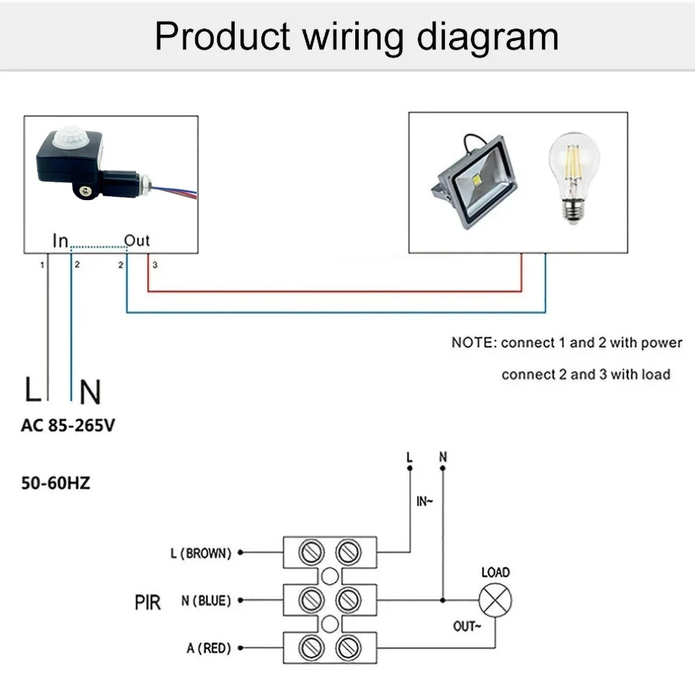
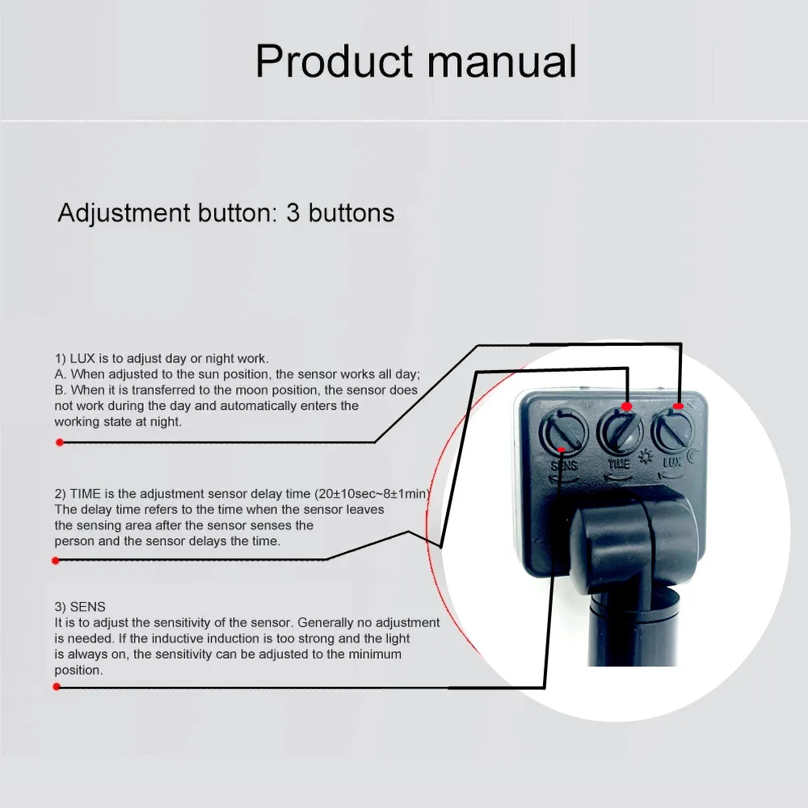
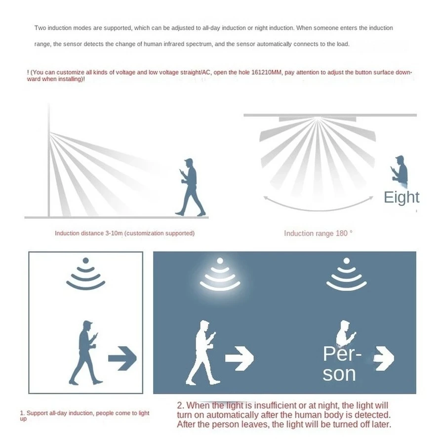
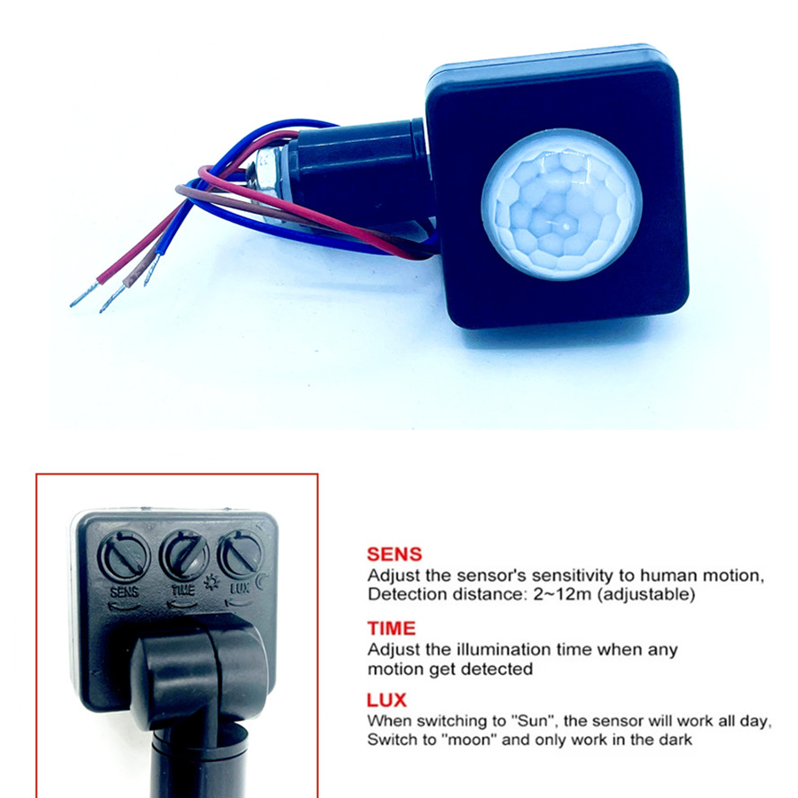
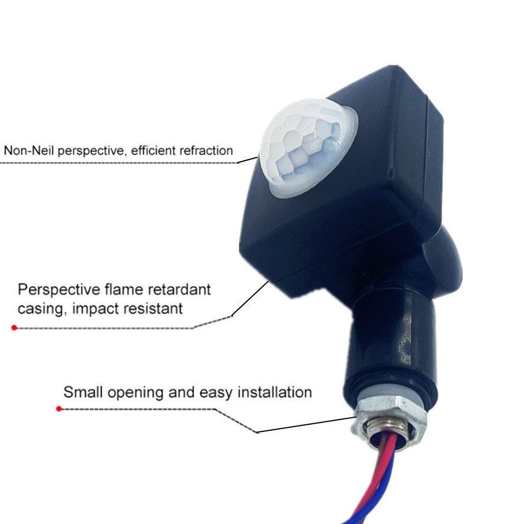

### 85-265 в IP65, регулируемый датчик движения 
### ультратонкий, светодиодный PIR водонепроницаемый наружный датчик движения

#### [RnnTuu Global Store](https://aliexpress.ru/store/1102077315?g=y&page=1&searchInfo=search&spm=a2g2w.orderdetail.0.0.52d74aa6Q0eiHT)

#### [Muunnn Store](https://aliexpress.ru/store/1102077331?g=y&page=1&searchInfo=search&spm=a2g2w.orderdetail.0.0.1d3d4aa6c6xjd3)

#### [Инфракрасный датчик движения HC-SR501](https://robotchip.ru/obzor-infrakrasnogo-datchika-dvizheniya-hc-sr501/)

```
► Напряжение питания: 4.8В … 20В
► Статический ток: 50 мА
► Уровня выходного сигнала: 3.3 В / низкий 0 В
► Время задержки: 0.5 — 200с (регулируемая)
► Время блокировки: 2.5 с
► Угол работы: < 100
► Рабочая температура: -15С … + 70C
► Определение объектов: 23 мм
► Габариты: 33мм x 25мм x 24мм
```

#### Описание

```
100% Brand New and High Quality!

The 10mm open version of the interface is made of iron, and the
Sensing distance / light intensity / power-on time adjustable

Small size and high sensitivity.

160 degree monitoring range

1) LUX switch is to adjust day or night work.
---------------------------------------------
A. When adjusted to the sun position, the sensor works all day;
B. When it is transferred to the moon position, the sensor does not work during the day and automatically enters the working state at night.

2) TIME switch is to adjust the sensor delay time (20±10sec~8+1min)
-------------------------------------------------------------------
The delay time refers to the time when the sensor leaves the sensing area after the sensor senses the person and the sensor delays the time.

3) The SENS switch is the sensitivity of the adjustment sensor. Generally no adjustment is needed.


If the inductive induction is too strong and the light is always on, the sensitivity can be adjusted to the minimum position.
Fresnel perspective, efficient refraction.
Flame-retardant casing, impact resistant.
```

#### Specification

```
Detection range:           160 degrees
Detection distance:        6-8M (25 degrees Celsius)
Ambient lighting:          2-2000 LUX (adjustable)
Working humidity:          less than 93% RH
Material:                  ABS
Installation method:       open type (opening 10mm/12mm)
Working voltage:           AC85-265V
Delay time:                8 seconds - 6 minutes (adjustable)
Working temperature:       -10 degrees Celsius - 40 degrees Celsius
Installation height:       1.8m-2.5m
Dimensions:                42*40*20mm
```











