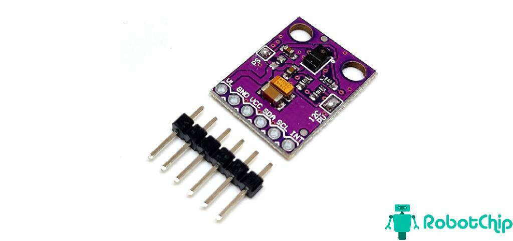
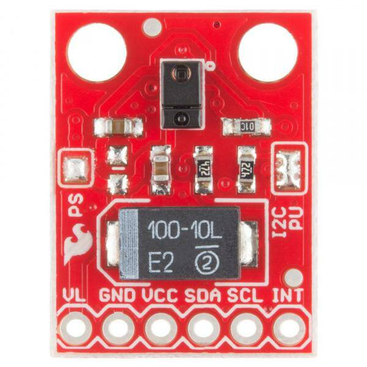
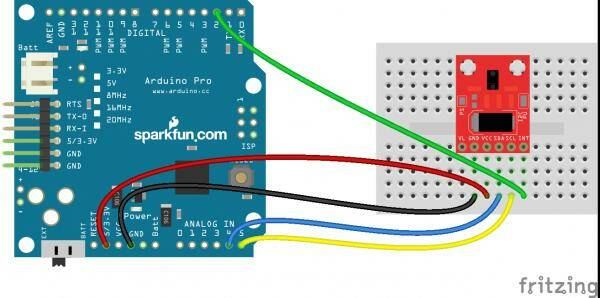
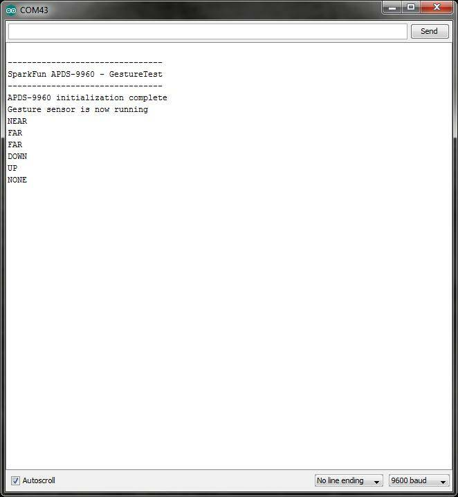

### [APDS-9960](https://www.sparkfun.com/products/12787)
### Датчик жестов, приближения, освещенности, цвета



Датчик APDS-9960 обеспечивает измерение окружающего света и цвета, определяет приближение и бесконтактно распознаёт жесты, это один из лучших датчиков жестов на рынке по цене.

APDS-9960 - это серьезное небольшое устройство со встроенными фильтрами, блокирующими УФ- и ИК-излучение, четырьмя отдельными диодами, чувствительными к разным направлениям, и интерфейсом, совместимым с I2C. 

Характеристики:
```
Рабочее напряжение: 3,3 В
Датчик окружающего света и цвета RGB
Датчик приближения
Обнаружение жестов
Диапазон обнаружения: 4-8 дюймов (10-20 см)
Интерфейс ввода-вывода 2C, адрес ввода-вывода: 0x39
```
[Электрическая схема датчика APDS-9960](SparkFun_APDS-9960_RGB_and_Gesture_Sensor-v10.pdf)

#### [Руководство по подключению APDS-9960 RGB и датчика жестов](https://learn.sparkfun.com/tutorials/apds-9960-rgb-and-gesture-sensor-hookup-guide?_gl=1*1fggeez*_ga*MTA2MzUyOTA3Mi4xNzA2ODA1MzUz*_ga_T369JS7J9N*MTcwNjg1NTA2Ni4zLjEuMTcwNjg1NjA3MC42MC4wLjA.&_ga=2.80920983.1049575777.1706805355-1063529072.1706805353)



Плата управления APDS-9960 имеет 6 контактов для подачи питания на датчик и шину I2C:

```
Pin   Описание
----------------------------------------------------------------------
VL	  Доп.питание ИК-светодиода при отключенной перемычке PS, 3.0-4.5В
GND	  Подключение к заземлению.
VCC	  Питание датчика APDS-9960. Должно быть 2.4-3.6В
SDA   Данные I2C
SCL	  Часы I2C
INT	  Вывод внешнего прерывания. Активен при НИЗКОМ уровне прерывания
```
На передней панели разделительной платы расположены 2 паяных перемычки:

***PS*** - Эта перемычка соединяет источники питания датчика и ИК-светодиода (также расположенные на APDS-9960) вместе. Когда перемычка замкнута (т.е. подключена), вам нужно только подать питание на вывод VCC для питания как датчика, так и ИК-светодиода. Если перемычка разомкнута, необходимо подавать питание на оба вывода VCC (2,4 - 3,6 В) и VL (3,0 - 4,5 В) отдельно. По умолчанию эта перемычка замкнута.

***I2C PU*** - это 3-ходовая паяная перемычка, которая используется для подключения и разъединения подтягивающих резисторов I2C. По умолчанию эта перемычка замкнута, что означает, что к обеим линиям SDA и SCL подключены подтягивающие резисторы на плате отключения. Можно открыть перемычку, если вам не нужны подтягивающие резисторы (например, у вас есть подтягивающие резисторы, которые расположены на шине I2C где-то в другом месте).

По умолчанию при установке датчика на плату контакт VL остается отключенным.

***ВАЖНО: Вы должны использовать напряжение 3,3 В! При попытке использовать источник питания 5В или устройства связи 5В I2C вы рискуете повредить APDS-9960. Если вы используете Arduino с напряжением 5В (например, UNO), то у вас должен быть какой-то сдвиг напряжения до 3,3 В.***



Для работы с датчиком следует подключить [библиотеку](https://github.com/sparkfun/APDS-9960_RGB_and_Gesture_Sensor/archive/master.zip) ***SparkFun_APDS9960*** из каталога APDS-9960_RGB_and_Gesture_Sensor_Arduino_Library.

Как пример распознавания жестов используйте пример ***GestureTest*** из библиотеки:
```
/****************************************************************
GestureTest.ino
APDS-9960 RGB and Gesture Sensor
Shawn Hymel @ SparkFun Electronics
May 30, 2014
https://github.com/sparkfun/APDS-9960_RGB_and_Gesture_Sensor

Tests the gesture sensing abilities of the APDS-9960. Configures
APDS-9960 over I2C and waits for gesture events. Calculates the
direction of the swipe (up, down, left, right) and displays it
on a serial console. 

To perform a NEAR gesture, hold your hand
far above the sensor and move it close to the sensor (within 2
inches). Hold your hand there for at least 1 second and move it
away.

To perform a FAR gesture, hold your hand within 2 inches of the
sensor for at least 1 second and then move it above (out of
range) of the sensor.

Hardware Connections:

IMPORTANT: The APDS-9960 can only accept 3.3V!

 Arduino Pin  APDS-9960 Board  Function

 3.3V         VCC              Power
 GND          GND              Ground
 A4           SDA              I2C Data
 A5           SCL              I2C Clock
 2            INT              Interrupt

Resources:
Include Wire.h and SparkFun_APDS-9960.h

Development environment specifics:
Written in Arduino 1.0.5
Tested with SparkFun Arduino Pro Mini 3.3V

This code is beerware; if you see me (or any other SparkFun 
employee) at the local, and you've found our code helpful, please
buy us a round!

Distributed as-is; no warranty is given.
****************************************************************/

#include <Wire.h>
#include <SparkFun_APDS9960.h>

// Pins
#define APDS9960_INT    2 // Needs to be an interrupt pin

// Constants

// Global Variables
SparkFun_APDS9960 apds = SparkFun_APDS9960();
int isr_flag = 0;

void setup() {

  // Initialize Serial port
  Serial.begin(9600);
  Serial.println();
  Serial.println(F("--------------------------------"));
  Serial.println(F("SparkFun APDS-9960 - GestureTest"));
  Serial.println(F("--------------------------------"));

  // Initialize interrupt service routine
  attachInterrupt(0, interruptRoutine, FALLING);

  // Initialize APDS-9960 (configure I2C and initial values)
  if ( apds.init() ) {
    Serial.println(F("APDS-9960 initialization complete"));
  } else {
    Serial.println(F("Something went wrong during APDS-9960 init!"));
  }

  // Start running the APDS-9960 gesture sensor engine
  if ( apds.enableGestureSensor(true) ) {
    Serial.println(F("Gesture sensor is now running"));
  } else {
    Serial.println(F("Something went wrong during gesture sensor init!"));
  }
}

void loop() {
  if( isr_flag == 1 ) {
    detachInterrupt(0);
    handleGesture();
    isr_flag = 0;
    attachInterrupt(0, interruptRoutine, FALLING);
  }
}

void interruptRoutine() {
  isr_flag = 1;
}

void handleGesture() {
    if ( apds.isGestureAvailable() ) {
    switch ( apds.readGesture() ) {
      case DIR_UP:
        Serial.println("UP");
        break;
      case DIR_DOWN:
        Serial.println("DOWN");
        break;
      case DIR_LEFT:
        Serial.println("LEFT");
        break;
      case DIR_RIGHT:
        Serial.println("RIGHT");
        break;
      case DIR_NEAR:
        Serial.println("NEAR");
        break;
      case DIR_FAR:
        Serial.println("FAR");
        break;
      default:
        Serial.println("NONE");
    }
  }
}
```
После загрузки скетча можно проверить жесты:

Наведите руку на 4-8 дюймов (10-20 см) над датчиком, но в сторону (т. е. не непосредственно над датчиком). Сохраняя ту же высоту, проведите рукой над датчиком (в пределах досягаемости датчика, а затем сразу за ее пределами). Если вы двигаетесь слишком быстро, датчик не распознает жест.

На последовательном мониторе появятся жесты, указывающие направление прокрутки.


Доступны также 2 других жеста: ближний и дальний.

Жест "РЯДОМ" можно выполнить, удерживая руку высоко над датчиком (более 10 дюймов (25 см)), приблизив ее к датчику (около 2 дюймов (5 см) непосредственно над датчиком), удерживая ее там не менее 1 секунды, а затем убрав руку.

Дальнего жеста можно добиться, удерживая руку непосредственно над датчиком и близко к нему (примерно 2 дюйма (5 см)) не менее 1 секунды, а затем переместив руку вверх непосредственно над датчиком и вне зоны его досягаемости.

Если жест был неправильно интерпретирован, на последовательном мониторе ничего не отобразится.



#### Поддерживаемые жесты

Вот список поддерживаемых в настоящее время жестов. Убедитесь, что каждый жест начинается за пределами диапазона действия датчика, переходит в диапазон действия датчика и заканчивается за пределами диапазона действия датчика.
```
Жест	Описание
ВВЕРХ	Проведите пальцем от нижней части платы к верхней и вне зоны действия датчика. Убедитесь, что ваше запястье / рука не находятся в зоне действия датчика в конце касания!
ВНИЗ	Проведите пальцем от верхней части платы к нижней и выходите за пределы досягаемости датчика.
СЛЕВА	Проведите пальцем с правой стороны платы влево и за пределы досягаемости датчика.
ПРАВИЛЬНО Проведите пальцем от левой стороны платы вправо и за пределы досягаемости датчика.
РЯДОМ	Объект (например, рука) начинается намного выше датчика, приближается к датчику, зависает не менее чем на 1 секунду и выходит из зоны действия датчика.
ДАЛЕКО	Объект начинается рядом с датчиком, зависает не менее чем на 1 секунду, а затем перемещается выше и вне зоны действия датчика.
Нет	    Сенсор не смог правильно угадать выполняемый жест.
```

#### Ресурсы и дальнейшие действия

Теперь, когда вы ознакомились с возможностями APDS-9960 по распознаванию жестов, вы можете начать использовать его в своем проекте! Имейте в виду, что APDS-9960 также способен определять близость объекта и окружающий / цветной свет. Попробуйте другие примеры в библиотеке SFE_APDS9960, чтобы увидеть, на что способен датчик.:

***AmbientLightInterrupt*** - В этом примере показано, как вы можете генерировать прерывание Arduino всякий раз, когда окружающий свет падает ниже заданного уровня. Вы также можете изменить его, чтобы он вызывал прерывание, когда уровень освещенности поднимается выше определенного уровня.

***ColorSensor*** - В этой демонстрации показано, как считывать значения окружающего, красного, зеленого и синего света с APDS-9960.

***GestureTest*** - Мы использовали этот пример в этом руководстве по подключению. Здесь показано, как считывать основные жесты с помощью APDS-9960.

***ProximityInterrupt*** - APDS-9960 можно использовать для обнаружения перемещения объектов в пределах досягаемости его датчика. В этом примере показано, как создавать прерывание всякий раз, когда объект перемещается в пределах определенного диапазона датчика. Вы также можете изменить ограничения, чтобы генерировать прерывание всякий раз, когда объект перемещается за пределы определенного диапазона.

***ProximitySensor*** - Вам не нужно использовать прерывания для датчика приближения. В этой демонстрации мы покажем вам, как регулярно опрашивать датчик на предмет наличия данных о приближении. Попробуйте запустить этот пример и поднести руку поближе к датчику.

[Техническое описание APDS-9960](Avago-APDS-9960-datasheet.pdf)

[Библиотека для APDS-9960 RGB и датчика жестов](https://github.com/sparkfun/SparkFun_APDS-9960_Sensor_Arduino_Library/tree/V_1.4.2)

[Весь репозиторий APDS-9960 RGB и датчика жестов на GitHub](https://github.com/sparkfun/APDS-9960_RGB_and_Gesture_Sensor)


