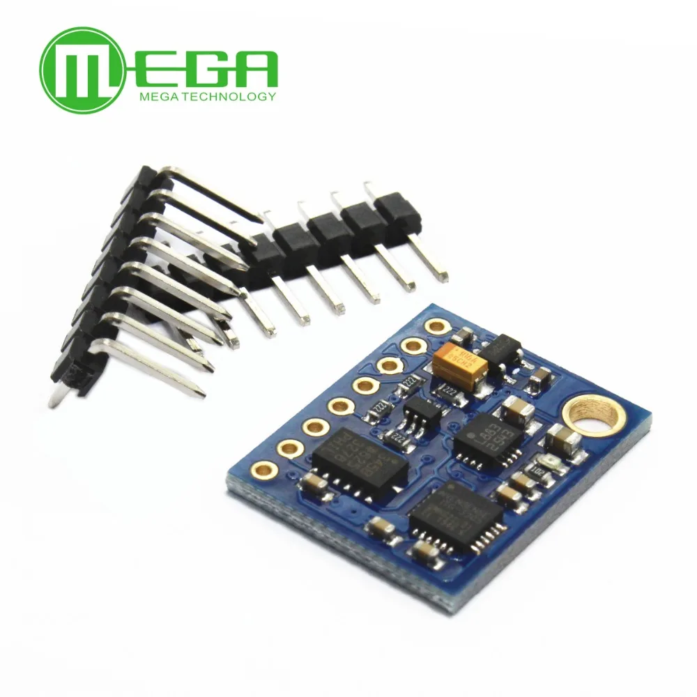

### GY-85 датчик положения

---

#### [GY-85 - датчик положения](https://aliexpress.ru/item/1005006659544199.html?sku_id=12000037949190647&spm=a2g2w.productlist.search_results.0.45445430x5v3SS)

###### [Mega Semiconductor CO., Ltd.](https://aliexpress.ru/store/808897?g=y&page=1&searchInfo=search&spm=a2g2w.detail.0.0.78ef2406rjz1gh)

```
9 осевой модуль (3 оси гироскоп + 3 акселерометра + 3 оси магнитного поля)
Процесс погружения золота PCB
Чип: ITG3205 + ADXL345 + HMC5883L
Питание: 3-5 В
Протокол связи IIC (полностью совместим с системой 3-5 В)
Размеры: 2,2 см * 1,7 см
```



#### [Technical documentation for GY-85 (ADXL345 accelerometer, ITG3200 gyroscope and HMC5883L magnetometer)](https://github.com/madc/GY-85)
 
#### [Tutorial to Interface GY-85 IMU 9DOF Sensor With Arduino](https://www.instructables.com/Tutorial-to-Interface-GY-85-IMU-9DOF-Sensor-With-A/)

#### [Инерционный трекер на базе Arduino и GY-85](https://habr.com/ru/articles/372171/)

---

###### [к содержанию](../README.md)

