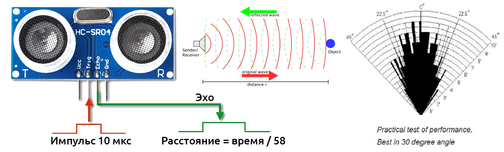

### [HC-SR04](HC-SR04 Datasheet.pdf)
###  [Ультразвуковой датчик расстояния](https://kit.alexgyver.ru/tutorials/hc-sr04/)

#### Характеристики:

```
Питание:              5V
Рабочий ток:         15 мА
Звуковая частота:    40 кГц
Угол измерения:      15 градусов
Диапазон измерения:   2 см. - 4 м.
Точность:            ~1 мм при грамотной фильтрации
```

Датчик работает довольно интересно: подаём импульс с продолжительностью 10 мкс на пин Trig, модуль посылает ультразвуковой импульс, он отражается от препятствия и детектируется. Затем с пина Echo возвращается импульс по продолжительности соответствующий времени путешествия звуковой волны. Ардуина этот импульс должна измерить.




С датчиком можно работать без библиотек, стандартными средствами Arduino. Но есть и библиотеки:

[HC-SR04](https://github.com/d03n3rfr1tz3/HC-SR04) – можно установить по названию HC-SR04 из менеджера библиотек (автор Dirk Sarodnick);

[NewPing](https://www.arduino.cc/reference/en/libraries/newping/) – можно установить по названию NewPing из менеджера библиотек.

```
Небольшой момент:
 
чтобы датчик не ловил “эхо” от самого себя – 
его не рекомендуется опрашивать чаще 30 мс!
```
#### [Опрос средствами Arduino](PollingUsingArduino/PollingUsingArduino.ino)

```
// Опрос средствами Arduino
// PollingUsingArduino.ino

// Для опроса используем встроенные Arduino-функции.
// опрашиваем через 50 мс

#define HC_TRIG 3
#define HC_ECHO 2

void setup() 
{
  Serial.begin(9600);       // для связи
  pinMode(HC_TRIG, OUTPUT); // trig выход
  pinMode(HC_ECHO, INPUT);  // echo вход
}

void loop() 
{
  float dist = getDist();   // получаем расстояние
  Serial.println(dist);     // выводим
  delay(50);
}

// Определить расстояние до препятствия
float getDist() 
{
  // импульс 10 мкс
  digitalWrite(HC_TRIG, HIGH);
  delayMicroseconds(10);
  digitalWrite(HC_TRIG, LOW);
  // измеряем время ответного импульса
  uint32_t us = pulseIn(HC_ECHO, HIGH);
  // считаем расстояние и возвращаем
  return (us / 58.2);
}
```
На показаниях плоттера видно, что при приближении руки к датчику уменьшается зарегистрированное расстояние.

#### [Опрос средствами Arduino с фильтрацией](PollingWithDataFiltering/PollingWithDataFiltering.ino)

В дополнение к предыдущему примеру фильтруем данные при помощи простейшего [экспоненциального фильтра](https://alexgyver.ru/lessons/filters/). 

И, здесь, показания плоттера гораздо более ровные и спокойные.

Опрос датчика при помощи pulseIn(), не так плох, как про него пишут на форумах: погрешность измерения составляет всего 0.5 мкс, что в пересчёте на расстояние даёт точность 0.17 мм! 

На деле точность получается в два раза выше, так как фактически мы измеряем сигнал два раза (путь до препятствия и обратно). Сам датчик шумит гораздо сильнее, поэтому миллиметровую точность получить абсолютно не проблема. 

```
Но есть проблема в другом: 

выполнение кода блокируется на время измерения, 
например на трёх метрах это будет 17 мс. 

Вроде и немного, но для некоторых задач это будет весьма критично.
```
#### [Опрос датчика расстояния с помощью библиотеки NewPing](PollingByNewPing/PollingByNewPing.ino)

#### [Коррекция опроса датчика по температуре](PollingOnTemperature/PollingOnTemperature.ino)

Скорость звука зависит от температуры: при +20°С это 343 м/с, а при -20°С – 318 м/с! А ведь это целых 318/343=7%, что на расстоянии в 1 метр даст погрешность 7 сантиметров. Много, гораздо больше возможных погрешностей в измерении. Давайте это исправим.

В диапазоне -50.. 50°С зависимость является линейной и аппроксимируется уравнением V = 0.609 * t + 330.75:


Таким образом для нахождения более точного расстояния с поправкой на температуру достаточно делить время импульса не на 58, а на.. кстати, откуда берётся 58? Для прохождения 1 м звуку понадобится 1 / 343 = 0.0029 с, или 2.915 мс. Мы получаем время туда и обратно, поэтому умножаем ещё на 2. В и для сантиметров – ещё на 10, и получаем 58.3. Гораздо понятнее было бы умножать время импульса на скорость звука и делить пополам.

Таким образом для расчёта расстояния в миллиметрах с учётом температуры в °С получим формулу:

S = us * V / 2000 
S = us * (0.609 * t + 330.75) / 2000
S = us * (t * 6 / 10 + 330) / 2000

Настолько высокая точность нам не нужна, поэтому можно избавиться от float, чтобы код весил меньше (третье уравнение). Погрешность составит не более 1 мм на 1 метр. И финальный пример тогда (подставим в первую программу):

```
// Опрос датчика расстояния средствами Arduino (опрашиваем через 50 мс)
// с коррекцией по температуре и результатом в целых миллиметрах
// (если фильтровать, будет еще лучше)

#define HC_TRIG 3
#define HC_ECHO 2

void setup() 
{
  Serial.begin(9600);       // для связи
  pinMode(HC_TRIG, OUTPUT); // trig выход
  pinMode(HC_ECHO, INPUT);  // echo вход
}

void loop() 
{
  int t = 24;           // представим, что получили с датчика
  int dist = getMm(t);  // получаем расстояние в мм
  Serial.println(dist); // выводим
  delay(50);
}

// сделаем функцию для удобства
int getMm(int t) 
{
  // импульс 10 мкс
  digitalWrite(HC_TRIG, HIGH);
  delayMicroseconds(10);
  digitalWrite(HC_TRIG, LOW);
  // измеряем время ответного импульса
  uint32_t us = pulseIn(HC_ECHO, HIGH);
  // считаем расстояние и возвращаем
  return (us * (t * 6 / 10 + 330) / 2000ul);
}
```

