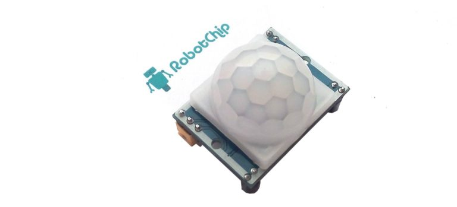
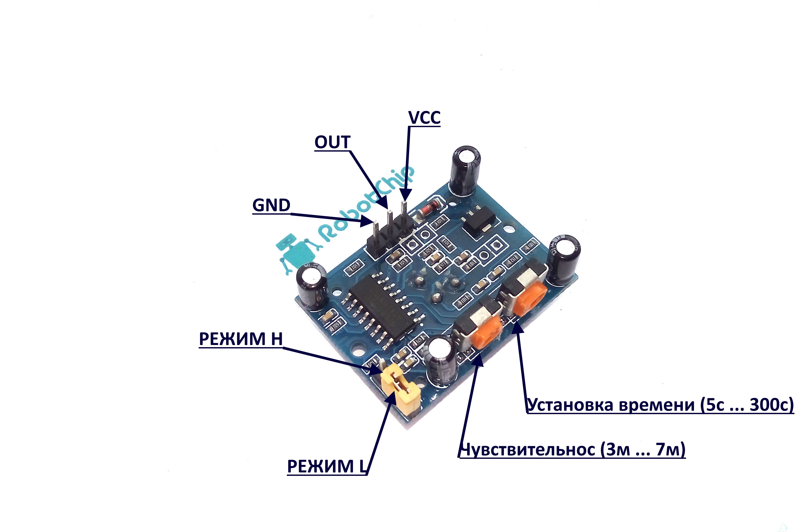
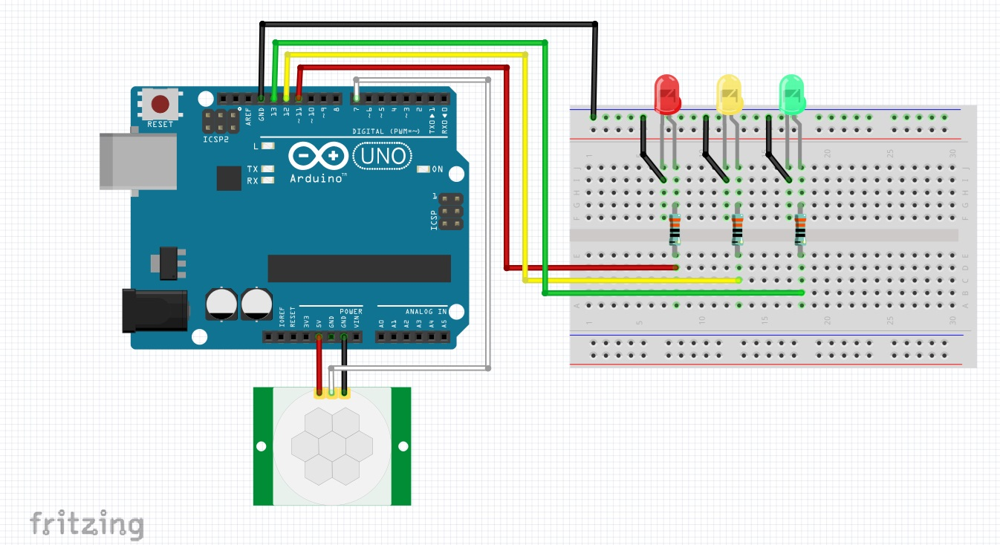

### HC-SR501
### Инфракрасный датчик присутствия

### [Обзор инфракрасного датчика движения HC-SR501](https://robotchip.ru/obzor-infrakrasnogo-datchika-dvizheniya-hc-sr501/)



***Технические характеристики:***
```
► Напряжение питания: 4.8В … 20В
► Статический ток: 50 мА
► Уровня выходного сигнала: 3.3 В / низкий 0 В
► Время задержки: 0.5 — 200с (регулируемая)
► Время блокировки: 2.5 с
► Угол работы: < 100
► Рабочая температура: -15С … + 70C
► Определение объектов: 23 мм
► Габариты: 33мм x 25мм x 24мм
```

***Общие сведения:***

Любой человек или животное с температурой выше нуля испускает тепловую энергию в виде излучения. Это излучение не видно человеческому глазу, потому что оно излучается на инфракрасных волнах, ниже спектра, который люди могут видеть.

Измерение этой энергии, не то же самое, что измерять температуру. Так как температура зависит от теплопроводности, поэтому, когда человек входит в комнату, он не может мгновенно изменить температуру в помещении. Однако есть уникальная инфракрасное излучение из-за температуры тела и которую ищет PIR датчик.

Принцип работы инфракрасного датчика движения HC-SR501 прост, при включении, датчик настраивается на «Нормальное» инфракрасное излучение в пределах своей зоны обнаружения. Затем он ищет изменения, например человек прошел или переместился в пределах контролируемой зоны. Для определения инфракрасного излечения детектор использует пироэлектрический датчик. Это устройство, которое генерирует электрический ток в ответ на прием инфракрасного излучения. Поскольку датчик не излучает сигнал (например, ранее упомянутый ультразвуковой датчик), его называют «пассивным». Когда обнаружено изменение, датчик HC-SR501 изменяет выходной сигнал.

Для повышения чувствительности и эффективности датчика HC-SR501 используется метод фокусировки инфракрасного излечения на устройство. Достигается, это с помощью «Линзы Френеля». Линза выполнен из пластика в виде купола и фактически состоит из нескольких небольших линз Френеля. Хоть пластик и полупрозрачен для человека, но на самом деле полностью прозрачен для инфракрасного света, поэтому он также служит в качестве фильтра.

HC-SR501 полностью автономный, способный работать сам по себе или в сопряжении с микроконтроллером. Датчик имеет регулировку чувствительности, которая позволяет определять движение от 3 до 7 метров, а его выход можно настроить так, чтобы он оставался высоким в течение времени от 3 секунд до 5 минут. Так же, датчике имеет встроенный стабилизатор напряжения, поэтому он может питаться от постоянного напряжения от 4,5 до 20 вольт и потребляет небольшое количество тока. 



Назначение выводов:

```
► VCC — положительное напряжение постоянного тока от 4,5 до 20 В постоянного тока.
► OUTPUT — логический выход на 3,3 вольта. LOW не указывает на обнаружение, HIGH означает, что кто-то был обнаружен.
► GND — заземление.
```

На плате также установлены два потенциометра для настройки нескольких параметров:

```
►  SENSITIVITY — устанавливает максимальное и минимальное расстояние (от 3 метров до 7 метров).
►  TIME (ВРЕМЯ) — время, в течение которого выход будет оставаться HIGH после обнаружения. Как минимум, 3 секунды, максимум 300 секунд или 5 минут.
```

Назначение перемычек:

```
►  H — это настройка Hold или Repeat. В этом положении HC-SR501 будет продолжать выдавать сигнал HIGH, пока он продолжает обнаруживать движение.
(в нашем случае - 2024-07-04 по умолчанию установлен режим H - Hold)
►  L — Это параметр прерывания или без повтора. В этом положении выход будет оставаться HIGH в течение периода, установленного настройкой потенциометра TIME.
```

На плате HC-SR501 имеются дополнительные отверстия для двух компонентов, рядом расположена маркировка, посмотреть на нее можно сняв линзу Френеля.

Назначение дополнительных отверстий:

```
►  RT — это предназначено для термистора или чувствительного к температуре резистора. Добавление этого позволяет использовать HC-SR501 в экстремальных температурах, а также в некоторой степени повышает точность работы детектора.
►  RL — это соединение для светозависимого резистора или фоторезистора. Добавляя компонент, HC-SR501 будет работать только в темноте, что является общим приложением для чувствительных к движению систем освещения.
```

### Пример подключения HC-SR501 к Arduino

Необходимые детали:
```
► Arduino UNO R3 x 1 шт.
► Датчика движения HC-SR501 x 1 шт.
► Светодиоды 5 мм x 3 шт.
► Резистор 0,125W, 320Om x 3 шт.
► Провод DuPont, 2,54 мм, 20 см, F-M (Female — Male) x 1 шт.
```

Подключение:

Хотя датчик HC-SR501 и самостоятельное устройство, его можно подключить к выводу микроконтроллера. В примере используем контроллер Arduino UNO R3, в котором можем учесть время включения и период сброса. Таким образом, устройство может быть более точным, так как вы не будете пытаться воспринимать движение вперед, когда датчик не готов. 

Так же, можно подключить несколько датчиков HC-SR501 к Arduino, что позволит  позволит отслеживать движение в разных местах.

В следующем примере, мы подключим один HC-SR501 к Arduino в качестве индикации воспользуемся тремя светодиодами, каждый из который отображения состояния датчика :

Красный светодиод — этот светодиод указывает, что датчик не готов.
Желтый светодиод — этот светодиод указывает, что датчик готов к обнаружению движения.
Зеленый светодиод — этот светодиод горит в течение 3 секунд при срабатывании датчика.  Вместо светодиода, можно управлять внешним выходом (например, модулем реле, который мы использовали ранее).

Необходимо установить время на минимум (5 секунд), для этого поверните потенциометр влево до упора. 



```
/* 
По мотивам статьи:
https://robotchip.ru/obzor-infrakrasnogo-datchika-dvizheniya-hc-sr501/

В примере подключается HC-SR501 к Arduino. В качестве индикации используются три светодиода, 
каждый из который отображает состояния датчика:

красный светодиод указывает, что датчик не готов;
желтый светодиод указывает, что датчик готов к обнаружению движения;
зеленый светодиод горит в течение 3 секунд при срабатывании датчика. 
 
Вместо светодиода, можно управлять внешним выходом (например, модулем реле)
*/ 

int waitLED = 11;                    // пин красного - датчик не готов
int readyLED = 12;                   // пин желтого - датчик готов к обнаружению движения          
int detectedLED = 13;                // пин зеленого - светодиод горит в течение 3 секунд при срабатывании датчика

int pirPin = 7;                      // пин сигнального контакта датчика 
int sensorReady = 0;                 // флаг готовности датчика к обнаружению движения
int motionDetected = 0;              // флаг обнаруженного движения
int pirValue;                        // переменная для сохранения значения из PIR

void setup() 
{
  pinMode(detectedLED, OUTPUT);      // установили пины как выход
  pinMode(readyLED, OUTPUT);         // 
  pinMode(waitLED, OUTPUT);          // 
  pinMode(pirPin, INPUT);            // установили пин датчика, как вход
  // Выполняем начальную задержку в 1 минуту для стабилизации датчика
  digitalWrite(detectedLED, LOW);    // погасили зеленый
  digitalWrite(readyLED, LOW);       // погасили желтый
  digitalWrite(waitLED, HIGH);       // зажгли красный
  delay(15000);
  // Минута прошла, зажигаем желтый, гасим красный
  digitalWrite(readyLED, HIGH);
  digitalWrite(waitLED, LOW);
  sensorReady = 1;                   // подняли флаг готовности датчика к обнаружению движения
}

void loop() 
{
  // Если датчику разрешено обнаруживать движение, считываем его значение
  if (sensorReady == 1)                 
  {
    pirValue = digitalRead(pirPin);    // считали значение датчика движения
    // Если движение есть, то зажигаем зеленый светодиод и делаем задержку в 3 сек
    if (pirValue == 1)                 
    { 
      // Сбрасываем флаг готовности датчика движения и гасим желтую лампочку
      sensorReady = 0;
      digitalWrite(readyLED, LOW);    
      // Зажигаем зеленую лампочу, устанавливаем флаг               
      digitalWrite(detectedLED, HIGH);
      motionDetected = 1;
      delay(3000);
      // Сбрасываем флаг, гасим зеленый
      motionDetected = 0;
      digitalWrite(detectedLED, LOW);
      // Зажигаем красный
      digitalWrite(waitLED, HIGH); 
      // Ждем пол-минутки и разрешаем обнаруживать движение      
      delay(15000);
      digitalWrite(readyLED, HIGH);
      digitalWrite(waitLED, LOW);
      sensorReady = 1;                   // подняли флаг готовности датчика к обнаружению движения
    } 
  }
}
```

