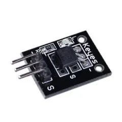
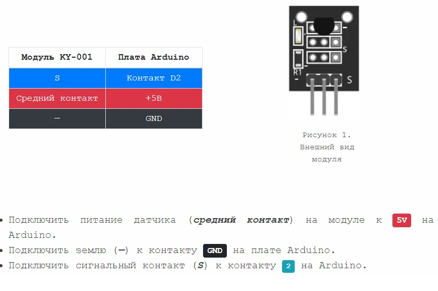
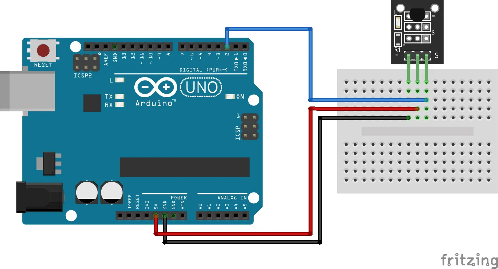

### KY-001
### [Модуль цифрового датчика температуры](https://rxtx.su/mikrokontrollery/arduino/moduli-i-datchiki-k-arduino/modul-datchika-temperatury-ky-001/)

Модуль цифрового датчика температуры KY-001 построен на основе микросхемы [DS18B20](https://роботехника18.рф/термодатчик-ардуино/), представляет из себя цифровой датчик температуры и позволяет измерять температуру окружающей среды. Данные передаются на микроконтроллер с помощью цифровой последовательной шины. К одной и той же шине можно подключить более одного модуля.



Модуль совместим с популярными электронными платами, такими как Arduino, Raspberry Pi и ESP 32.

#### ТЕХНИЧЕСКИЕ ХАРАКТЕРИСТИКИ KY-001

В состав модуля входят: цифровой датчик температуры [DS18B20](https://arduinomaster.ru/datchiki-arduino/arduino-ds18b20/), светодиод, резистор и 3 штыревых контакта.


 
```
Рабочий диапазон напряжений	      от 3,0 В до 5,5 В
Диапазон измерения температуры	  от -55°C до 125°C
Точность измерения температуры	  ±0,5°C
Размеры платы	                  18,5 мм x 15 мм
```

#### Схема подключения модуля KY-001 к arduino uno


Рисунок 2. Схема подключения модуля KY-001 к ардуино уно

#### СКЕТЧ АРДУИНО ДЛЯ МОДУЛЯ KY-001

Следующий скетч Arduino будет использовать библиотеку [OneWire](OneWire-2.3.7/OneWire.h) для последовательной связи с модулем и библиотеку [DallasTemperature](DallasTemperature-3.9.0/DallasTemperature.h)  для преобразования полученных данных в температуру.
```
#include <OneWire.h>
#include <DallasTemperature.h>
// Провод данных подключен к контакту 2 на Arduino
#define ONE_WIRE_BUS 2
// Настройка экземпляра OneWire для связи с любыми устройствами OneWire (не только с микросхемами Maxim/Dallas temperature)
OneWire oneWire(ONE_WIRE_BUS);
// Передача ссылки экземпляра  OneWire для создания экземпляра DallasTemperature.
DallasTemperature sensors(&oneWire);
void setup(void)
{
  // Запуск последовательного порта
  Serial.begin(9600);
  Serial.println("Dallas Temperature IC Control Library Demo");
  // Инициализация библиотеки DallasTemperature
  sensors.begin();
}
void loop(void)
{ 
  // вызвать sensors.requestTemperatures() для отправки глобального запроса температуры всем устройствам на шине
  Serial.print("Requesting temperatures...");
  sensors.requestTemperatures(); // Отправка команды для получения температуры
  Serial.println("DONE");
  Serial.print("Temperature for Device 1 is: ");
  Serial.print(sensors.getTempCByIndex(0)); На одной шине может быть несколько устройств. 0 относится к первому устройству на проводе
}
```