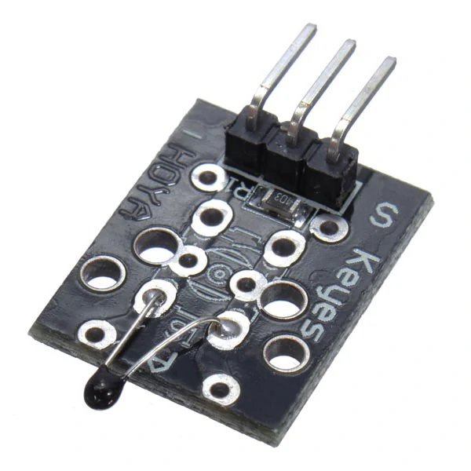
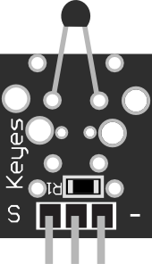
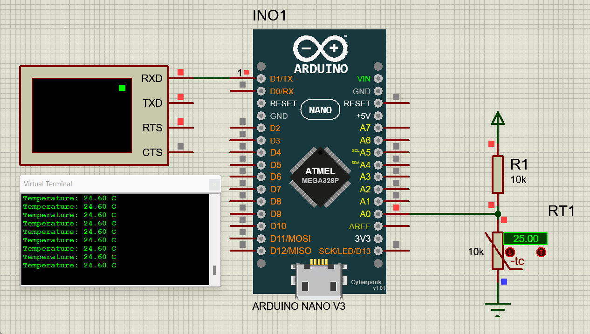
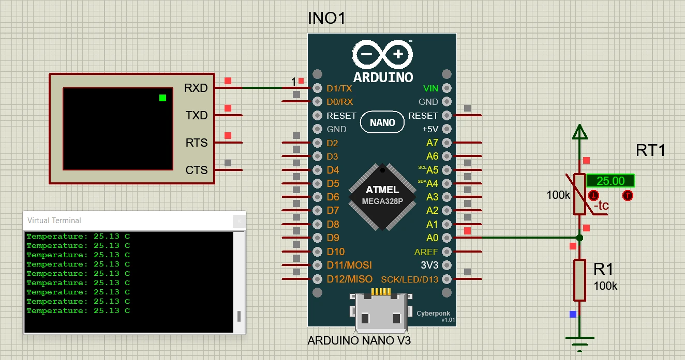
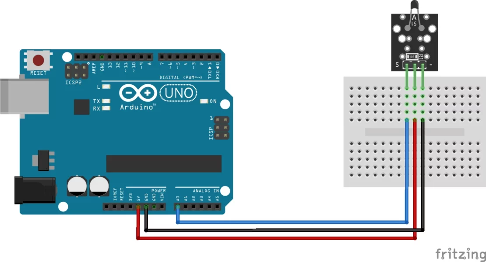

### [KY-013](https://rxtx.su/mikrokontrollery/arduino/moduli-i-datchiki-k-arduino/modul-analogovogo-datchika-temperatury-ntc-termistor-ky-013/)
### Модуль аналогового датчика температуры



Это аналоговый датчик температуры на основе термистора NTC и SMD резистора 10 кОм. В качестве аналога также выступает модуль датчика температуры KY-028, в котором используется датчик того же типа, с одним только отличием — у него присутствует и цифровой выход.

Существует два типа термисторов: NTC и PTC.

[NTC]() - его сопротивление уменьшается с повышением температуры и его обычно называют просто термистор или NTC ( термистор с отрицательным температурным коэффициентом). Эти компоненты состоят из оксидов металлов, таких как хром (Cr), железо (Fe), кобальт (Co), никель (Ni), марганец (Mn), смешанных со специальным связующим. Их можно найти на рынке в форме капли или диска.

[PTC]() Термисторы с положительным температурным коэффициентом (PTC), в отличие от NTC, увеличивают значение сопротивления при повышении температуры.

```
В модуле KY-13 используется NTC, который может измерять температуру 
примерно от -55 °C до +125 °C с допуском ±0,5 градуса.
```



[KY-013 для Fritzing](KY-013 Fritzing/KY-013-keyes-analog-temp.fzpz)

#### ХАРАКТЕРИСТИКИ ТЕМПЕРАТУРНОГО ДАТЧИКА KY-013
```
Датчик	                        NTC 10 кОм
Подтягивающий резистор	        10 кОм
Рабочее напряжение	            5 В
Диапазон измерения температуры	от -55°C до 125°C
Точность измерения	            ± 0,5°С
Размер	                        18,5 мм х 15 мм
```


[ВНИМАНИЕ!]()

Некоторые KY-013 имеют другое расположение контактов. Поэтому для корректной работы, несмотря на шелкографию на модуле, центральный контакт должен быть подключен к GND, а тот, что со знаком «-», должен быть подключен к VCC(+5В). В противном случае на практике при повышении температуры выходные значения будут неверными.



Был случай, когда вместо термистора 10 кОм на плате был запаян термистор на 100 кОм. При замене резистора R1 = 100 кОм получилось добиться адекватных показаний.



#### Подключение температурного модуля KY-013 к Arduino UNO

```
2023-12-20: следующее подключение на модуле дало -273.15ºС

Подключите сигнальный контакт (S) модуля к выводу A0 на Arduino.
Подключите питания модуля (средний контакт) к 5V на Arduino.
Подключите землю модуля (-) к GND на Arduino.

2023-12-20: сделал замену. Это  дало повышенные показатели температуры (при 24ºС реальных показывало 42ºС) .

центральный контакт к GND, 
что со знаком «-» к VCC(+5В).
```



#### СКЕТЧ ДЛЯ ПОДКЛЮЧЕНИЯ МОДУЛЯ KY-013 К ARDUINO

Следующий скетч выведет температуру, полученную от датчика и рассчитанную, используя уравнение Стейнхарта-Харта.

Код вернет температуру в градусах Цельсия, раскомментируйте строку 15, чтобы получить температуру в градусах Фаренгейта.
```
// Аналоговый контакт Ардуино, к которому подключен датчик
int ThermistorPin = A0; 
// Переменная для хранения считанного значения АЦП
int Vo;    
// Значение резистора R1 на модуле             
float R1 = 10000;
// Переменные для рассчета       
float logR2, R2, T;    
// Коэффициенты Стейнхарта — Харта для термистора 
float c1 = 0.001129148, c2 = 0.000234125, c3 = 0.0000000876741; 

void setup()
 {
  // Инициализация последовательного порта
  Serial.begin(9600);   
}

void loop() 
{
  // Считываем значение с аналогового контакта
  Vo = analogRead(ThermistorPin); 
  // Вычисление сопротивления термистора      
  R2 = R1 * (1023.0 / (float)Vo - 1.0); 
  // Вычисление логарифма
  logR2 = log(R2);         
  // Температура в Кельвинах             
  T = (1.0 / (c1 + c2*logR2 + c3*logR2*logR2*logR2)); 
  // Преобразование температуры из Кельвина в Цельсий
  T = T - 273.15; 
  // Преобразование температуры из Цельсия в Фаренгейт
  // T = (T * 9.0)/ 5.0 + 32.0; 
  Serial.print("Temperature: "); 
  Serial.print(T);
  Serial.println(" C"); 
  delay(500);
}
```

