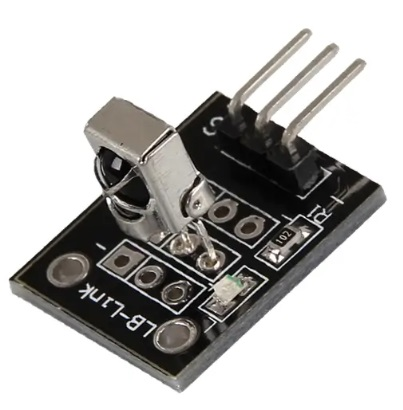
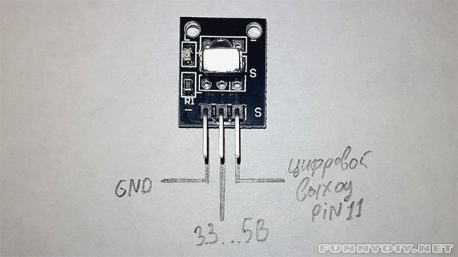
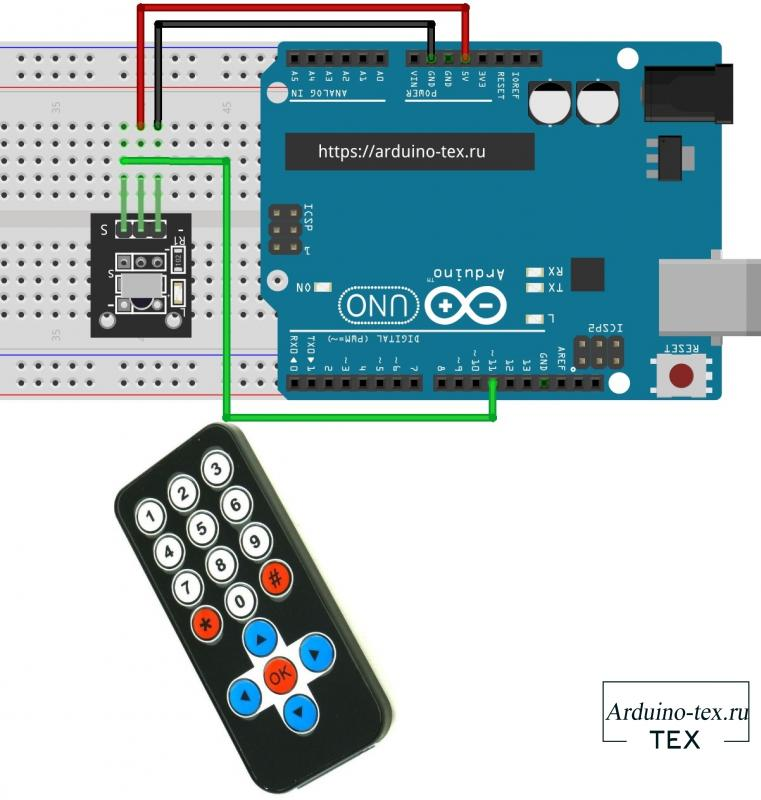
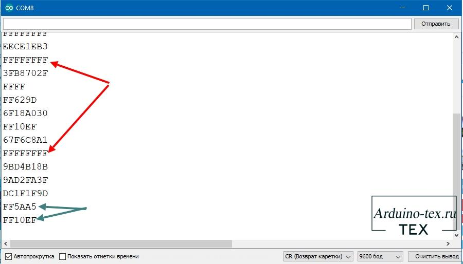

### [KY-022](KY-022.PDF)

### [Модуль ИК - приёмника](https://arduino-tex.ru/news/62/ky-022---modul-ik-priemnika-podklyuchenie-k-arduino.html)



Инфракрасный приемник KY-022 выполнен на базе датчика «VS1838B» (рабочая частота 38 кГц) и предназначен для приема данных по инфракрасному каналу от пультов дистанционного управления телевизором и от другого оборудования в доме.

На плате имеется светодиод, сигнализирующий о поступлении ИК сигнала, с токоограничивающим резистором 1 кОм, которые включены между контактами «VCC+» и «S». Модуль работает вместе с модулем ИК-передатчика KY-005, но обладает большой универсальностью и позволяет принимать команды от большинства ИК пультов бытовой техники. Для этого используется ИК излучение модулированное основной частотой указанной далее в характеристиках. 

Данные передаются с помощью пачек импульсов основной частоты. Для кодирования используются различные способы: пачки с различным количеством импульсов, время паузы между пачками и прочие способы. Это существенно увеличивает помехозащищенность и дальность связи. Электромагнитное излучения инфракрасного участка спектра, так же как и видимый свет, подчиняется законам оптики. Благодаря свойствам ИК излучения и свойствам информационного канала становится возможным совместно использовать светодиод и модуль ИК приемника.



Совместим с популярными электронными платформами, такими как Arduino, Raspberry Pi и ESP8266.

```
Рабочее напряжение                      От 2,7 до 5,5 В

Рабочий ток                             От 0,4 до 1,5 мА

Расстояние приема                       18 м

Угол приема                             ± 45º

Несущая частота                         38 кГц

Напряжение низкого уровня               0,4 В

Напряжение высокого уровня              4,5 В

Фильтр окружающего света                до 500 люкс

```
#### Схема подключения KY-022 к Arduino UNO.



#### [Скетч проверки кодов пульта ДУ](Proverka-kodov-pulta-du/Proverka-kodov-pulta-du.ino)

В скетче Arduino используется библиотека IRremote для приема и обработки инфракрасных сигналов. После того как скетч загружен и IR приемник подключен, можно проверить, какой код соответствует той или иной кнопке пульта ДУ.

Берём в руку ТВ пульт и открываем монитор порта. Поочередно нажимаем на кнопки, и в мониторе последовательного порта (Ctrl+Shift+M) видим идентификатор нажатой кнопки.



У вас скорее всего возник вопрос: "Что за повторяющая команда FFFFFFFF"? Эта команда выводится, когда мы долго удерживаем кнопку на пульте и на Ардуино приходит одинаковая команда. В этом нет ничего страшного, а иногда это даже полезно.

#### [Скетч включения светодиода с помощью пульта ДУ](Vklyucheniya-svetodioda-s-pomoshchyu-pulta-du/Vklyucheniya-svetodioda-s-pomoshchyu-pulta-du.ino)

В скетче используются две кнопки. Коды кнопок различных пультов могут отличаться от представленных в примере:

FF10EF   — стрелочка вправо,
FF5AA5   — стрелочка влево.
