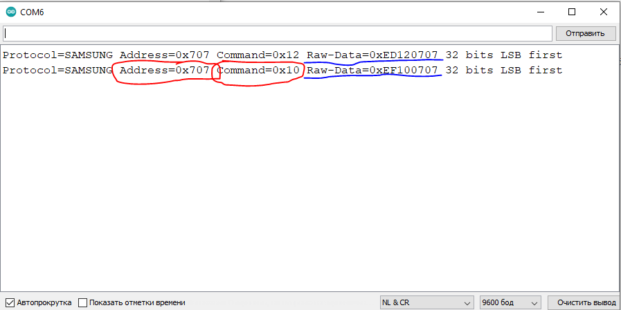

### [Небольшой обзор большой библиотеки IRremote для управления по ИК каналу](https://dzen.ru/a/Ygo1_lvZ9XiO1G3l)

Краткий (частичный из указанной статьи) обзор библиотеки IRremote для среды Arduino IDE.

Ссылка на гитхаб [https://github.com/Arduino-IRremote/Arduino-IRremote](https://github.com/Arduino-IRremote/Arduino-IRremote). В статье представлен обзор по версии библиотеки 3.5.2. Перед использованием, необходимо убедиться, что в среде Arduino IDE установлена именно она. (со старыми версиями библиотеки, примеры кода из данной статьи работать не будут).

Библиотека поддерживает протоколы: Denon/Sharp, JVC, LG, NEC/Onkyo/ Apple, Panasonic/Kaseikyo, RC5, RC6, Samsung, Sony, (Pronto), BoseWave, Lego, Whynter

Может работать на Ардуино-платформах и отдельных "камнях":

```
Arduino Uno / Mega / Leonardo / Duemilanove / Diecimila / LilyPad / Mini / Fio / Nano etc.
Teensy 1.0 / 1.0++ / 2.0 / 2++ / 3.0 / 3.1 /
Sanguino
ATmega8, 48, 88, 168, 328
ATmega8535, 16, 32, 164, 324, 644, 1284,
ATmega64, 128
ATmega4809 (Nano every)
ATtiny3217 (Tiny Core 32 Dev Board)
ATtiny84, 85, 167 (Digispark + Digispark Pro)
SAMD (Zero, MKR*, but not DUE, which is SAM architecture)
ESP32 (ESP32 C3 since board package 2.0.2 from Espressif)
ESP8266
Sparkfun Pro Micro
Nano Every, Uno WiFi Rev2, nRF5 BBC MicroBit, Nano33_BLE
BluePill with STM32
RP2040 based boards (Raspberry Pi Pico, Nano RP2040 Connect etc.)
```

#### [Получение данных с пульта управления](IRremote_V1/IRremote_V1.ino)

Авторы библиотеки пошли в сторону упрощения использования библиотеки конечным пользователем, и запуск "прослушки" и анализа данных с датчика запускается командой:
```
IrReceiver.begin(15, true, 13);
```

Если теперь на датчик направить пульт и нажать кнопку, зелененький светодиод бодро моргает, сигнализируя о том, что пришли данные. 

Если бодро моргающий светодиод не нужен - можно просто написать:
```
IrReceiver.begin(15);
```
Пример данных по двум кнопкам с пульта SAMSUNG (канал+ канал-)



Как видим, библиотека IRremote не только отдает сырые данные (отправленное сообщение Raw-Data=0xEF100707), но и дает расшифровку протокола SAMSUNG. Все кнопки моего пульта имеют один адрес Address=0x707. Для каждой кнопки уникальна только команда Command=0x10, а сама библиотека дает возможность отправки команд именно в таком формате.

#### [Формирование готовых команд для отправки ИК сообщения](IRremote_V2/IRremote_V2.ino)

Скетч формирует готовые команды для отправки ИК сообщения с пультов разных устройств по типу:
```
sendNEC(0x0, 0x15);
sendNEC(0x0, 0x11);
 
sendSamsung(0x707, 0x2);
sendNEC(0x4000, 0x10);
```
#### [Отправка команд бытовой технике](IRremote_V3/IRremote_V3.ino)

```
#include <IRremote.h>

void setup() 
{
  // Старт передачи: ИК светодиод ПИН 4,индикация ПИН 12
  IrSender.begin(4, true, 12);
}

void loop() 
{
  IrSender.sendSamsung(0x707, 0x12, 0); // переключаем ТВ канал туда ch+
  delay(5000);                          // пауза 5 секунд
  IrSender.sendSamsung(0x707, 0x10, 0); // переключаем ТВ канал обратно ch-
  delay(5000);                          // пауза 5 секунд
}
```

Пример скетча совсем простой: канал+1, ждем 5 секунд, канал-1, ждем 5 секунд. 
Вместо объекта IrReceiver у нас появляется объект IrSender
```
IrSender.sendSamsung(0x707, 0x12, 0);
```
Последняя цифра в этой строчке - число повторов отправки команды. У меня работает и с нулем.

#### [Управление светодиодом с помощью любого пульта от бытовой техники](IRremote_V4/IRremote_V4.ino)

В этом примере с помощью кнопки переключения каналов будем включать и выключать светодиод который подключен к 14 выводу. Вот тут, как раз удобнее воспользоваться данными Raw-Data, которые были получены в результате работы первого скетча.
```
программа + Raw-Data=0xED120707   ВКЛ светодиод
программа - Raw-Data=0xEF100707   ВЫКЛ светодиод
```
Сырые данные, можно добыть, обратившись к свойству объекта IrReceiver
IrReceiver.decodedIRData.decodedRawData.

Убирая трассировку команд на последовательный порт, получаем [код 5-того примера:](IRremote_V5/IRremote_V5.ino)

```
#include <IRremote.h>

void setup() 
{
  // Старт приема: приемник ПИН 15,индикация ПИН 13
  IrReceiver.begin(15, true, 12);
  // Светодиод ПИН 14
  pinMode(14,OUTPUT);
}
void loop() 
{
  if (IrReceiver.decode()) 
  {
    // Получаем сырые данные и сохраняем в переменную
    uint32_t r = IrReceiver.decodedIRData.decodedRawData;
    if (r == 0xED120707) digitalWrite(14,HIGH); // зажигаем светодиод
    if (r == 0xEF100707) digitalWrite(14,LOW);  // гасим светодиод   
    IrReceiver.resume();
  }
}

```
Если у вас дома завалялся ПДУ валяющийся без дела, с помощью этой библиотеки Вы легко сможете прицепить его для управления самодельным устройством на базе любого микроконтроллера или ардуино-подобной платформе, список которых был приведен в начале данной статьи. Потребуется только купить или выковырять из старой радиоаппаратуры ИК приемник.

Судя по данным гитхаба у данной библиотеки 53 автора, что говорит о большом объёме проделанной работы по расшифровке ИК протоколов различных фирм производителей. Одиночке такое написать не под силу. 