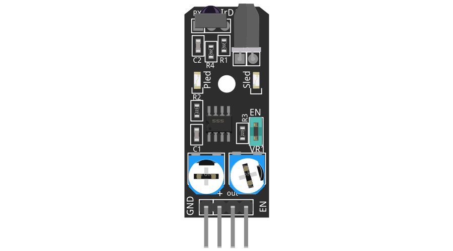

### [KY-032](https://arduinomodules.info/ky-032-infrared-obstacle-avoidance-sensor-module/)
### [Модуль дальномера (датчика для избегания препятствий)

#### МОДУЛЬ ИНФРАКРАСНОГО ДАТЧИКА ОБХОДА ПРЕПЯТСТВИЙ KY-032

Модуль датчика обхода препятствий KY-032 представляет собой инфракрасный датчик приближения с регулировкой расстояния, предназначенный для колесных роботов. Также известен как AD-032.

Расстояние обнаружения датчика составляет от 2 см до 40 см, его можно регулировать поворотом ручки потенциометра. Его рабочее напряжение составляет 3,3 В – 5 В, поэтому он подходит для различных микроконтроллеров, таких как Arduino, ESP32, Teensy, ESP8266, Raspberry Pi и других.

Он обладает высокой адаптивностью к окружающему освещению и довольно точно определяет изменения в окружающей среде.

#### ТЕХНИЧЕСКИЕ ХАРАКТЕРИСТИКИ KY-032

Модуль оснащен парой инфракрасных светодиодов, излучателем и приемником. Излучающий светодиод посылает импульсы инфракрасного света с определенной частотой. Когда свет попадает на препятствие, он отражается обратно на светодиод приемника.

KY-032 имеет 4 контакта: GND, +, S (out) и EN. Перемычка делает модуль постоянно включенным, поэтому он всегда обнаруживает препятствия. Для контроля состояния датчика снимите перемычку и используйте штырь EN, высокий сигнал активирует датчик, а низкий сигнал отключает его.

Вы можете отрегулировать расстояние обнаружения, повернув левую ручку, поверните ее посередине для достижения максимального расстояния. Правая ручка регулирует частоту излучаемого ИК-импульса, поверните ее по часовой стрелке до упора, чтобы настроить излучатель на нужную частоту, необходимую для работы с приемником.

```
Рабочее напряжение	     3,3 В – 5 В постоянного тока
Рабочий ток	             ≥ 20 мА
Рабочая температура      -10°C – 50°C [14°F – 122°F]
Расстояние обнаружения   2 см – 40 см [0,79 дюйма – 15,75 дюйма]
Интерфейс ввода-вывода	 4-проводной интерфейс (-/+/S/EN)
Выходной сигнал	Уровень  TTL (низкий уровень при обнаружении препятствия, высокий при отсутствии препятствий)
Способ настройки	     многооборотная регулировка сопротивления
Частота ИК-импульсов	 38 кГц в соответствии со спецификацией HS0038DB
Эффективный угол	     35°
Размер платы	         1,6 см x 4 см [0,62 дюйма x 1,57 дюйма]
Вес	                     9g
```
#### СХЕМА ПОДКЛЮЧЕНИЯ KY-032

```
    Подключите линию GND модуля (крайний левый вывод) к GND на Arduino 
и + (второй вывод) к 5V.
    Подключите сигнал (out) к контакту 3 на Arduino.
[*] Снимите перемычку, чтобы использовать вывод EN.

KY-032	  Arduino
GND	      GND
+	      +5 В
выход	  Вывод 3
EN [*]	  Вывод 2 [*]
```


#### КОД ARDUINO KY-032

Когда датчик обнаруживает препятствие, он посылает низкий сигнал на свой выходной вывод. Высокий сигнал отправляется, когда препятствие не обнаружено или находится вне зоны действия. В следующем примере мы включим светодиод на выводе 13 Arduino, когда датчик обнаружит препятствие.

Код разработан для работы с установленной перемычкой, поэтому датчик всегда включен. Чтобы программно включить / отключить датчик, снимите перемычку, подключите вывод EN датчика к выводу 2 на Arduino и раскомментируйте строки 4, 12 и 13.

```
int ledPin = 13;      // LED pin on arduino
int detectorPin = 3;  // obstacle avoidance sensor interface
int val;              // variable to store result
//int enablePin = 2;  // sensor enable interface (EN)
void setup()
{
  pinMode(ledPin, OUTPUT);  // Define LED as output interface
  pinMode(detectorPin, INPUT);  // Define obstacle avoidance sensor as input interface
  
  // [uncomment and remove jumper on module to use enable pin (EN)]
  //pinMode(enablePin, OUTPUT);
  //digitalWrite(enablePin, HIGH);  // Enable sensor
}
void loop()
{
  val = digitalRead(detectorPin); // Read value from sensor
  if(val == LOW) // When the sensor detects an obstacle, the LED on the Arduino lights up
  {
    digitalWrite(ledPin, HIGH);
  }
  else
  {
    digitalWrite(ledPin, LOW);
  }
}
```

[Изображение для Fritzing](ky-032.svg)

#### [ДОПОЛНИТЕЛЬНЫЕ ЗАМЕЧАНИЯ](https://www.matematicus.ru/arduino/datchik-dlya-izbeganiya-prepyatstvij-ky-032)

Модуль дальномера KY-032 (оbstacle avoidance sensor module- avoid, датчик для избегания препятствий) определяет есть ли препятствие на указанном расстоянии, но точное расстояние до преграды не определяет. 

```
!!! Может применяться для измерения оборотов скорости вращения 
за счет нанесение на движущиеся часть широких белых и чёрных полос. 

Принцип датчика основан на инфракрасном излучение светодиодом, 
которое отражается от препятствий и возвращается в фотоприемник.
```

 В состав датчика дальномера KY-032 входит таймер 555.
 
 ```
Ток в режиме ожидания                         2 мА;
Ток в режиме работы                           20 мА;
Расстояние до обнаружение белой преграды      2-40 см;
Инфракрасный луч с модулированной частотой    38 кГц;
Угол обзора                                   35°;
Температура эксплуатации                      от -10 0С до +50 0С;
```

Датчик для избегания препятствий KY-032


