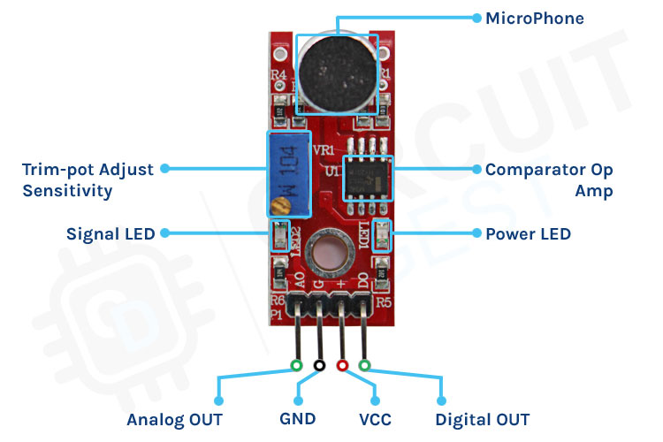
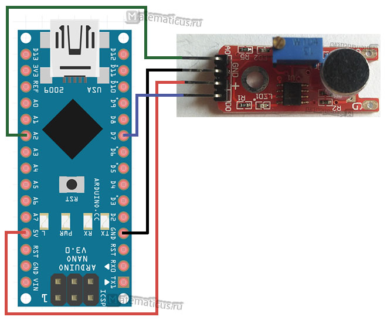
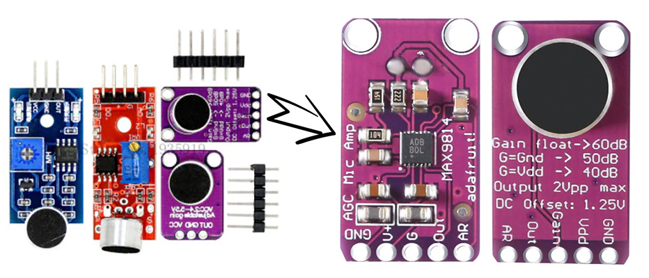
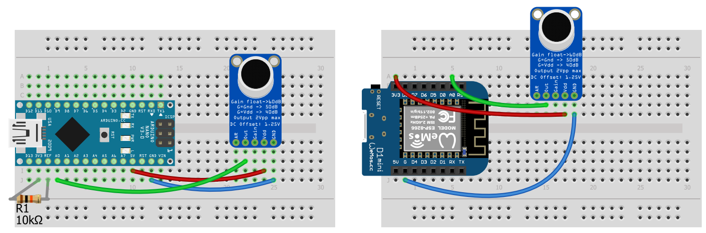
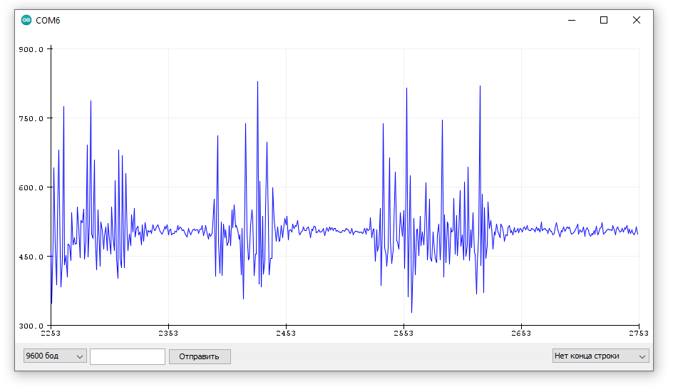
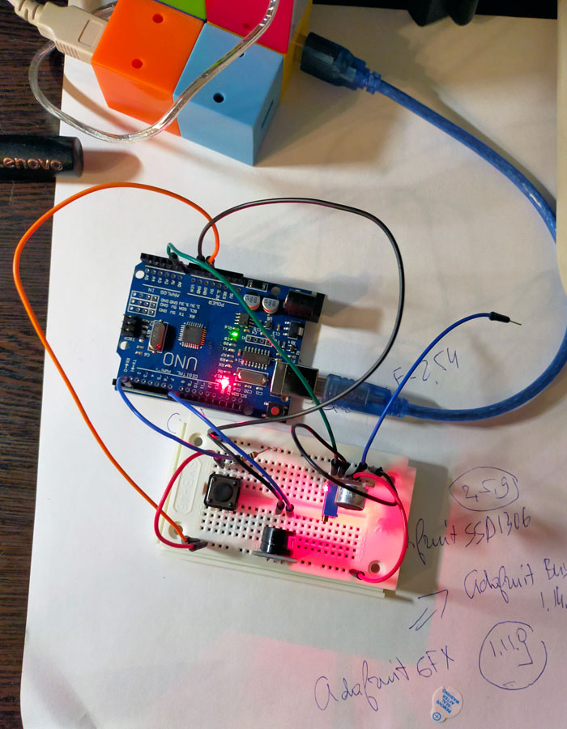
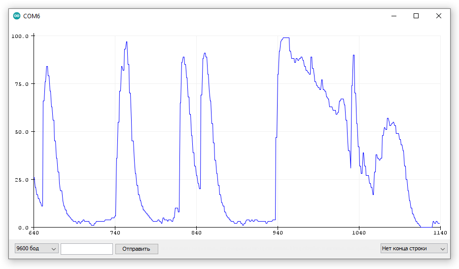
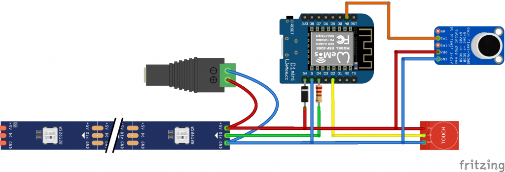
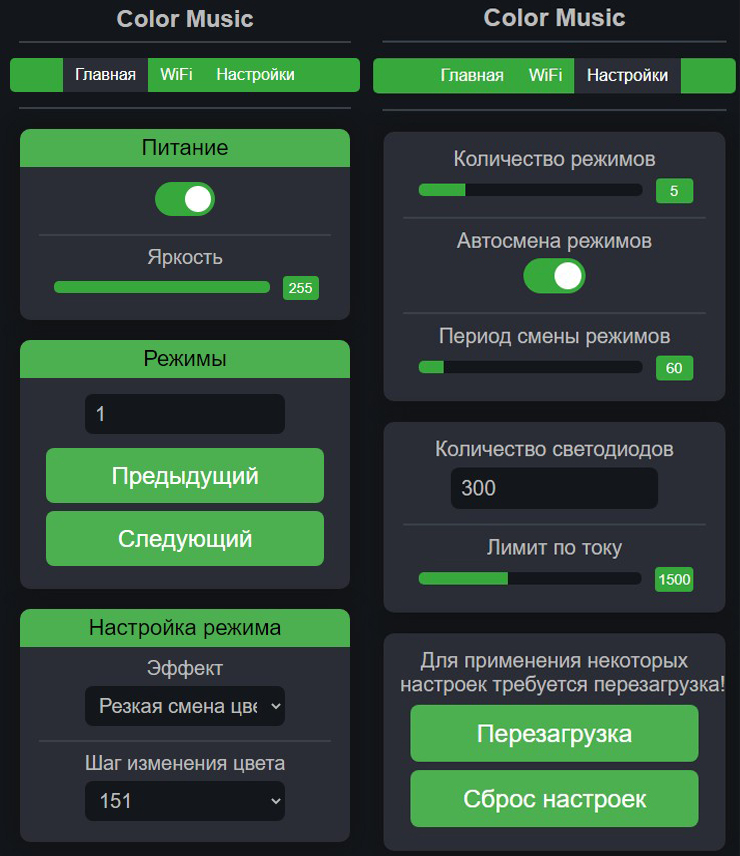
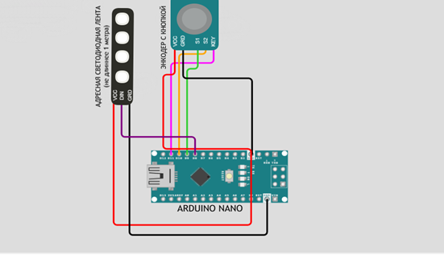

### KY-038
### [Микрофонный модуль звукового датчика](https://rxtx.su/mikrokontrollery/arduino/moduli-i-datchiki-k-arduino/datchik-zvuka-arduino/)

Модуль датчика звука представляет собой микрофон, подстроечный резистор и операционный усилитель LM393 с аналоговым выходом. Питание датчика составляет 5V.  A0 — аналоговый выход. D0 — цифровой выход. В составе модуля имеется подстроченный резистор для подстройки чувствительности микрофона (trim-pot ajast sensytivity) и индикатор срабатывания датчика по громкости звука (signal led).



Датчики звука можно использовать для множества проектов с использованием звукового управления. Например, это может быть управление включением света по хлопку или стуку. Или открытие ворот по звуковому сигналу автомобиля.

#### [Схема подключения датчика звука KY-038 к arduino](https://www.matematicus.ru/arduino/analogovo-tsifrovoj-datchik-zvuka)



#### [Скетч отлавливания, определения силы звука и срабатывания датчика по громкости](https://www.matematicus.ru/arduino/analogovo-tsifrovoj-datchik-zvuka)

```
const int pin_bigsound_analog = A2;
const int pin_bigsound_digital = 7;
 
void setup ()
{
  Serial.begin(9600);
  pinMode(pin_bigsound_analog, INPUT);
  pinMode(pin_bigsound_digital, INPUT);
}

void loop ()
{
  float signal_analog = analogRead (pin_bigsound_analog);
  int signal_digital = digitalRead (pin_bigsound_digital);
  // значение аналогового звука варьируется от 0 до 1023,
  // чем ближе к 1023, тем сильнее звук
  Serial.print(signal_analog); 
  Serial.print(" - Значение аналогового сигнала \n");
  // значения цифрового сигнала 1 или 0, 
  // 1 - отсутствие сильного звука, 0 - наличие сильного звука
  Serial.print(signal_digital); 
  Serial.print(" - Значение цифрового сигнала \n");  
  delay(1000);
}
```

#### Скетч обнаружения хлопка

```
#define sensorPin 7

// Переменная для хранения времени, когда произошло последнее событие
unsigned long lastEvent = 0;

void setup() 
{
  // Настраиваекм вывод, к которому подключен датчик, как вход
  pinMode(sensorPin, INPUT); 
  Serial.begin(9600);
}

void loop() 
{
  // Прочитать показания датчика
  int sensorData = digitalRead(sensorPin);
  // Если на вывод подан низкий логический уровень, то звук обнаружен
  if (sensorData == LOW) 
  {
    // Если прошло 25 мс с момента последнего состояния низкого логического уровня,
    // это значит, что обнаружен хлопок, а не какие-либо ложные звуки
    if (millis() - lastEvent > 25) 
    {
      Serial.println("Хлопок!");
    }
    // Запомнить, когда произошло последнее событие
    lastEvent = millis();
  }
}

```

Есть две статьи ([оригинальная](https://circuitdigest.com/microcontroller-projects/interface-ky038-sound-sensor-with-esp32) и [русская копия](https://microkontroller.ru/esp32-projects/kak-rabotaet-datchik-zvuka-ky-038-i-kak-ego-podklyuchit-k-esp32/) по определению силы звука в децибелах для ESP32.

### [Arduino, микрофон и VolAnalyzer()](https://kit.alexgyver.ru/tutorials/microphone/)

Arduino весьма неплохо измеряет напряжение, почему бы не подключить к ней микрофон? Просто голый микрофонный капсюль подключать нет смысла, для работы с ним понадобятся ещё некоторые электронные компоненты. У китайцев есть несколько вариантов микрофонных модулей, но самый хороший из них – на базе микросхемы MAX9814.



Данный модуль обеспечивает:
```
Усиление сигнала с микрофона до амплитуды 1.25V (выходной диапазон 0.. 2.5V)
Встроенный АРУ – автоматическая регулировка усиления, выравнивает громкость тихих и громких звуков
Подавление шума – сигнал с микрофона довольно чистый даже при не очень хорошем питании. Его очень приятно обрабатывать, да и рацию можно сделать
```

Пины и настройки модуля:

```
GND и Vdd (V+): питание, 3.. 5V
Out: выход сигнала для подключения к МК
Gain (G): настройка усиления
Никуда не подключен: 60dB
На GND: 50dB
На VCC: 40dB
AR: настройка компрессии звука (время восстановления)
Никуда не подключен: 1:4000 мс
На VCC: 1:2000 мс
На GND: 1:500 мс
```
#### Подключение к питанию и на аналоговый пин:



Примечание:

На схеме с Arduino (слева) можно переключить опорное напряжение (пин REF) на встроенный источник 3.3V, желательно через резистор на 10к. Соответственно в программе вызвать analogReference(EXTERNAL). Это нужно для того, чтобы расширить диапазон чтения сигнала микрофона и обрабатывать его более точно (он выдаёт 0.. 2.5V)

На схеме с Wemos (справа) мы подключаем микрофон на питание 3.3V. Сигнал он всё равно выдаёт 0.. 2.5V, что очень хорошо: у Wemos как раз 3.3V – верхняя граница напряжения на аналоговый пин A0

#### Библиотеки

Модуль выдаёт аналоговый сигнал, то есть его достаточно опрашивать стандартными средствами Arduino для получения сырого сигнала. Но полезные библиотеки всё таки есть:

Если микрофон используется для измерения громкости звука, то можно воспользоваться библиотекой амплитудного анализа [VolAnalyzer](https://github.com/GyverLibs/VolAnalyzer), которая обработает звук и преобразует громкость в нужный диапазон, а также будет автоматически подстраивать чувствительность при изменении среднего уровня громкости

[Clap](https://github.com/GyverLibs/Clap) – библиотека для распознавания хлопков в ладоши, удобно использовать совместно с VolAnalyzer

Для частотного анализа звука можно использовать библиотеку [FHT (только для AVR)](https://github.com/Evg33/ArduinoFHT)

#### Пример: вывод сырого сигнала в порт. Обработка от функции [analogReference()](https://rxtx.su/mikrokontrollery/arduino/funkcii-arduino-ide/funkciya-analogreference/).

```
void setup() 
{
  Serial.begin(9600);

  // переключаем на внешнее опорное
  // его подключаем к 3.3V
  analogReference(EXTERNAL);  
}

void loop() 
{
  Serial.println(analogRead(0));
}
```
Откроем монитор порта и скажем что-нибудь в микрофон.



Отлично! Но это сырой сигнал, с ним работать неудобно – он не отражает усреднённую громкость, а всего лишь показывает форму звукового сигнала.

#### [Скетч снятия звука с модулей KY-037, KY-038 и вывода на плоттер с использованием зуммера и кнопки для его включения](SoundByAnalogReferenceDEFAULT/SoundByAnalogReferenceDEFAULT.ino).



#### Пример с VolAnalyzer.

Заведём похожий пример, но с библиотекой VolAnalyzer: выведем приведённую “громкость” звука и построим график:

```
// Амплитудный анализ звука

#include "VolAnalyzer.h"
VolAnalyzer analyzer(A0);

void setup() 
{
  Serial.begin(9600);
}

void loop()
{
  if (analyzer.tick()) 
  {
    Serial.print(analyzer.pulse()*20);  // скачок громкости
    Serial.print(',');
    Serial.print(analyzer.getVol());    // громкость 0-100
    Serial.print(',');
    Serial.print(analyzer.getRaw());    // сырая величина
    Serial.print(',');
    Serial.println(analyzer.getMax());  // амплитудная огибающая
  }
}
```


Такой сигнал достаточно подать на светодиод – и уже получится светомузыка!

### [Светомузыка с управлением через Wi-Fi на Ардуино](https://nsk.giant4.ru/blog/proekty-pobediteley-konkursa-arduino-2022/svetomuzika-statya/)

#### Задача

```
Снять звук с микрофона, и управлять адресной светодиодной лентой под музыку.
Несколько настраиваемых эффектов.
Управление с телефона.
Запоминать настройки в EEPROM.
Опционально: управление кнопкой.
```

#### Описание проекта

5 эффектов

```
Резкая смена цвета
Столбик громкости
Бегущие огни
Градиент
Цвет
```

У эффекта Столбик громкости и Градиент есть 8 палитр

```
Тепло
Лава
Вечеринка
Радуга
Павлин
Облака
Океан
Лес
```

Состав

```
Wemos D1 mini
Адресная светодиодная лента WS2812b
Микрофон MAX9814
Сенсорная кнопка TTP223
Диод 1N4007
Резистор 220 Ом
```

Подключение

```
При подаче питания начнётся подключение к роутеру (лента мигает синим)
Если подключение не будет установлено за 30 секунд, то ESP8266 создаёт свою точку доступа (лента мигает красным)   
Точка доступа называется Color Music, пароль 12345678
При подключении к точке доступа перейдите в браузере по адресу 192.168.4.1
Для настройки Wi-Fi перейдите на вкладку Wi-Fi, введите SSID и пароль от своей сети
При успешном подключении светомузыка перейдёт в режим работы
Страница с настройками (веб - страница) доступна в локальной сети роутера по IP адресу, который выдал роутер. Чтобы его узнать, надо подключить Wemos к компьютеру и открыть монитор порта.
```

Схема сборки светомузыки через Wi-Fi



Настройки в коде

```
// ------------ НАСТРОЙКИ ------------
#define USE_BTN 1         // 1 использовать кнопку, 0 нет
#define BTN_PIN 4         // кнопка на D2
#define STRIP_PIN 2       // D4 пин подключения ленты
#define MAX_LEDS 300      // максимальное количество светодиодов
#define MAX_PRESETS 20    // максимальное количество режимов
```

Управление происходит через веб-страницу

Веб-интерфейс позволит переключать и настраивать режимы, настраивать автосмену режимов, количество светодиодов, устанавливать лимит по току, изменять яркость и выключать светомузыку.



Управление через кнопку

```
1 клик: включить/выключить 
2 клика: следующий режим
3 клика: предыдущий режим
Удерживание: изменить яркость
```

Используемые библиотеки: [VolAnalyzer](), [FastLED](), [GyverPortal]().

#### [Гирлянда на адресной светодиодной ленте](https://nsk.giant4.ru/blog/proekty-pobediteley-konkursa-arduino-2022/girlyanda-na-adresnoy-lente-statya/)

Данный проект - один из отобранных нами проектов, участвовавших в конкурсе Arduino 2022. Проект получил второе место №2. Разработчик Артем (12 лет) предложил понятную схему сборки при интересных и сложных эффектах для создания декоративной новогодней гирлянды на базе адресной ленты. Гирлянда имеет 5 разных режимов, поэтому позволит Вам привнести в своё рабочее место что-то необычное и интересное. Для сборки этого интересного проекта Arduino Вам не понадобится большое количество компонентов или невероятные навыки в программировании, его можно собрать быстро и с лёгкостью!

Особенности проекта

```
5 режимов работы гирлянды
Возможность добавления или настройки эффектов (через прошивку)
Регулируемая яркость ленты
```

Необходимые компоненты

```
Адресная светодиодная лента WS2812B (1 метр) - 1 шт.
Arduino Nano - 1 шт.
Энкодер с кнопкой - 1 шт.
```

Схема сборки:




ПРИМЕЧАНИЕ: рекомендуется подключать светодиодную ленту длиной не больше 1 метра в связи с большим током потребления светодиодной ленты. Если вы хотите сделать гирлянду, то нужно ленту запитать от отдельного источника питания!

[Прошивка (код)](address_LED_strip/address_LED_strip.ino).

