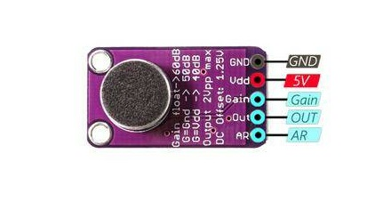
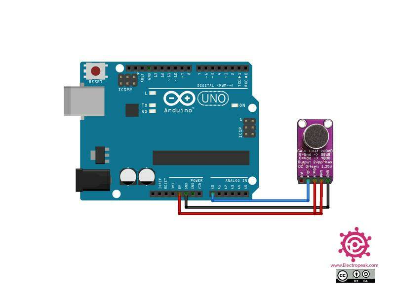

### [MAX9814 Electret - модуль усилителя микрофона](MAX9814.pdf)

#### Общее описание

Модуль состоит из электронного микрофона (20-20 кГц) и специального усилителя на чипе MAX9814 фирмы Maxim. Микросхема намного лучше усиливает звук по сравнению с другими усилителями из-за встроенного автоматического регулировкой усиления (АРУ), которая подавляет «громкие» звуки и усиливает «тихие» звуки. Модуль отлично подойдет в проектах, где часто меняется уровни звука и вам не придется постоянно настраивать усиление.

На модуле выведен дополнительный вход GAIN, с помощью которого можно регулировать «Максимальное усиление», если не подключать его, максимальное усиление составит 60 дБ., если подключить вывод к GND усиление составит 50 дб и минимальное усиление можно получить при подключение этого вывода к питанию 40 дб. Так же, можно отрегулировать соотношение время срабатывание/время восстановления, для этого необходимо подключить вывод AR к VDD получим 1:2000 мс, если подключим к GND получим 1:500 мс и если оставим по умолчанию получим 1:4000 мс.

MAX9814 - это недорогой высококачественный микрофонный усилитель с автоматической регулировкой усиления (AGC) и  малошумящим смещением микрофона. Устройство оснащено малошумящим предусилителем, усилителем с переменным коэффициентом усиления (VGA), выходным усилителем, генератором напряжения смещения микрофона и схемой управления AGC.

Малошумящий предусилитель имеет фиксированное усиление в 12 дБ, в то время
как усиление VGA автоматически регулируется от 20 дБ до 0 дБ в зависимости от выходного напряжения и порога AGC. 

Выходной усилитель обеспечивает выбираемое усиление в 8 дБ, 18 дБ и 28 дБ. Без каскадного сжатия усилители обеспечивают общее усиление 40 дБ, 50 дБ или 60 дБ. 

Трехуровневый цифровой вход программирует усиление выходного усилителя. 
Внешний резистивный делитель управляет порогом AGC, а один конденсатор программирует время атаки/срабатывания. Трехуровневый цифровой вход программирует соотношение времени атаки и срабатывания. 

Время удержания АРУ фиксировано на уровне 30 мс. Генератор напряжения смещения микрофона с низким уровнем шума может смещать большинство
электретных микрофонов.

MAX9814 выпускается в компактном 14-контактном корпусе 
TDFN. Это устройство предназначено для работы в расширенном диапазоне температур от -40°C до +85°C.

#### Особенности
```
● Автоматическая регулировка усиления (AGC)
● Три настройки усиления (40 дБ, 50 дБ, 60 дБ)
● Программируемое время атаки
● Программируемое соотношение атаки и ослабления
● Диапазон напряжения питания от 2,7 В до 5,5 В
● Низкая плотность входного шума - 30 Нв/√Гц
● Низкий уровень THD: 0,04% (тип)
● Режим отключения с низким энергопотреблением
● Внутреннее малошумящее смещение микрофона, 2 В
● Доступно в компактном 14-контактном корпусе TDFN (3 мм x 3 мм)
● Расширенный диапазон температур от -40°C до +85°C
```
#### Абсолютные максимальные оценки
```
VDD - GND ...................................... от -0,3В до +6 В
Все остальные контакты подключены к GND ........ 3 V к (VDD + 0,3В)
Длительность короткого замыкания на выходе...... Непрерывное
Постоянный ток (MICOUT, MICBIAS)................ ± 100 мА
Все остальные контакты ......................... ± 20 мА
Непрерывное рассеивание мощности (TA = +70°C)
   14-контактный разъем TDFN-EP
   (снижение на 16,7МВт/°C выше +70°C) ......... 1481.5 МВт
Диапазон рабочих температур..................... -40° C до +85°C
Температура соединения.......................... +150° C
Температура свинца (пайка, 10 с) ............... +300° C
Переплавка при высокой температуре (пайка) ..... +235° C
```
#### [Сопряжение модуля усилителя электретного микрофона MAX9814 с Arduino](https://electropeak.com/learn/interfacing-max9814-electret-microphone-amplifier-module-with-arduino/)

Это устройство оснащено встроенным микрофонным смещением с низким уровнем шума. Этот модуль также можно подключить напрямую к выходу AUX.

Примечание: Выходной сигнал модуля не равен нулю в бесшумном режиме и имеет смещение 1,25 В.

Модуль MAX9814 имеет 5 контактов:
```
VCC:  питание модуля - 2,7-5,5 В
GND:  заземление
OUT:  аналоговый вывод данных на микроконтроллер
Gain: усиление - регулировка максимальной мощности модуля
AR:   точность - регулировка времени срабатывания/времени восстановления
```


```
Отключен    VCC        GND      *
----------------------------------------
60 дБ	    50 дБ	   40 дБ	Усиление
1:4000    	1:2000	   1:500    AR
```



```
/*
  modified on Sep 8, 2020
  Modified by MohammedDamirchi from Arduino Examples
  Home
*/

// the setup routine runs once when you press reset:
void setup() 
{
  // initialize serial communication at 9600 bits per second:
  Serial.begin(9600);
}

// the loop routine runs over and over again forever:
void loop() 
{
  // read the input on analog pin 0:
  int sensorValue = analogRead(A0);
  // print out the value you read:
  Serial.println(sensorValue);
}
```

#### [Вывод напряжения с выходного контакта микрофона](obzor-modulya-max9814/obzor-modulya-max9814.ino).

#### [Alislahish-MAX9814 - библиотека для управления уровнем усиления и соотношением атаки/срабатывания](https://github.com/alislahish/Alislahish-MAX9814).

Эта библиотека управляет соотношением высвобождения/атаки (500:1, 2000:1 или 4000:1) и уровнем усиления (40 дБ, 50 дБ или 60 дБ).

Обратите внимание, что все ссылки на A/R (атака/выпуск) в техническом описании и на Adafruit breakout в этой библиотеке называются RA (выпуск/атака). Функционально это эквивалентно, однако разумнее писать таким образом.

Эта библиотека опирается на библиотеку [Alislahish-ICUsingMCP23017](https://github.com/alislahish/Alislahish-ICUsingMCP23017), которая основана на [Adafruit-MCP23017-Arduino-Library](https://github.com/adafruit/Adafruit-MCP23017-Arduino-Library). 

Следует подключить обе библиотеки к [скетчу в примере](Alislahish-MAX9814-master/examples/test_MAX9814gain_ar/test_MAX9814gain_ar.ino).

#### [Какой датчик лучше подходит для хлопкового выключателя KY-038 или GY-MAX9814](https://habr.com/ru/articles/721384/)

