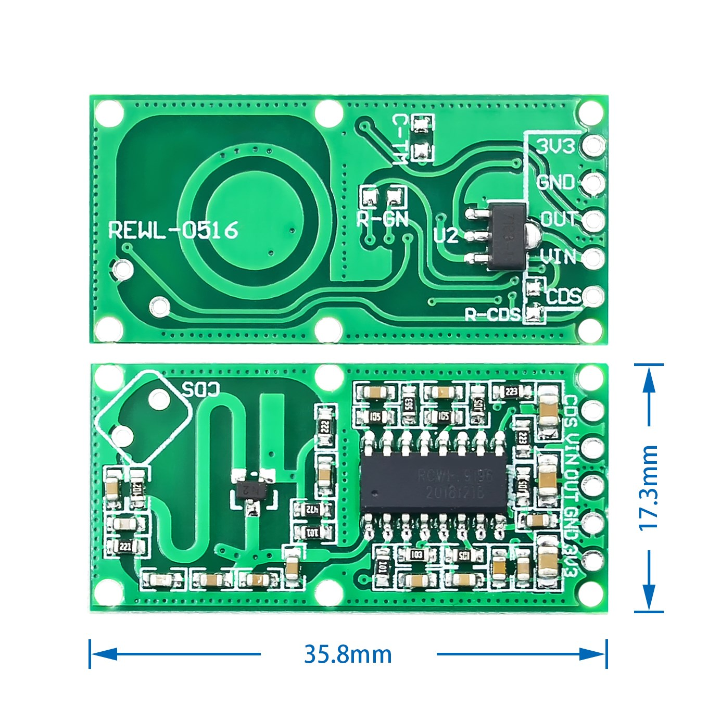

### [RCWL-0516 микроволновый радар - датчик движения](https://microkontroller.ru/arduino-projects/podklyuchenie-doplerovskogo-datchika-dvizheniya-rcwl-0516-k-arduino/) 

### [Обзор микроволнового датчик движения RCWL-0516](https://robotchip.ru/obzor-mikrovolnovogo-datchik-dvizheniya-rcwl-0516/)

### [Доделка микроволнового датчика WAVGAT RCWL-0516 для автомата освещения или охранной сигнализации](https://mysku.club/blog/aliexpress/77038.html)

#### [Simple Robot Store - 26.08.2024](https://aliexpress.ru/store/716258?g=y&page=1&searchInfo=search&spm=a2g2w.detail.0.0.4ca12ec9rJmf4T)

Описание
Теплая подсказка: Уважаемый покупатель, наши самые дешевые транспортные услуги, экономическая категория логистики (SunYou экономичная воздушная почта, почта Китая обычный маленький пакет плюс) можно отследить только для того, чтобы он прибыл в вашу страну, пожалуйста, выберите стандартную категорию логистики, если вам нужна полная информация об отслеживании.
Экспресс-инструкции по транспортировке и Обратная связь:

(1) Пожалуйста, внимательно прочитайте наши спецификации товара и подтвердите, что это то, что вам нужно.
(2) вы говорите с нами онлайн или оставляете здесь сообщение по любым вопросам нашего товара, срокам доставки и цене.
(3) Если у вас есть дополнительные требования к нашим товарам, пожалуйста, свяжитесь с нами.
 
Некоторые уведомления о доставке:
 
(1) Время доставки почтой Китая составляет около 15-22 дней (некоторым требуется около 30 дней), пожалуйста, будьте немного терпеливы во время ожидания Ваших посылок.
(2) вы также рассматриваете другие виды экспресс-доставки (UPS, DHL, FedEx, TNT или EMS) в течение 2-8 дней.
(3) Пожалуйста, свяжитесь с нами сразу, если есть какие-либо аберрантные письма.
(4) Пожалуйста, пришлите нам свои предложения, так как вы знаете что-то лучше, чем мы. Мы будем признательны за ваши хорошие идеи.
(5) Если вы предлагаете бесплатную доставку почтой Китая, мы осуществляем доставку только через почту Китая. Мы будем выполнять свои обязанности так же, как и то, что мы согласовали.
(6) Мы не несем ответственности за любые таможенные пошлины или налог на импорт.
(7) Мы постараемся сделать все возможное, чтобы удовлетворить вас, но никаких необоснованных требований, пожалуйста.
 
Важное примечание:
 
Клиенты должны быть уверены, что их страны могут импортировать этот продукт.
Если вы не уверены, разрешает ли ваша страна эти виды продукции,
Мы рекомендуем вам связаться с заказом для подтверждения.
Мы не несем ответственности за потери в связи с конфискованной таможней.
 
Контроль качества:
 
(1) Мы проверяем каждый товар перед отправкой, чтобы убедиться, что он в хорошем состоянии.
(2) Как опытный поставщик мы упаковываем товары в картонную коробку с EPE, что предотвратит ваши товары от неожиданных повреждений эффективно во время доставки.
(3) Мы предлагаем вам быструю доставку, обычно около 3 дней подготовки. Это приблизительное время, ваши данные о доставке будут соответствовать вашим конкретным заказам.
(4) мы сообщим вам номер отслеживания, как только мы отправим ваши продукты.
 

