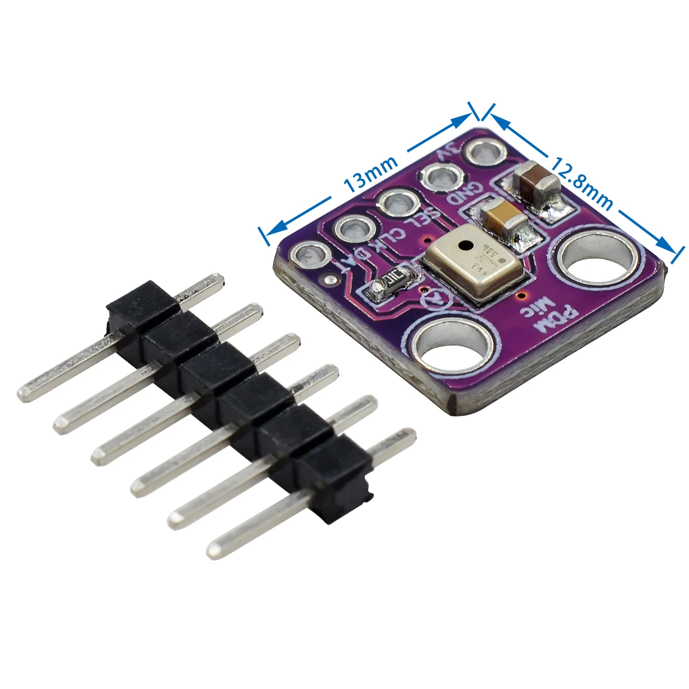

### MP34DT01 цифровой микрофонный модуль MEMS

---

#### [MP34DT01 цифровой микрофонный модуль MEMS](https://aliexpress.ru/item/1005004508565866.html?spm=a2g2w.orderdetail.0.0.50144aa6rJGCTB&sku_id=12000029410351038)

###### [MT Technology Co., Ltd.](https://aliexpress.ru/store/535576?g=y&page=1&searchInfo=search&spm=a2g2w.detail.0.0.7c936885ZryfPO)


```
Особенности:

1. Этот продукт имеет цифровой интерфейс и представляет собой очень 
   простой выход с модуляцией плотности импульсов
2. Высокая чувствительность, может быть интегрирована с электронным
   оборудованием и не легко вмешивается внешней средой
3. Отношение сигнал-шум очень низкое, всего 61 дБ, очень практично
4. Использование высококачественных электронных компонентов, точных технологий, обеспечивает долговечность
5. Штифт имеет хорошие контактные характеристики для обеспечения стабильной работы

Характеристики:

Тип проекта: 							Микрофонный модуль
Рабочее напряжение источника питания: 	1,8V до 3,3V
Размеры: 								14 x 12,8 x 2,8 мм
Тип интерфейса: 						PDM
```


#### [МЭМС микрофон «сглаживает» путь к естественному голосовому управлению в интеллектуальных потребительских устройствах](https://www.rlocman.ru/news/new.html?di=111641)

---

###### [к содержанию](../README.md)

